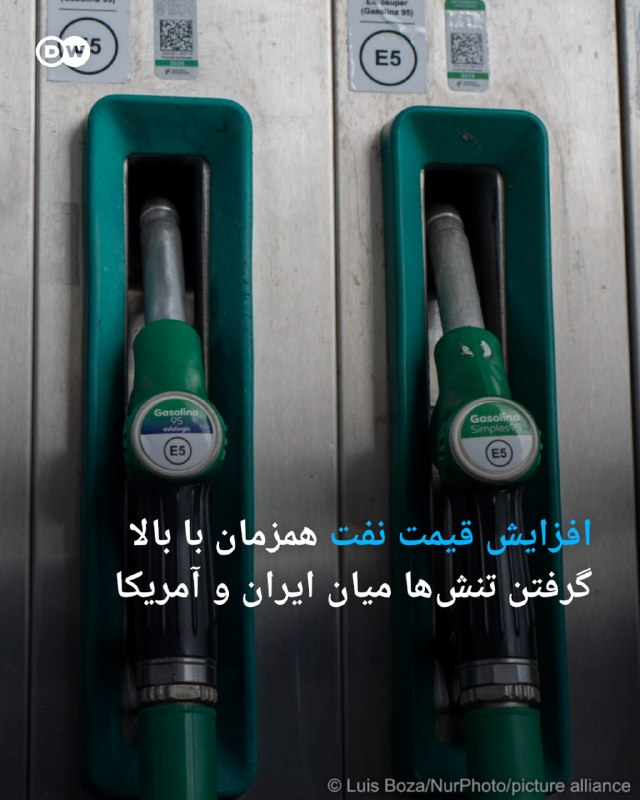
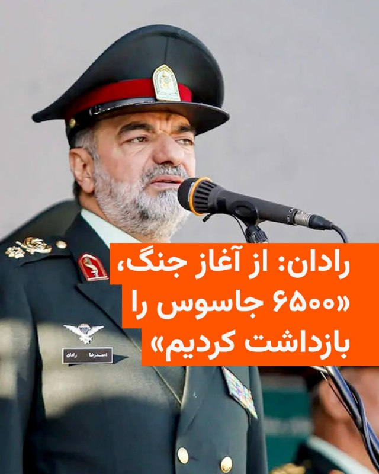
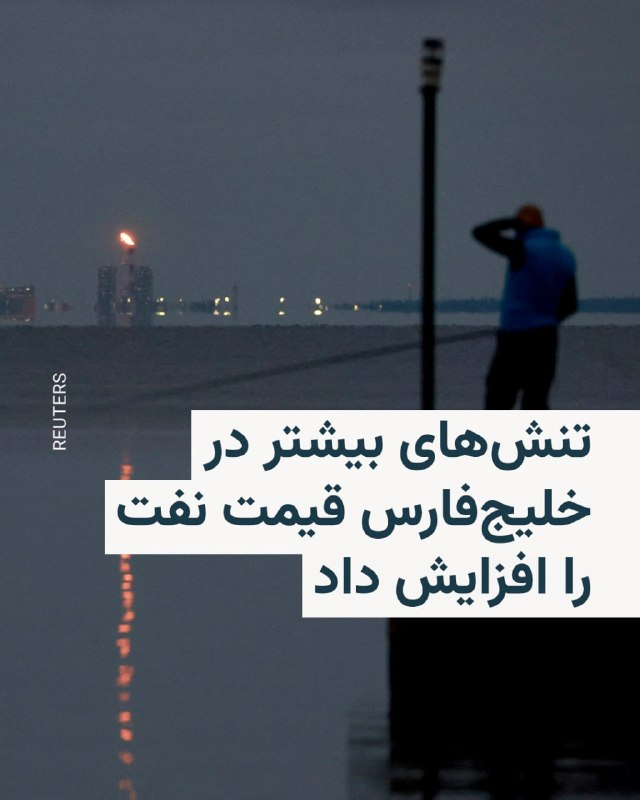
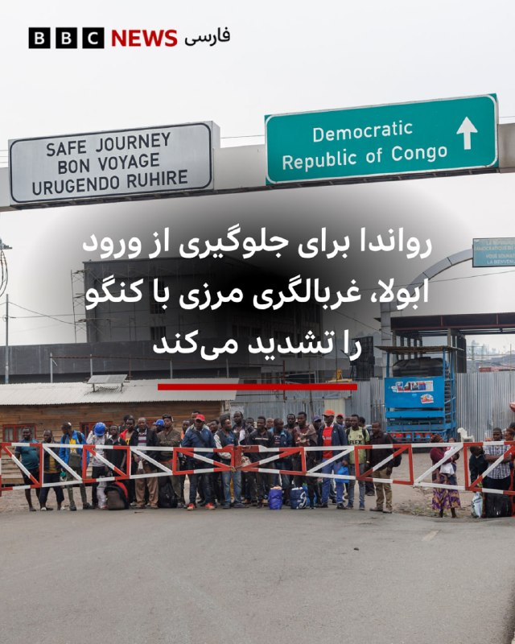
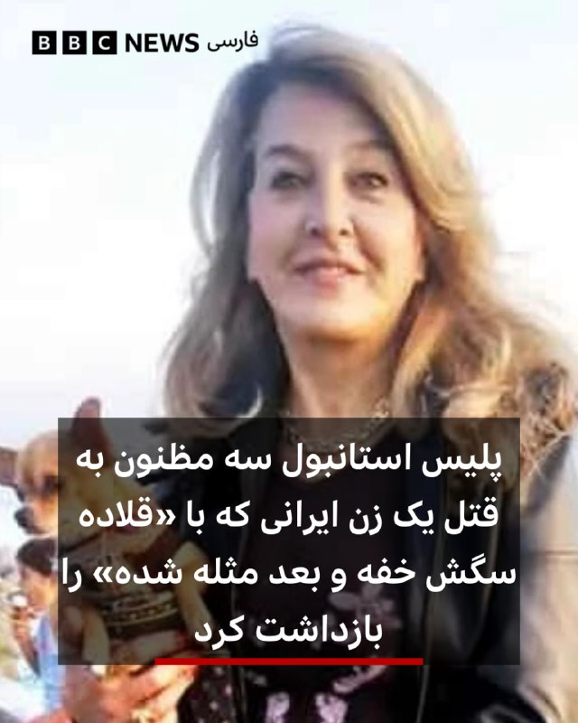

# خواننده تلگرام

<!-- TOP_NAV START -->

<a href="https://github.com/aliinreallife/aio-downloader/blob/main/telegram/content/archive_1.md" style="display:inline-block; padding:6px 12px; margin:0 4px; background-color:#2ea44f; color:white; text-decoration:none; border-radius:4px; font-weight:bold;">صفحه بعد</a>

<!-- TOP_NAV END -->

<!-- MSG START -->

---
📅 بروزرسانی: 1405/02/28 09:32
---

## VahidOOnLine — post 240741

♦️ پلیس ازبکستان روز یکشنبه ۲۷ اردیبهشت از کشف نزدیک به نیم تن مواد مخدر در مرز این کشور با افغانستان خبر داد.

براساس گزارش پلیس مرزی ازبکستان، این محموله شامل ۵۹۳ کیلوگرم حشیش و سه کیلوگرم تریاک به‌شکل ماهرانه‌ای در یک بیل مکانیکی که در یک تریکی در حال عبور از مرز افغانستان بود، کشف و ضبط شد.

به گفته مقام‌های مرزبانی و اداره گمرک ازبکستان، ماموران امنیتی در زمان بازرسی محموله تریلی، به تجهیزات «غیرضروری» این ابزار سنگین مشکوک شدند و پس از آن با استفاده از بازرسی با اشعه ایکس، توانستند بسته‌های جاسازی شده مواد مخدر در بدنه آن را کشف کنند.

این خبر در حالی منتشر می‌شود که از زمان بازگشت طالبان به قدرت در افغانستان، کشت خشخاش و تولید مواد مخدر در این کشور به‌شدت کاهش یافته است.
‌🇸🇦 Indypersian

🤖 @VahidOOnLine

## VahidOOnLine — post 240740

  <a href="telegram/content/VahidOOnLine_240740_1779084173.mp4" target="_blank">🎬 Download video</a>

‌🏁 🇬🇧 ManotoTV

🤖 @VahidOOnLine

## VahidOOnLine — post 240739

  <a href="telegram/content/VahidOOnLine_240739_1779084174.mp4" target="_blank">🎬 Download video</a>

دونالد ترامپ تصویری بدون توضیح در شبکه اجتماعی خود منتشر کرده است که در آن، پرچم آمریکا سراسر خاورمیانه و کشورهای اطراف ایران را پوشانده و پیکان‌هایی به‌سوی داخل ایران کشیده شده‌اند.

ترامپ ساعاتی پیش از انتشار این تصویر گفته بود که زمان برای ایران رو به پایان است.
‌🏁 🇬🇧 ManotoTV

🤖 @VahidOOnLine

## VahidOOnLine — post 240738

  

ناصر عتباتی، رییس کل دادگستری آذربایجان غربی، از توقیف اموال ۱۲۹ نفر در این استان به اتهام «اقدامات ضدامنیتی و همکاری با کشورهای متخاصم» خبر داد. او تاکید کرد قوه قضاییه به این روند توقیف اموال «با قدرت» ادامه خواهد داد.
‌🏁 🇬🇧 IranintlTV

🤖 @VahidOOnLine

## VahidOOnLine — post 240737

  

محسن رضایی، مشاور نظامی مجتبی خامنه‌ای، گفت: «آمریکا پس از شکست سختی که از جمهوری اسلامی خورد، در حال سقوط است.» او به ارتش ایالات‌متحده هشدار داد: «قبل از اینکه دریای عمان به گورستانی برای ناوهای شما تبدیل شود، خودتان عقب بکشید.»
محسن رضایی گفت: «یکی از سه ناو آمریکایی که از دریای عمان وارد خلیج فارس شده بود، با موشک‌های ما آسیب دید، اما آمریکا صدایش را درنمی‌آورد.»
او تاکید کرد: تنگه هرمز برای تجارت باز است، اما برای لشکرکشی و ناامنی بسته خواهد بود.

‌🏁 🇬🇧 IranintlTV

🤖 @VahidOOnLine

## VahidOOnLine — post 240736

♦️خبرگزاری رویترز بامداد دوشنبه ۲۸ اردیبهشت با انتشار ویدیویی گزارش داد یک هواپیمای آب‌نشین متعلق به دوران جنگ جهانی دوم پس از بروز نقص فنی، در یکی از خیابان‌های شهر فینیکس در ایالت آریزونا فرود اضطراری انجام داد.
این ویدیو که با دوربین نصب‌شده روی بال هواپیما ضبط شده، لحظه کاهش ارتفاع و فرود سخت هواپیما را نشان می‌دهد. بر اساس این گزارش، پس از شنیده شدن صدایی از موتور، دود وارد کابین خلبان شد و خلبان پس از جست‌وجو برای یافتن محل مناسب، یک خیابان خلوت را برای فرود انتخاب کرد.
رویترز گزارش داد هر سه سرنشین هواپیما سالم نجات پیدا کردند و تحقیقات هیئت ملی ایمنی حمل‌ونقل آمریکا درباره علت حادثه ادامه دارد.
‌🇸🇦 Indypersian

🤖 @VahidOOnLine

## VahidOOnLine — post 240735

  

♦️به گزارش العربیه، کشورهای حوزه خلیج فارس درنظر دارند پیش‌نویس یک قطعنامه‌ درباره آزادی کشتیرانی در تنگه هرمز و حفاظت از گذرگاه‌های آبی بین‌المللی را بار دیگر به شورای امنیت ارائه کنند و روسیه و چین را متقاعد کنند از حق «وتو» استفاده نکرده و پیشنهاد تصویب شود. این پیش‌نویس از ایران می‌خواهد حمله به کشتی‌ها را متوقف کند. عبدالعزیز العویشق، معاون دبیرکل شورای همکاری خلیج فارس در امور سیاسی و مذاکرات به العربیه گفت: «ایران با استفاده از تنگه هرمز به‌عنوان ابزار فشار در مذاکرات با آمریکا اشتباه بزرگی مرتکب شد، چرا که این اقدام ناقض قوانین بین‌المللی است.» او افزود: «کشورهای حوزه خلیج فارس پیش از جنگ ارتباطات خود را با ایران حفظ کرده بودند و امیدوار بودیم پایه‌ای جدید برای روابط شکل بگیرد، اما حملات ایران علیه کشورهای خلیج فارس، که چند برابر عملیاتش علیه اسرائیل بود، باعث شده تهران در پی نقض تفاهم‌ها اکنون با بار سنگینی برای بازسازی پل اعتمادروبه‌رو شود.» العویشق همزمان ابراز امیدواری کرد در آینده توافقی با ایران حاصل شود که برنامه هسته‌ای، موشک‌های بالستیک و دخالت‌های منطقه‌ای ایران را در بر بگیرد. او گفت: «جغرافیا ما را ناگزیر می‌کند که چه بخواهیم چه نخواهیم، با ایران تعامل داشته باشیم.» به نوشته العربیه، حملات ایران علیه کشورهای خلیج فارس و بستن تنگه هرمز تغییر قابل توجهی در چارچوب همکاری مشترک این کشورها ایجاد کرده است. کشورهای شورای همکاری اکنون تلاش‌های مشترک خود را برای تقویت همگرایی اقتصادی و توسعه‌ای، گسترش گزینه‌های دفاعی در چارچوب تقویت فرماندهی نظامی مشترک، تقویت توافق دفاع مشترک، ارتقای سطح امنیتی و اطلاعاتی و ادامه فعالیت برای دستیابی به سامانه دفاع هوایی مشترک افزایش داده‌اند. این کشورها همچنین در نظر دارند یک سامانه هشدار زودهنگام برای مقابله با تهدیدها ایجاد کنند.
‌🇸🇦 Indypersian

🤖 @VahidOOnLine

## VahidOOnLine — post 240734

  

مارک کارنی، نخست‌وزیر کانادا، در ایکس نوشت کشورش در همراهی با آژانس بین‌المللی انرژی اتمی حمله‌های پهپادی به نیروگاه هسته‌ای براکه در امارات متحده عربی را محکوم می‌کند و در کنار دوستان خود در امارات متحده عربی می‌ایستد.
کارنی با هشدار درباره اینکه هدف قرار دادن تاسیسات هسته‌ای صلح‌آمیز خطرات جدی برای جان انسان‌ها و محیط زیست به همراه دارد، بر ضرورت فوری خویشتنداری و کاهش تنش در منطقه تاکید کرد.

‌🏁 🇬🇧 IranintlTV

🤖 @VahidOOnLine

## VahidOOnLine — post 240733

♦️اردلان الیاسین‌فر، که در برنامه «به وقت ایران» صداوسیما به‌عنوان «پژوهشگر حوزه تکنولوژی و هوش مصنوعی» معرفی شده است، یکشنبه‌شب ۲۷ اردیبهشت‌ماه از ایجاد اختلال و بحران در مدار پایینی زمین به‌عنوان راهی برای مقابله با آمریکا و آسیب به ماهواره‌هایی مانند استارلینک سخن گفت.

او مدعی شد آمریکا با در اختیار داشتن ماهواره‌های مستقر در مدار LEO، امکان «اقدام پیش‌دستانه» و رصد تحرکات در نقاط مختلف جهان را دارد و افزود ایجاد بحران و زباله‌های فضایی در این مدار می‌تواند به ماهواره‌های مستقر در آن آسیب وارد کند.

در این برنامه، مجری نیز احتمال هدف قرار گرفتن ماهواره‌های مرتبط با جنگ را مطرح کرد و الیاسین‌فر گفت وقوع یک بحران در مدار پایین زمین می‌تواند زنجیره‌ای از مشکلات و اختلال‌های فضایی ایجاد کند.
‌🇸🇦 Indypersian

🤖 @VahidOOnLine

## VahidOOnLine — post 240732

  <a href="telegram/content/VahidOOnLine_240732_1779084179.mp4" target="_blank">🎬 Download video</a>

♦️به دنبال برگزاری دادگاه برای صادق ساعدی‌نیا، مدیر کافه‌های زنجیره‌ای ساعدی‌نیا که در جریان انقلاب ملی در کنار مردم ایران ایستاد، دادستان فهرستی از اتهامات ادعایی برای او را قرائت کرد که در آن «تعطیل کردن کافه‌های خودش» هم یک جرم عنوان شده است. حکومت ایران همه اموال ساعدی‌نیا را نیز توقیف کرده است.
‌🇸🇦 Indypersian

🤖 @VahidOOnLine

## VahidOOnLine — post 240731

  

♦️بامداد دوشنبه، همزمان با بازگشایی بازارها و ساعاتی پس از گزارش رهگیری حمله پهپادی بر فراز عربستان سعودی، بهای هر بشکه نفت برنت با حدود یک دلار افزایش به ۱۱۱ دلار و ۴۹ سنت رسید. بهای نفت آمریکا (وست تگزاس) نیز با ۱ دلار و ۲۲ سنت به ۱۰۶ دلار و ۶۴ سنت رسیده است.
‌🇸🇦 Indypersian

🤖 @VahidOOnLine

## VahidOOnLine — post 240730

  

آنیتا آناند، ‌وزیر خارجه کانادا، اقدام جمهوری اسلامی در هدف قرار دادن تاسیسات انرژی هسته‌ای صلح‌آمیز را غیرقابل قبول دانست و بر همبستگی کشورش با امارات متحده عربی در ارتباط با حملات پهپادی به نیروگاه هسته‌ای براکه در این کشور تاکید کرد.
او نوشت: «قطعنامه‌های آژانس بین‌المللی انرژی اتمی و قوانین بین‌المللی هر دو تاکید می‌کنند که هدف قرار دادن تأسیسات انرژی هسته‌ای صلح‌آمیز غیرقابل قبول است.»
آناند اشاره کرد که در تماس با همتای خود در امارات متحده عربی حمایت کامل خود را از این کشور ابراز داشته است، و نوشت: «کانادا از تحقیقات کامل در مورد این حملات حمایت می‌کند و از جامعه بین‌المللی می‌خواهد که آنها را به طور مشابه محکوم کند.»

‌🏁 🇬🇧 IranintlTV

🤖 @VahidOOnLine

## WithYashar — post 11528

‏شاهزاده رضا پهلوی: «برای انجام نقش خودم به بهترین نحو، باید کاملا موضع فراجناحی و بی‌طرف داشته باشم. نه به نفع پادشاهی و نه به نفع جمهوری؛ به نفع دموکراسی!»
@withyashar

## WithYashar — post 11527

پست جدید ترامپ در تروث مبنی بر فشار یا حمله همه جانبه به ایران @withyashar

## WithYashar — post 11526

حسین دهباشی سازنده کلیپ تبلیغاتی حسن روحانی سال ۱۳۹۶ در پست عجیبی نوشت : حملات و ترورهای دشمن تا رهبری حسن روحانی ادامه خواهد داشت
@withyashar

## WithYashar — post 11525

سی‌ان‌ان به نقل از منابع آگاه:
ترامپ به‌طور فزاینده‌ای از روند مذاکرات با جمهوری اسلامی و ادامه بسته بودن تنگه هرمز ناراضی و کلافه شده.

ترامپ احتمالا اوایل این هفته دوباره با تیم امنیت ملی خود درباره جنگ دیدار خواهد کرد.

پنتاگون در صورت تصمیم نهایی ترامپ، مجموعه‌ای از اهداف و سناریوهای نظامی برای حملات بیشتر آماده کرده.
@withyashar

## FoxNewsTwitter — post 341866

  <a href="telegram/content/FoxNewsTwitter_341866_1779084182.mp4" target="_blank">🎬 Download video</a>

Fox News (Twitter/X)

A World War II-era seaplane makes an emergency landing right on a Phoenix street.

Smoke reportedly started entering the cockpit after the plane's engine made a noise. The video, captured by a camera mounted on the plane's wing, shows the aircraft's descent. All the passengers made it out safely.

An NTSB investigation is now underway.

## pm_afshaa — post 90934

🔴جلسه دادگاه نتانیاهو به دلایل امنیتی برای بار هزارم لغو شد

💧 Rainbet.com the #1 Non-KYC Crypto Casino & Sportsbook @rainbetcom

😁 @Pm_Afshaa

## VahidOnline — post 75527

  

در پی افزایش تنش‌های ژئوپولیتیک در خلیج فارس و نگرانی از تداوم فشارهای تورمی، قیمت نفت در بازار جهانی انرژی افزایش یافت.

قیمت نفت برنت در روز دوشنبه ۲۸ اردیبهشت با رشد ۱.۲ درصدی به بیش از ۱۱۱ دلار در هر بشکه رسید و نفت خام وست تکزاس اینترمدیت آمریکا نیز با افزایش یک درصدی بیش از ۱۰۸ دلار معامله شد.
@VahidHeadline

📡 @VahidOnline

## VahidOnline — post 75526

  

مارکو روبیو، وزیر خارجه آمریکا در مصاحبه با ان‌بی‌سی در پاسخ به مجری که از او درباره بازگشت «پروژه آزادی» (هدایت امن کشتی‌ها از تنگه هرمز از سوی ارتش آمریکا) و از سرگیری کارزار نظامی پرسید گفت: «ما پروژه آزادی را به درخواست پاکستان متوقف کردیم.»
روبیو افزود: پاکستان به ما گفت اگر پروژه آزادی را متوقف کنید، ما فکر می‌کنیم که می‌توانیم به توافق برسیم.»
او گفت که ما پذیرفتیم و رئیس‌جمهور هم دیپلماسی را ترجیح می‌دهد.
با این حال روبیو گفت ما در حال خارج کردن ناوشکن‌ها از تنگه هرمز بودیم که دیدید رژیم ایران آنها را هدف قرار داد.
@VahidOOnLine

📡 @VahidOnline

## IranIntlTV — post 337724

  <a href="https://t.me/IranintlTV/337724" target="_blank">📎 Download file</a>

🎧نسخه صوتی اخبار بامدادی | دوشنبه ۲۸ اردیبهشت
@iranintlTV

## IranIntlTV — post 337723

  <a href="telegram/content/IranIntlTV_337723_1779084187.mp4" target="_blank">🎬 Download video</a>

🔻محمد تقوی، ایران‌اینترنشنال در برنامه هت‌تریک درباره اعلام لیست تیم ملی گفت: «امیر قلعه‌نویی در حالی به مسجد جمکران رفت که با خودش عکاس برد و اگر نمی‌خواست ریا شود می‌توانست کلاه بر سرش بگذارد و به مسائل اعتقادی‌اش بپردازد. او چاپلوس‌ترین بازیکنان را به تیم ملی دعوت کرد.»

🔹تماشای نسخه کامل هت‌تریک؛👇
https://youtu.be/gw3eJ0R9R5Y

@iranintltvsport

## IranIntlTV — post 337722

  <a href="telegram/content/IranIntlTV_337722_1779084190.mp4" target="_blank">🎬 Download video</a>

در روز جهانی ارتباطات، مسعود پزشکیان بدون اشاره به قطعی طولانی‌مدت اینترنت در ایران، دسترسی باکیفیت به خدمات دیجیتال را «حق مردم» دانست و نوشت دولت او برای برقرار ماندن ارتباطات، شبانه‌روز تلاش می‌کند.

گفت‌وگو با کامیار بهرنگ، عضو تحریریه ایران‌اینترنشنال
@iranintltv

## IranIntlTV — post 337721

  

ناصر عتباتی، رییس کل دادگستری آذربایجان غربی، از توقیف اموال ۱۲۹ نفر در این استان به اتهام «اقدامات ضدامنیتی و همکاری با کشورهای متخاصم» خبر داد. او تاکید کرد قوه قضاییه به این روند توقیف اموال «با قدرت» ادامه خواهد داد.
https://iranintl.com/202605185365

## IranIntlTV — post 337720

  <a href="telegram/content/IranIntlTV_337720_1779084193.mp4" target="_blank">🎬 Download video</a>

روزنامه دیلی‌میل در گزارشی، به روایت بازداشت‌شدگان ایرانی از شکنجه، آزار جنسی و خشونت روانی در زندان‌های جمهوری اسلامی پرداخت و نوشت این موارد نشان‌دهنده الگوی سازمان‌یافته‌ای از سرکوب و ارعاب مخالفان است.

گفت‌وگو با رقیه رضایی، روزنامه‌نگار و عضو تحریریه ایران‌وایر
@iranintltv

## IranIntlTV — post 337719

  <a href="telegram/content/IranIntlTV_337719_1779084196.mp4" target="_blank">🎬 Download video</a>

جاویدنامان انقلاب ملی ایرانیان
«رها بهلولی‌پور» در ۱۸ دی‌ماه در جریان اعتراضات در میدان فاطمی تهران، مورد اصابت گلوله نیروهای سرکوب جمهوری اسلامی قرار گرفت و در ۱۹ دی‌ماه جان باخت. نامش در حافظه‌ی این سرزمین می‌ماند و یادش چراغ راه آزادی‌خواهان است.

@iranintltv

## IranIntlTV — post 337718

  <a href="telegram/content/IranIntlTV_337718_1779084198.mp4" target="_blank">🎬 Download video</a>

سرخط خبرهای دوشنبه ۲۸ اردیبهشت
@iranintltv

## IranIntlTV — post 337717

  

محسن رضایی، مشاور نظامی مجتبی خامنه‌ای، گفت: «آمریکا پس از شکست سختی که از جمهوری اسلامی خورد، در حال سقوط است.» او به ارتش ایالات‌متحده هشدار داد: «قبل از اینکه دریای عمان به گورستانی برای ناوهای شما تبدیل شود، خودتان عقب بکشید.»
محسن رضایی گفت: «یکی از سه ناو آمریکایی که از دریای عمان وارد خلیج فارس شده بود، با موشک‌های ما آسیب دید، اما آمریکا صدایش را درنمی‌آورد.»
او تاکید کرد: تنگه هرمز برای تجارت باز است، اما برای لشکرکشی و ناامنی بسته خواهد بود.

https://iranintl.com/202605182971

## IranIntlTV — post 337716

  

مارک کارنی، نخست‌وزیر کانادا، در ایکس نوشت کشورش در همراهی با آژانس بین‌المللی انرژی اتمی حمله‌های پهپادی به نیروگاه هسته‌ای براکه در امارات متحده عربی را محکوم می‌کند و در کنار دوستان خود در امارات متحده عربی می‌ایستد.
کارنی با هشدار درباره اینکه هدف قرار دادن تاسیسات هسته‌ای صلح‌آمیز خطرات جدی برای جان انسان‌ها و محیط زیست به همراه دارد، بر ضرورت فوری خویشتنداری و کاهش تنش در منطقه تاکید کرد.

https://iranintl.com/202605180232

## IranIntlTV — post 337715

  

آنیتا آناند، ‌وزیر خارجه کانادا، هدف قرار دادن تاسیسات انرژی هسته‌ای صلح‌آمیز را غیرقابل قبول دانست و بر همبستگی کشورش با امارات متحده عربی در ارتباط با حملات پهپادی به نیروگاه هسته‌ای براکه در این کشور تاکید کرد.
او نوشت: «قطعنامه‌های آژانس بین‌المللی انرژی اتمی و قوانین بین‌المللی هر دو تاکید می‌کنند که هدف قرار دادن تأسیسات انرژی هسته‌ای صلح‌آمیز غیرقابل قبول است.»
آناند اشاره کرد که در تماس با همتای خود در امارات متحده عربی حمایت کامل خود را از این کشور ابراز داشته است، و نوشت: «کانادا از تحقیقات کامل در مورد این حملات حمایت می‌کند و از جامعه بین‌المللی می‌خواهد که آنها را به طور مشابه محکوم کند.»

https://iranintl.com/202605188323

## ManotoTV — post 105583

  <a href="telegram/content/ManotoTV_105583_1779084203.mp4" target="_blank">🎬 Download video</a>

🎬 Video

## ManotoTV — post 105582

  <a href="telegram/content/ManotoTV_105582_1779084204.mp4" target="_blank">🎬 Download video</a>

دونالد ترامپ تصویری بدون توضیح در شبکه اجتماعی خود منتشر کرده است که در آن، پرچم آمریکا سراسر خاورمیانه و کشورهای اطراف ایران را پوشانده و پیکان‌هایی به‌سوی داخل ایران کشیده شده‌اند.

ترامپ ساعاتی پیش از انتشار این تصویر گفته بود که زمان برای ایران رو به پایان است.

## FarsiVOA — post 218028

🔺اعلام وضعیت اضطراری با نگرانی بین‌المللی درباره شیوع ابولا

▪️در پی مرگ ۸۰ نفر در آفریقا و قرار گرفتن شش آمریکایی در معرض ویروس ابولا، سازمان جهانی بهداشت «وضعیت اضطراری بهداشت عمومی با نگرانی بین‌المللی» اعلام کرده است.

▪️تا روز شنبه، ۸۰ مرگ مشکوک، ۸ مورد آزمایشگاهی تأییدشده و ۲۴۶ مورد مشکوک در استان ایتوری جمهوری دموکراتیک کنگو، در دست‌کم سه منطقه بهداشتی شامل بونیا، روامپارا و مونگبالو گزارش شده است.

▪️این هفدهمین شیوع بیماری در کشوری است که ابولا نخستین بار در سال ۱۹۷۶ در آن شناسایی شد، و ممکن است در واقع بسیار گسترده‌تر باشد، زیرا نرخ مثبت بودن نمونه‌های اولیه بالا است و شمار موارد مشکوک گزارش‌شده نیز در حال افزایش است.

⬇️ بیشتر بخوانید:
https://ir.voanews.com/a/8151173.html

## FarsiVOA — post 218027

🔺نگرانی از گسترش حملات پهپادی از عراق پس از حمله به نیروگاه هسته‌ای امارات

▪️حمله پهپادی به محدوده نیروگاه هسته‌ای براکه در امارات متحده عربی، موجی از محکومیت‌های منطقه‌ای و نگرانی تازه درباره گسترش حملات پهپادی از خاک عراق به کشورهای خلیج فارس را برانگیخته است؛ کشوری که چندین گروه مسلح همسو با جمهوری اسلامی در آن فعال هستند.

▪️مقام‌های امارات روز یکشنبه اعلام کردند یک پهپاد به یک ژنراتور برق در خارج از محدوده داخلی نیروگاه براکه در منطقه الظفره برخورد کرد و موجب آتش‌سوزی شد.

▪️به گفته مقام‌های امارات، این حادثه تلفات جانی نداشت و سطح ایمنی پرتوی نیروگاه تحت تأثیر قرار نگرفت. وزارت دفاع امارات گفت دو پهپاد دیگر نیز رهگیری شدند و منشأ حمله در دست بررسی است.

⬇️ بیشتر بخوانید:
https://ir.voanews.com/a/8151172.html

## FarsiVOA — post 218026

  

بلومبرگ گزارش داد کاهش شدید واردات نفت خام چین، پالایشگاه‌های این کشور را به کاهش تولید وادار کرده و فعالیت پالایشگاه‌های دولتی را به پایین‌ترین سطح چند سال اخیر رسانده است.

بر اساس این گزارش، چین در ماه آوریل ۵۴ میلیون و ۶۵۰ هزار تن نفت پالایش کرد؛ رقمی که ۱۱ درصد کمتر از ماه مارس و ۵.۸ درصد پایین‌تر از مدت مشابه سال گذشته است. نرخ فعالیت پالایشگاه‌های دولتی نیز به حدود ۶۷ درصد کاهش یافته است.

این کاهش از آن جهت مهم است که بخش اصلی پالایش نفت چین در کنترل شرکت‌های دولتی قرار دارد و افت تولید در این بخش، نشانه فشار مستقیم اختلال در مسیرهای تأمین نفت بر امنیت انرژی پکن است. بلومبرگ علت اصلی این وضعیت را کاهش واردات نفت، در پی اختلال در عبور محموله‌ها از تنگه هرمز دانست.

رویترز نیز پیش‌تر نوشته بود پالایشگاه‌های مستقل چین به دلیل قیمت بالای نفت، ضعف تقاضای داخلی و زیان سنگین عملیاتی، تولید خود را کاهش داده‌اند. به نوشته رویترز این نشانه‌ای از سرایت جنگ و اختلال هرمز به زنجیره انرژی چین است.
@FarsiVOA

## FarsiVOA — post 218025

🔺گزارش کاخ سفید از دستاوردهای سفر ترامپ به پکن؛ چین و آمریکا توافق کردند جمهوری اسلامی نباید در تنگه هرمز عوارض بگیرد

▪️کاخ سفید، توضیحاتی درباره دستاوردهای سفر دونالد ترامپ، رئيس‌جمهوری آمریکا به چین و دیدارش با شی جین‌پینگ، رئيس‌جمهوری این کشور، منتشر کرد.

⬇️ بیشتر بخوانید:
https://ir.voanews.com/a/8151170.html
@FarsiVOA

## DW_Farsi — post 124813

  

🔶 کشته شدن فرمانده گروه "جهاد اسلامی" در حمله اسرائیل به شرق لبنان

خبرگزاری دولتی لبنانی گزارش داد در پی حمله موشکی اسرائیل به یک آپارتمان در حومه شهر بعلبک در شرق لبنان، وائل عبدالحلیم، یکی از فرماندهان گروه "جهاد اسلامی" به همراه دختر ۱۷ ساله‌اش کشته شد. طبق این گزارش تیم‌های امداد و نجات همچنان در محل این حادثه مشغول آواربرداری و جستجو برای یافتن بازماندگان هستند.

مقامات دولتی لبنان و خبرگزاری دولتی این کشور اعلام کرده‌اند در حملات اسرائیل در روز یکشنبه (۱۷ مه) هفت تن کشته و ده‌ها تن زخمی شدند.

به‌رغم آتش‌بس میان اسرائیل و لبنان، نیروهای اسرائیلی در هفته‌های گذشته به حملات گسترده خود در جنوب لبنان ادامه داده‌اند و ارتش این کشور به‌طور مکرر برای شهرها و روستاهای واقع در جنوب هشدار تخلیه صادر کرده است.

حملات جدید اسرائیل در حالی رخ داده است که نمایندگان اسرائیل و لبنان سومین دور مذاکرات خود را در واشنگتن برگزار کرده و با تمدید آتش‌بس موافقت کرده بودند. حزب‌الله بارها این مذاکرات را محکوم و اعلام کرده است آن را به رسمیت نمی‌شناسد.

@dw_farsi

## DW_Farsi — post 124812

  

🔶 عربستان: سه پهپاد مهاجم از خاک عراق را رهگیری و منهدم کردیم

عربستان سعودی شامگاه یکشنبه ۱۷ مه (۲۷ اردیبهشت) اعلام کرد سه پهپاد را که از حریم هوایی عراق وارد این کشور شده بودند، رهگیری و منهدم کرده است.

وزارت دفاع عربستان با انتشار بیانیه‌ای در ایکس اعلام کرد این پهپادها صبح یکشنبه وارد خاک عربستان شدند و نیروی دفاعی این کشور موفق به رهگیری آنها شد. ترکی المالکی، سخنگوی این وزارتخانه، تأکید کرد که عربستان این حق را برای خود محفوظ می‌دارد که در زمان و مکان مورد نظر خود به این حملات پاسخ دهد.

پیش‌تر امارات متحده عربی نیز در روز یکشنبه از حمله پهپادی به نیروگاه هسته‌ای "براکه" در غرب ابوظبی خبر داده بود. وزارت دفاع امارات اعلام کرد سه پهپاد از غرب وارد حریم هوایی این کشور شده بودند که دو فروند از آنها رهگیری شد، اما پهپاد سوم به یک مولد برق در خارج از محدوده امنیتی داخلی نیروگاه برخورد کرد.

این حادثه آتش‌سوزی محدودی را در این نیروگاه ایجاد کرد اما آسیب جدی و تهدید خطرناکی را به همراه نداشت.

این وزارتخانه اضافه کرده بود تحقیقات برای مشخص شدن منشأ این پهپادها همچنان ادامه دارد.

ایران در جریان جنگ با آمریکا و اسرائیل اهداف متعددی را در اسرائیل و سراسر منطقه خلیج فارس هدف حملات موشکی و پهپادی قرار داد. در این میان امارات متحده عربی بیش از سایر کشورها هدف قرار گرفته شد.

در روزهای گذشته و پس از بازگشت دونالد ترامپ، رئیس جمهور آمریکا از چین، تنش‌های امنیتی در منطقه خاورمیانه و خلیج فارس شدت گرفته و برخی گزارش‌های رسانه‌های غربی حاکی از احتمال از سرگیری دوباره جنگ آمریکا و اسرائیل علیه ایران است.

@dw_farsi

## DW_Farsi — post 124811

  

🔶افزایش قیمت نفت همزمان با بالا گرفتن تنش‌ها میان ایران و آمریکا

بروز تنش‌های تازه در خاورمیانه و بالا گرفتن تنش‌های لفظی میان دونالد ترامپ و جمهوری اسلامی قیمت نفت را در بازارهای جهانی افزایش داد.

روز دوشنبه ۱۸ مه (۲۸ اردیبهشت) معاملات آتی نفت برنت بیش از ۱ درصد رشد داشت و به بیش از ۱۱۱ دلار در هر بشکه رسید. این نفت در اواخر فوریه و قبل از شروع جنگ ایران تقریبا ۷۰ دلار در هر بشکه معامله می‌شد.

نفت خام آمریکا نیز با ۲.۳ درصد افزایش به ۱۰۷.۸۳ دلار در هر بشکه رسید.

تحلیلگران بازار ارز در بانک "اُسی‌بی‌‌سی"، یکی از بزرگترین و معتبرترین بانک‌های جنوب شرق آسیا می‌گویند حملات پهپادی جدید به نیروگاه "براکه" امارات متحده عربی و خاک عربستان سعودی همراه با ضرب‌الاجل مجدد ترامپ و جلسه‌ای که با حضور او به همراه مقامات ارشد آمریکا در اتاق وضعیت در روز سه‌شنبه برنامه‌ریزی شده، خطر از سرگیری جنگ را به شدت افزایش داده است.

با گذشت بیش از دو ماه از جنگ خاورمیانه و افزایش فشارهای تورمی و چشم‌انداز تیره نرخ‌های بهره در سطح جهانی، سرمایه‌گذاران به تدریج نسبت به پیامدهای اقتصادی این درگیری ابراز نگرانی می‌کنند.

@dw_farsi

## Persian_Trend_Official — post 14380

  

۲۰ سانتیمتر؟؟ شوخی میکنی؟
در پایان جنگ ۸ ساله
۲۶۰۰ کیلومتر مربع از خاک ایران، یعنی بخش‌هایی از: شلمچه، طلائیه، فکه، مهران، میمک، سومار، نفت‌شهر و خسروی و دشت‌ ذهاب، در دست ارتش عراق ماند و
شما «جام زهر» نوشیدید!
خود صدام حسین در سال ۱۹۹۰ به خاطر حمله به کویت این سرزمین‌ها رو آزاد کرد! خودش به اراده خودش! نه به زور شما! شماها که جام زهر رو نوشیده بودید و تموم شده بود! اصلا خمینی بازگشت این سرزمین‌ها رو ندید!
چون یکسال قبلش مرده بود!
فرهمند علیپور

📌 @persian_trend_official
پرشین ترند | متفاوت‌ترین کانال نظامی

## Persian_Trend_Official — post 14379

🔴 آمریکا تیم ویژه مقابله با تهدیدات انتخابات میان‌دوره‌ای ۲۰۲۶ را فعال کرد

💢دفتر مدیر اطلاعات ملی آمریکا دو مقام اطلاعاتی را برای هماهنگی فعالیت نهادهای جاسوسی در مقابله با تهدیدات انتخابات میان‌دوره‌ای ۲۰۲۶ منصوب کرده است.

بر اساس گزارش‌ها:

▪️ «دیو ماسترو» از شورای اطلاعات ملی
▪️ و «جیمز کانجیالوسی» از مرکز ملی ضدجاسوسی و امنیت

مسئول هماهنگی اقدامات مرتبط با امنیت انتخابات شده‌اند.

دفتر اطلاعات ملی آمریکا اعلام کرد:

▪️ این تیم بخشی از تلاش‌های دولت ترامپ و تولسی گبرد برای «حفظ سلامت انتخابات» است
▪️ جلسات توجیهی امنیتی گسترده‌ای مشابه سال‌های انتخاباتی برگزار خواهد شد

تهدیداتی که این تیم روی آن تمرکز دارد شامل:

▪️ حملات سایبری به سامانه‌های رأی‌گیری
▪️ عملیات نفوذ خارجی
▪️ و کمپین‌های اطلاعات نادرست برای تضعیف اعتماد عمومی به انتخابات

💢در گزارش آمده مرکز مقابله با نفوذ خارجی که در سال ۲۰۲۲ ایجاد شده بود، پس از نگرانی‌های حقوقی درباره همکاری با شبکه‌های اجتماعی، بخشی از وظایفش را به نهادهای دیگر واگذار کرده است.

💢همچنین تولسی گبرد، مدیر اطلاعات ملی آمریکا، به‌دلیل نقش خود در بررسی مسائل امنیت انتخاباتی با انتقاد برخی دموکرات‌ها روبه‌رو شده است.

🫆:Tony

📌 @persian_trend_official
پرشین ترند | متفاوت‌ترین کانال نظامی

## Persian_Trend_Official — post 14378

  

🇺🇸
🇨🇳 کاخ سفید یک برگه اطلاعاتی درباره دیدار ترامپ-شی منتشر کرد که در آن آمده است رئیس‌جمهور آمریکا دونالد ترامپ و رئیس‌جمهور چین شی جین‌پینگ توافق کردند تا هیئت‌های جدید تجارت و سرمایه‌گذاری آمریکا-چین را تأسیس کنند.

دو رهبر همچنین تأکید کردند که ایران نمی‌تواند به سلاح هسته‌ای دست یابد و از بازگشایی تنگه هرمز حمایت کردند.

چین همچنین موافقت کرد که ۲۰۰ هواپیمای بوئینگ و حداقل ۱۷ میلیارد دلار در سال محصولات کشاورزی آمریکا را تا سال ۲۰۲۸ خریداری کند، در حالی که نگرانی‌های آمریکا درباره زنجیره‌های تأمین عناصر نادر زمین را مورد توجه قرار داده و دسترسی بازار برای صادرات گوشت گاو و مرغ آمریکایی را بازگرداند.

☆Phantom☆

📌 @persian_trend_official
پرشین ترند | متفاوت‌ترین کانال نظامی

## Persian_Trend_Official — post 14377

🔴 اختلاف بر سر هزینه پروژه دفاع موشکی«Golden Dome» ترامپ

مسئولان پروژه دفاع موشکی «گلدن دوم» آمریکا برآورد ۱.۲ تریلیون دلاری دفتر بودجه کنگره از هزینه این طرح را زیر سؤال بردند.

ژنرال مایکل گوتلین از نیروی فضایی آمریکا، که مدیریت این پروژه را برعهده دارد، اعلام کرد:

▪️ گزارش دفتر بودجه کنگره بر پایه برآوردهای قدیمی تهیه شده است
▪️ این گزارش ترکیب واقعی فناوری‌ها و تسلیحات مورد استفاده در سامانه را در نظر نگرفته
▪️ جزئیات معماری واقعی این سپر موشکی به‌دلیل ملاحظات امنیتی منتشر نشده است

او گفت:

▪️ «آن‌ها حتی از ما نپرسیدند دقیقاً چه چیزی در حال ساخت است»
▪️ «به‌دلیل تهدیدات اطلاعاتی بالا، اطلاعات زیادی درباره پروژه منتشر نکرده‌ایم»

💢پروژه «گلدن دوم» یکی از جاه‌طلبانه‌ترین طرح‌های دفاع موشکی دولت ترامپ توصیف می‌شود و هدف آن ایجاد یک سپر گسترده برای مقابله با تهدیدات موشکی عنوان شده است.

منبع

🫆:Tony

📌 @persian_trend_official
پرشین ترند | متفاوت‌ترین کانال نظامی

## Persian_Trend_Official — post 14376

بولتن خبری ۲۴ساعت گذشته

۲۸ اردیبهشت ۱۴۰۵

تهیه شده در تحریریه پرشین ترند

━━━━━━━━━━━━━━━

🇮🇷
🏛 ایران
━━━━━━━━━━━━━━━

◾️ سخنگوی کمیسیون امنیت ملی: وضعیت تنگه هرمز به دو دوره پیش و پس از مرگ خامنه‌ای تقسیم می‌شود

◾️ رسانه‌های ایرانی: آمریکا ۵ شرط اصلی مطرح کرده؛ عدم غرامت، انتقال ۴۰۰ کیلوگرم اورانیوم، محدودیت هسته‌ای، بلوکه ماندن دارایی‌ها و گره خوردن آتش‌بس به مذاکرات. ایران نیز ۵ پیش‌شرط دارد؛ توقف جنگ، لغو تحریم‌ها، آزادسازی دارایی‌ها، جبران خسارت و به رسمیت شناختن حاکمیت بر هرمز

◾️ نقوی وزیر کشور پاکسـتان در سفری اعلام‌نشده با پزشکیان دیدار ۹۰ دقیقه‌ای داشت؛ هدف جلوگیری از فروپاشی مذاکرات است

◾️ الجزیره: میانجی پاکستانی در تلاش است پیشنهادهای دو طرف را به یک چارچوب مشترک تبدیل کند

◾️ بقائی: آمریکا و اسرائیل ابتدا بحران می‌آفرینند، سپس با شعار بازگرداندن ثبات به تشدید درگیری ادامه می‌دهند

◾️ سخنگوی نیروهای مسلح: هرگونه اقدام تجاوزکارانه آمریکا، ضربات شدیدتری در پی خواهد داشت

◾️ قالیباف با تأیید رهبری به عنوان نماینده ویژه ایران در امور چین منصوب شد

◾️ وال استریت ژورنال: ایران یک کشتی امنیتی چینی را در نزدیکی هرمز توقیف کرد؛ تهران حتی برای کشتی‌های چینی اجازه حفاظت مسلحانه نمی‌دهد

◾️ تصادف زنجیره‌ای در جاده انار-یزد پس از طوفان شن، ۲ کشته و ۱۰ مصدوم برجای گذاشت

━━━━━━━━━━━━━━━

🇮🇱
🇮🇱 اسرائیل و خاورمیانه
━━━━━━━━━━━━━━━

◾️ امارات: ۳ پهپاد از مرزهای غربی وارد حریم هوایی شدند؛ ۲ فروند رهگیری شد، پهپاد سوم به مولد برق نیروگاه هسته‌ای براکه برخورد کرد؛ هیچ مصدومی گزارش نشده

◾️ نیویورک‌تایمز: اسرائیل دو پایگاه مخفی در صحرای غربی عراق برای عملیات علیه ایران احداث کرده؛ یکی توسط چوپانی کشف شد که در حمله بالگرد کشته شد

◾️ نیویورک‌تایمز: واشنگتن از بغداد خواسته بود رادارهایش را خاموش کند تا حضور اسرائیل پنهان بماند

◾️ عراق: اجازه نخواهیم داد خاکمان سکوی حمله به دیگران باشد

◾️ ارتش اسرائیل مدعی ترور بهاء بارود، فرمانده عملیات حماس شد

◾️ نتانیاهو: اسرائیل تقریباً به هدف اصلی جنگ غزه دست یافته است

◾️ اسرائیل دستور تخلیه ۴ روستا در جنوب لبنان را صادر کرد

◾️ بهای نفت برنت به ۱۱۰.۶۲ و وست تگزاس به ۱۰۷.۲۶ دلار رسید

━━━━━━━━━━━━━━━

🇺🇸
🗺 آمریکا و جهان
━━━━━━━━━━━━━━━

◾️
📰 ترامپ روز شنبه با ونس، روبیو، رتکلیف و ویتکاف درباره گزینه‌های نظامی علیه ایران از جمله حمله به تأسیسات انرژی نشست برگزار کرد

◾️
📰: ترامپ روز سه‌شنبه جلسه رسمی بررسی گزینه‌های نظامی در اتاق وضعیت برگزار خواهد کرد

◾️ ترامپ: برای ایران ساعت تیک‌تاک می‌زند؛ باید سریع حرکت کنند وگرنه چیزی از آن‌ها باقی نخواهد ماند

◾️ رئیس مجلس آمریکا: عملیات «خشم حماسی» پایان یافته؛ واشنگتن در حال برنامه‌ریزی برای بازگشایی هرمز است

◾️ گراهام: هر چه هرمز بیشتر بسته بماند، ایران قوی‌تر می‌شود

◾️ 
📰: عبور روزانه از هرمز از ۱۳۵ کشتی به چند فروند کاهش یافته است

◾️دیلی میل: استارمر در میانه شورش داخلی حزب کارگر و درخواست ۹۰ نماینده، قصد استعفا دارد

◾️ اوکراین حمله پهپادی گسترده‌ای به مسکو انجام داد؛ روسیه در پاسخ دنیپرو را با موشک‌های اسکندر هدف قرار داد

◾️ دو جنگنده نیروی دریایی آمریکا در نمایش هوایی با هم برخورد کردند؛ هر ۴ خلبان سالم هستند

📌 @persian_trend_official
پرشین ترند | متفاوت‌ترین کانال نظامی

## Persian_Trend_Official — post 14375

  <a href="telegram/content/Persian_Trend_Official_14375_1779084209.webm" target="_blank">🎬 Download video</a>

💢 قیمت نفت برنت به 111 دلار رسید ‼️

🫆:Tony

📌 @persian_trend_official
پرشین ترند | متفاوت‌ترین کانال نظامی

## Persian_Trend_Official — post 14374

  <a href="telegram/content/Persian_Trend_Official_14374_1779084210.mp4" target="_blank">🎬 Download video</a>

🔴تخریب پُل ارتباطی زیراب مازندران در پی طغیان رودخانه

🔹پس از بارش شدید باران عصر روز گذشته -یکشنبه- در شهر زیراب، رودخانه جمشیدآباد طغیان کرد و پل ارتباطی روستاهای کارسالار، جمشیدآباد و چند روستای دیگر در ورودی تالار اسپهبد تخریب شد.

💢 در حال حاضر این پل ارتباطی مسدود است و عوامل شهرداری زیراب، اداره راه شهرستان و ماشین‌آلات شرکت شهاب بتن در محل حضور دارند. بر اثر این حادثه، خسارت سطحی به زمین‌های کشاورزی، خزانه برنج و سردهنه وارد شده و همچنین آبگرفتگی چند دامداری و تخریب دیوار حفاظتی پل کوچک گزارش شده است.

🫆:Tony

📌 @persian_trend_official
پرشین ترند | متفاوت‌ترین کانال نظامی

## Persian_Trend_Official — post 14373

کانال رسمی پرشین ترند pinned «♨️ دوستان عزیز، با توجه به شرایط پیش‌رو، بهتر است از همین حالا برای سناریوهای اضطراری آماده باشیم. آمادگی یعنی آرامش بیشتر و آسیب کمتر برای خودمان و خانواده‌مان. 🧭 ⚠️ چند مورد مهم را جدی بگیرید: • برای دست‌کم ۱ ماه، آذوقه‌ی غذایی فاسد نشدنی و آب آشامیدنی…»

## Persian_Trend_Official — post 14372

  

🔴علیرضا دبیر 💢نوید افکاری رو ما میخاستیم بیاریم بیرون نجات بدیم اما ضد انقلاب نذاشت ! ! ! 🫆:Tony 📌 @persian_trend_official پرشین ترند | متفاوت‌ترین کانال نظامی

## Persian_Trend_Official — post 14370

  <a href="telegram/content/Persian_Trend_Official_14370_1779084213.mp4" target="_blank">🎬 Download video</a>

🔴علیرضا دبیر

💢نوید افکاری رو ما میخاستیم بیاریم بیرون نجات بدیم اما ضد انقلاب نذاشت ! ! !
🫆:Tony

📌 @persian_trend_official
پرشین ترند | متفاوت‌ترین کانال نظامی

## Persian_Trend_Official — post 14369

♨️ دوستان عزیز، با توجه به شرایط پیش‌رو، بهتر است از همین حالا برای سناریوهای اضطراری آماده باشیم. آمادگی یعنی آرامش بیشتر و آسیب کمتر برای خودمان و خانواده‌مان. 🧭 ⚠️ چند مورد مهم را جدی بگیرید: • برای دست‌کم ۱ ماه، آذوقه‌ی غذایی فاسد نشدنی و آب آشامیدنی…

## RadioFarda — post 157299

  

🔸فرمانده نیروی انتظامی جمهوری اسلامی می‌گوید از آغاز جنگ حدود «شش هزار و ۵۰۰» نفر با اتهاماتی که او آن را «وطن‌فروشی و جاسوسی» نامیده، بازداشت شده‌اند.

🔸احمدرضا رادان مدعی شده که ۵۶۷ نفر از این افراد «مرتبط با نفاق، اشرار و گروهک‌های ضدانقلاب بودند».

🔸این فرمانده پلیس توضیحی درباره علت حضور این تعداد به گفته او «جاسوس» در کشور علی‌رغم ادعاهای مقام‌های جمهوری اسلامی مبنی بر «اشراف اطلاعاتی نیروهای امنیتی» ارائه نکرده است.

🔸رادان افزوده که «دستگیری سربازان دشمن و وطن‌فروشان» در اعتراضات دی‌ماه پارسال که او آن را «اغتشاشات» نامیده، نیز «همچنان ادامه دارد».

🔸جمهوری اسلامی پس از سرکوب خونین اعتراضات دی‌ماه ۱۴۰۴، با آغاز جنگ، شماری از بازداشت‌شدگان آن زمان را به بهانه‌های مختلفی از جمله «جاسوسی» برای اسرائیل اعدام کرده است.

@RadioFarda

## RadioFarda — post 157298

گفت‌وگو با لوک کافی؛ ایران چگونه از الگوی روسیه برای مذاکرات استفاده می‌کند؟

🔸همزمان با این‌که واشینگتن در حال بررسی گام‌های بعدی خود در قبال حکومت ایران است، برخی تحلیلگران معتقدند که الگوهایی آشنا در حال شکل‌گیری است؛ الگوهایی که نه از خاورمیانه، بلکه از «کتاب راهنمای کرملین» برآمده است.

🔸لوک کافی، پژوهشگر ارشد مؤسسه هادسون در حوزهٔ امنیت ملی و روابط فراآتلانتیک، در گفت‌وگو با رادیو اروپای آزاد/رادیو آزادی می‌گوید ظاهراً حکومت ایران مستقیماً از راهبرد مذاکره‌ای روسیه الگوبرداری می‌کند؛ یعنی طولانی کردن مذاکرات، تلاش برای گرفتن امتیازات به‌صورت گام‌به‌گام و پرهیز از دادن تعهدات معنادار در عین حفظ ظاهر دیپلماتیک.

🔸نسخه کامل این گفت‌وگو را در وب‌سایت رادیوفردا بخوانید.

@RadioFarda

## RadioFarda — post 157297

  

🔸در پی افزایش تنش‌های ژئوپولیتیک در خلیج فارس و نگرانی از تداوم فشارهای تورمی، قیمت نفت در بازار جهانی انرژی افزایش یافت.

🔸قیمت نفت برنت در روز دوشنبه ۲۸ اردیبهشت با رشد ۱.۲ درصدی به بیش از ۱۱۱ دلار در هر بشکه رسید و نفت خام وست تکزاس اینترمدیت آمریکا نیز با افزایش یک درصدی بیش از ۱۰۸ دلار معامله شد.

🔸تحلیلگران نسبت به محدود ماندن عرضه جهانی نفت در پی اختلال در آبراهه استراتژیک هرمز هشدار می‌دهند.

🔸با ادامه محدودیت در مسیر تنگه هرمز که حدود ۲۰ درصد تجارت جهانی نفت از آن عبور می‌کند، قیمت نفت می‌تواند به سطوح ۱۳۰ تا ۱۴۰ دلار در هر بشکه و حتی بالاتر برسد و تورم جهانی را به سطوح نزدیک به ۱۰ درصد در اروپا و بریتانیا افزایش دهد.

@RadioFarda

## RadioFarda — post 157296

  

🔸عربستان سعودی روز یکشنبه ۲۷ اردیبهشت اعلام کرد سه پهپاد را که از حریم هوایی عراق وارد این کشور شده بودند، رهگیری و منهدم کرده است.

🔸ترکی مالکی، سخنگوی وزارت دفاع عربستان، گفت این پهپادها روز یکشنبه وارد حریم هوایی عربستان شدند که نیروی دفاعی این کشور موفق به رهگیری و نابودی آن‌ها شد.

🔸سخنگوی وزارت دفاع عربستان تأکید کرد وزارت دفاع این‌ کشور حق پاسخ‌گویی در زمان و مکان مناسب را برای خود محفوظ می‌داند.

🔸در همین حال مقام‌های امارات متحده عربی نیز یکشنبه اعلام کردند در پی یک حمله پهپادی به نیروگاه هسته‌ای «براکه»، آتش‌سوزی محدودی در این تأسیسات رخ داد اما منجر به‌آسیب جدی و خطرناک نشد.

🔸وزارت دفاع امارات اعلام کرد دو پهپاد دیگر نیز پس از رهگیری، منهدم شده‌اند.

🔸امارات می‌گوید پهپادها از مرزهای غربی وارد حریم هوایی این کشور شدند اما جزئیات بیشتری درباره منشأ دقیق آن‌ها ارائه نشده است.

🔸این رویدادها در شرایطی رخ می‌دهد که تنش‌های امنیتی در منطقه خلیج فارس و خاورمیانه افزایش یافته و نگرانی‌ها درباره تهدید زیرساخت‌های حیاتی منطقه نیز بیشتر شده است.

@RadioFarda

## RadioFarda — post 157295

  <a href="https://t.me/radiofarda/157295" target="_blank">📎 Download file</a>

📻بشنوید: خبرهای ساعت ۲۱ با رادیوفردا، ۲۸ اردیبهشت ۱۴۰۵‌

@RadioFarda

## BBCPersian — post 281363

🔻گزارش‌ رسانه‌های اسرائیلی از «آماده‌‌سازی» ارتش برای همراهی با آمریکا در حمله مجدد به ایران

شبکه تلویزیونی کان گزارش داد که ارتش اسرائیل خود را برای سناریوی احتمالی درگیری با ایران آماده می‌کند.

به گزارش شبکه تلویزیونی کان، یک مقام امنیتی اسرائیل که نامش فاش نشد، گفته است که در صورت آغاز حملات جدید آمریکا، اسرائیل نیز به این عملیات خواهد پیوست و «زیرساخت‌های انرژی ایران» را هدف قرار خواهد داد.

این گزارش پس از تماس تلفنی دونالد ترامپ و بنیامین نتانیاهو در روز یکشنبه منتشر می‌شود.

شبکه کان اسرائیل گزارش داد که این تماس بیش از نیم ساعت به طول انجامید و در آن دو طرف درباره احتمال ازسرگیری درگیری‌ها گفت‌وگو کرده‌اند.

شبکه ۱۲ تلویزیون اسرائیل نیز تماس تلفنی رهبران دو کشور را گفتگویی در «سایه آماده‌سازی برای درگیری‌های جدید با ایران» توصیف کرد.

این شبکه هم گزارش داد که ارتش اسرائیل در آماده‌باش کامل قرار دارد.

شبکه ۱۲ همچنین گزارش داده است که دونالد ترامپ از سوی چین تحت فشار «قابل توجهی» قرار دارد تا از رویارویی جدید با ایران خودداری کند و به جای آن مسیر توافق را در پیش بگیرد.

کانال ۱۳ اسرائیل هم از فرود ده‌ها هواپیمای حامل مهمات و تسلیحات آمریکایی در اسرائیل خبر داد.

بنابر این گزارش این هواپیماها در ۲۴ ساعت گذشته از پایگاه‌هایی در آلمان برخاستند و در تل‌آویو به زمین نشستند.

این شبکه تلویزیونی اسرائیل هم این اقدامات را بخشی از روند آماده‌سازی‌ این کشور برای جنگ با ایران خواندند.

@BBCPersian

## BBCPersian — post 281362

🔻لیندزی گراهام خواستار حمله به زیرساخت‌های انرژی ایران شد

لیندزی گراهام، سناتور جمهوری‌خواه آمریکا از دونالد ترامپ خواست مادام که تهران با شروط آمریکا در مذاکرات هسته‌ای موافقت نکرده است، این کشور را هدف قرار دهد.

این سناتور ارشد جمهوری‌خواه از دونالد ترامپ خواست با هدف قرار دادن زیرساخت‌های انرژِی ایران به این کشور ضربه بزند.

بسیاری از کارشناسان در هفته‌های گذشته هشدار دادند که حمله به زیر ساخت‌هایی که برای غیرنظامیان حیاتی است خلاف قواعد بشردوستانه حاکم بر منازعات بین‌المللی است.

لیندزی گراهام در گفت‌وگو با شبکه ان‌بی‌سی گفته است: «زیرساخت‌های انرژی، نقطه‌ضعف آن‌هاست. اگر قرار باشد درگیری از سر گرفته شود، من بخش انرژی را در صدر فهرست قرار می‌دهم.»

او در ادامه گف تکرار رویکردهای پیشین تنها تکرار «نتایج قبلی» را به دنبال خواهد داشت.

این سناتور جمهوری‌خواه گفت که «بیشتر به آن‌ها ضربه بزنید. شاید اگر به اندازه کافی آسیب ببینند، توافق کنند. اما در حال حاضر فکر می‌کنم تلاش می‌کنند ما را منتظر نگه دارند. به نظرم دارند بازی می‌کنند و به تعبیر رئیس‌جمهور، فکر می‌کنم دیوانه هستند.»

@BBCPersian

## BBCPersian — post 281361

🔻نیویورک تایمز: ارتش اسرائیل «یک پایگاه مخفی دوم» در عراق داشت

روزنامه نیویورک تایمز گزارش داده است که ارتش اسرائیل دو پایگاه «مخفی» در بیابان‌های غربی عراق اداره می‌کرده است.

به نوشته این روزنامه، نیروهای اسرائیلی برای پنهان نگه داشتن یکی از این پایگاه‌ها در نزدیکی شهر النخیب، یک چوپان و یک سرباز را کشته‌اند.

نیویورک تایمز به نقل از مقام‌های منطقه‌ای نوشته‌اند که این پایگاه پیش از جنگ کنونی آمریکا و اسرائیل علیه ایران ایجاد شده بود و در جریان جنگ ۱۲ روزه ژوئن سال گذشته نیز مورد استفاده قرار گرفته است.

بر اساس این گزارش، از این پایگاه برای پشتیبانی هوایی، سوخت‌گیری و ارائه خدمات درمانی استفاده می‌شد است.

این روزنامه همچنین گزارش داده است که آمریکا از وجود این پایگاه اطلاع داشته است. این در حالی است که نیروهای آمریکایی در حال حاضر در هماهنگی با دولت عراق در این کشور حضور دارند و این گزارش به این معناست که ایالات متحده حضور نیروهای خارجی در خارک عراق را از این کشور پنهان کرده است.

به گزارش نیویورک تایمز، این پایگاه جدا از مقر موقتی قبلی است که پیش‌تر وال‌استریت ژورنال درباره آن گزارش داده بود.

وال‌استریت ژورنال گفته بود آن پایگاه اندکی پیش از آغاز جنگ آمریکا و اسرائیل علیه ایران ساخته شده بود و محل استقرار نیروهای ویژه و یک مرکز لجستیکی برای نیروی هوایی اسرائیل بود.

مقام‌های عراقی تاکنون واکنشی به این گزارش نشان نداده‌اند.

@BBCPersian

## BBCPersian — post 281360

بیش از ۸۰ سال، هیچ‌کس نمی‌دانست چه بر سر یک اسیر جنگی شوروی آمده است؛ مردی که از دست نازی‌ها در جزایر مانش گریخت و بقیه جنگ جهانی دوم را در حالی سپری کرد که با کمک یک خانواده محلی از اشغالگران آلمانی پنهان شده بود.

🔻این سرباز که تنها با نام کوچک «باقی‌جان» یا به اختصار «تام» شناخته می‌شد، یکی از حدود دو هزار اسیر جنگی و کارگر اجباری شوروی بود که برای ساخت استحکامات نازی‌ها به جزیره جرزی برده شد.

پس از آزادسازی جزایر، تام و دیگر اسرای بازمانده به اتحاد جماهیر شوروی بازگردانده شدند؛ و با وجود اینکه او قول داده بود در تماس بماند، پس از بازگشت دیگر هیچ خبری از او نشد.

این بی‌خبری ادامه داشت تا زمانی که تیم‌های بی‌بی‌سی موفق شدند بازماندگان او را در آسیای مرکزی، در منطقه‌ای بسیار دور از جرسی، در دورترین نقاط شرق ازبکستان پیدا کنند.

در سال ۱۹۴۳ بود که تام از یکی از اردوگاه‌های کار اجباری نازی‌ها در جرزی گریخت. او خسته، گرسنه و مستاصل، درِ خانه جان و فیلیس لبرتون، از کشاورزان محلی را زد. آن‌ها با وجود آگاهی از خطر، به او پناه دادند و جانش را نجات دادند.

https://bbc.in/493cC2W

## BBCPersian — post 281359

  

‌ ‌ ‌
مقامات نروژ می‌گویند که یک مرد چینی را به اتهام جاسوسی دستگیر کرده‌اند.

این مظنون در شمال این کشور دستگیر شده است و اکنون در بازداشت موقت به سر می‌برد.

براساس گزارش‌ها ۱۰ روز از دستگیری یک زن چینی به اتهام تاسیس شرکتی در نروژ برای دانلود داده‌ها از ماهواره‌ها در مدار قطبی می‌گذرد.

​​سرویس امنیت داخلی نروژ، چین و روسیه را به عنوان تهدیدهای اصلی جاسوسی معرفی کرده که هر دو به دنبال خرید زمین در نزدیکی تاسیسات نظامی هستند.

📷 Reuters
@BBCPersian

## BBCPersian — post 281358

  

‌ ‌ ‌ ‌
دادستان‌های پاریس می‌گویند که در حال بررسی بیش از صد مهدکودک و مدرسه ابتدایی به اتهام سوءاستفاده جسمی و جنسی هستند.

این اتهامات بیشتر شامل کسانی است که سرپرست غیرآموزشی بوده‌اند و مسئول مراقبت از کودکان قبل و بعد از مدرسه و در زمان زنگ تفریح ​​هستند.

تاکنون ۷۸ نفر از آنها از کار تعلیق شده‌اند، در حالی که یک مرد به اتهام تجاوز جنسی به سه دختر و آزار و اذیت ۹ دختر دیگر در حال محاکمه است.

امانوئل گرگوار، شهردار جدید پایتخت فرانسه، قول داده است که بررسی صلاحیت افرادی که برای سرپرستی درخواست می‌دهند را بهتر انجام دهد و آموزش‌های بهتری در مورد نحوه گزارش موارد مشکوک به بدرفتاری ارائه دهد.

📷EPA/Shutterstock
@BBCPersian

## BBCPersian — post 281357

🔻 ترامپ برای بررسی وضعیت جنگ با ایران به اتاق وضعیت کاخ‌سفید می‌رود

شبکه فاکس نوشته دونالد ترامپ برای وضعیت آخرین تحولات مرتبط با ایران روز سه‌شنبه با مشاوران امنیتی و نظامی کابینه خود در اتاق وضعیت کاخ‌سفید جلسه خواهد گذاشت.

اتاق وضعیت کاخ سفید محل جلسات بسیار مهم و معمولا مرتبط با جنگ و تحولات امنیتی در کاخ سفید است.

گزارش برنامه‌ریزی برای این جلسه را روز یکشنبه ابتدا نشریه اکسیوس گزارش کرد.

آقای ترامپ در چند روز گذشته با اظهار نارضایتی از پاسخ ایران به پیشنهادهای او، تهران را تهدید کرده که در «اسرع وقت» برای رسیدن به توافق با واشنگتن تلاش کند و گرنه به گفته آقای ترامپ ممکن است «چیزی برایش باقی نماند».

در برابر، ایران هم با پافشاری بر مواضع خود گفته «برای هر سناریویی آماده» است و به دولت آمریکا توصیه کرده که با پذیرش پیشنهادهای تهران، زمینه برای توافق و توقف جنگ را فراهم کند.

https://bbc.in/4dwYaSb
@BBCPersian

## BBCPersian — post 281356

  

‌ ‌ ‌ ‌
رواندا اعلام کرده که در بحبوحه شیوع مرگبار ویروس ابولا در جمهوری دموکراتیک کنگو، غربالگری را در مرز این کشور تشدید می‌کند.

برخی از ساکنان شهر گوما در شرق کنگو به بی‌بی‌سی گفته‌اند که فقط به رواندایی‌ها اجازه داده می‌شود که به رواندا برگردند و شهروندان کنگو اجازه ورود نمی‌یابند.

ساکنان شهر گوما نگران هستند که وضعیت اضطراری بهداشتی بر معیشت مردم نیز تأثیر بگذارد.

مقامات بهداشتی کنگو در حالی که تلاش‌ها برای مهار ابولا را افزایش داده‌اند، از استان ایتوری که مرکز شیوع این بیماری است، بازدید کرده‌اند.

سازمان بهداشت جهانی پس از شناسایی یک مورد در اوگاندا، شیوع این بیماری را یک وضعیت اضطراری بهداشت عمومی با نگرانی بین‌المللی اعلام کرده است.

📷TONY KARUMBA/AFP via Getty Images
@BBCPersian

## BBCPersian — post 281355

🔻 حوثی‌های یمن پس از کشته شدن عزالدین حداد، حمایت مجدد خود را از حماس اعلام کردند

رهبری نظامی حوثی‌های یمن، پس از کشته شدن عزالدین حداد، فرمانده ارشد واحد نظامی حماس، حمایت خود را از گروه‌های مسلح فلسطینی در غزه را مجددا اعلام کرده و متعهد به ادامه حمایت از آنها شده است.

یوسف حسن المدنی در پیام تسلیتی در تلگرام، مرگ عزالدین الحداد را ضایعه‌ای بزرگ برای جنبش فلسطین و منطقه توصیف کرد.

آقای المدنی گفت حوثی‌ها به تلاش‌های مشترک خود با حماس و گروه‌های متحد آن «تا زمان دستیابی به پیروزی» ادامه خواهند داد.

https://bbc.in/42K1LHt
@BBCPersian

## BBCPersian — post 281354

  

‌ ‌ ‌ ‌
به گزارش رسانه‌های ترکیه، پلیس استانبول یک مرد را به ظن قتل فجیع یک زن ایرانی به نام فرخنده قائم مقامی، شناسایی و بازداشت کرده است. بنابر گزارش‌ها، دو مظنون دیگر هم به ظن همکاری در این قتل بازداشت شده‌اند.

نشریه حریت ترکیه روز یکشنبه ۱۷ مه / ۲۷ اردیبهشت ضمن انتشار این خبر نوشت: «جسد تکه‌تکه‌شده فرخنده قائم‌مقامی، شهروند ایرانی که در استانبول ناپدید شده بود، در شهر کرشهیر پیدا شد. بر اساس تحقیقات، مشخص شد فرخنده قائم‌مقامی پس از مشاجره با (مرد مظنون)، با قلاده سگ خودش خفه شده و سپس جسد او داخل یک خودرو تکه‌تکه و در زمینی در منطقه موجورِ کرشهیر دفن شده است.»

آن طور که رسانه‌های ترکیه نوشته‌اند فرخنده قائم مقامی - ۶۸ ساله - با مظنون به قتل آشنا بوده و در روز حادثه به اتفاق او برای غذا خوردن بیرون رفته بودند.

حریت نوشته مرد بازداشت شده در بازجویی پلیس اعتراف کرده است که پس از مشاجره‌ای که در آخرین دیدارشان داخل خودرو رخ داد، «فرخنده قائم‌مقامی را با بند قلاده سگ او خفه کرده است».

https://bbc.in/3PIdpjb
📷hurriyet.com.tr
@BBCPersian

## BBCPersian — post 281353

🔻 افزایش بهای نفت در بازارهای صبح دوشنبه شرق آسیا

همزمان با بالا گرفتن مجدد تنش لفظی میان دونالد ترامپ و ایران، بهای نفت در بازارهای صبح دوشنبه شرق آسیا بالا رفت.

قیمت هر بشکه نفت برنت شمال صبح دوشنبه به وقت شرق آسیا به ۱۱۰ دلار رسید.

@BBCPersian

## BBCPersian — post 281343

‌ ‌ ‌
بیش از سه دهه پس از بسته شدن مرز میان آن‌ها، ترکیه و ارمنستان بار دیگر در میان تغییرات پویای منطقه‌ای به‌تدریج به سمت نزدیکی حرکت می‌کنند.

گام‌های اعتمادساز در سال‌های اخیر امیدهای محتاطانه‌ای برای عادی‌سازی ایجاد کرده است. اما پیشرفت‌های بزرگ، از جمله بازگشایی مرز زمینی و برقراری روابط دیپلماتیک، همچنان محدود باقی مانده است.

سیگنال‌های رسمی و رسانه‌ای کم ‌سر و صدای ترکیه درباره نزدیکی با ارمنستان بازتاب‌دهنده حساسیت این موضوع است.

با توجه به اینکه این روند همچنان به توافق صلح میان جمهوری آذربایجان و ارمنستان گره خورده است، باید دید آیا آنکارا و ایروان می‌توانند به‌طور مستقل پیش بروند و ژست‌های نمادین را به تغییرات پایدار تبدیل کنند یا نه.

https://bbc.in/4dhcZcH
📸GettyImages/EPA/Shutterstock/ ullstein bild via Getty Images/ Handout/Anadolu via Getty Images/ AFP via Getty Images
@BBCPersian

## manototv — post 105583

  <a href="telegram/content/manototv_105583_1779084221.mp4" target="_blank">🎬 Download video</a>

🎬 Video

## manototv — post 105582

  <a href="telegram/content/manototv_105582_1779084222.mp4" target="_blank">🎬 Download video</a>

دونالد ترامپ تصویری بدون توضیح در شبکه اجتماعی خود منتشر کرده است که در آن، پرچم آمریکا سراسر خاورمیانه و کشورهای اطراف ایران را پوشانده و پیکان‌هایی به‌سوی داخل ایران کشیده شده‌اند.

ترامپ ساعاتی پیش از انتشار این تصویر گفته بود که زمان برای ایران رو به پایان است.

## alonews — post 120753

  <a href="telegram/content/alonews_120753_1779084223.webm" target="_blank">🎬 Download video</a>

🔴مجموعه پوستر های ضد آمریکایی، اسرائیلی شورش جهل و جنون کمونیستی-اسلامی ۱۳۵۷ به رهبری روح‌ الله خمینی.

🔴طرح پوسترها ایده گرفته شده از کمونیست

🤔هیچ چیزی از انگلیس تو پوسترها نیست که انگلیسی بودن این آخوندها و حکومت فاسدشون رو نشون میده.

✅@AloNews

## alonews — post 120752

  <a href="telegram/content/alonews_120752_1779084224.webm" target="_blank">🎬 Download video</a>

👈روزنامه ایران: در پی محدودیت دسترسی به اینترنت، بازار خرید سیم کارت‌های عراقی در برخی مناطق مرزی غرب شکل گرفته

🔴در بعضی نقاط مرزی، سیگنال اپراتورهای عراقی تا دو کیلومتر داخل خاک ایران، قابل دریافت است

🔴 ارزانی این سیم کارت‌ها در مقایسه با هزینه فیلترشکن‌ها، از دلایل گرایش برخی به آن‌ها عنوان شده

🔴 استفاده از سیم کارت‌های خارجی می‌تواند چالش‌هایی را در حوزه نشت اطلاعات ایجاد کند

✅ @AloNews خبر جنگ

## alonews — post 120740

  <a href="telegram/content/alonews_120740_1779084224.webm" target="_blank">🎬 Download video</a>

👈نفت برنت به ۱۱۱ دلار رسید

✅ @AloNews خبر جنگ

## alonews — post 120739

  <a href="telegram/content/alonews_120739_1779084224.webm" target="_blank">🎬 Download video</a>

🔴فوری / کانال ۱۵ اسراییل به نقل از یک منبع: نتانیاهو به دلایل سیاسی و امنیتی خواستار لغو جلسه دادگاه خود در امروز شد.

✅ @AloNews خبر جنگ

## alonews — post 120738

  <a href="telegram/content/alonews_120738_1779084225.mp4" target="_blank">🎬 Download video</a>

👈زلزله ۵.۲ ریشتری در منطقه گوانگشی چین

🔴بر اثر وقوع زلزله ۵.۲ ریشتری در منطقه گوانگشی چین، دو نفر جان خود را از دست دادند.

🔴هزاران نفر دیگر نیز مجبور شدند خانه‌هایشان را ترک کنند و تخلیه شدند

✅ @AloNews خبر جنگ

## alonews — post 120737

  <a href="telegram/content/alonews_120737_1779084228.webm" target="_blank">🎬 Download video</a>

👈وال استریت ژورنال: صادرات نفت آمریکا قیمت‌ها را در داخل افزایش می‌دهد

✅ @AloNews خبر جنگ

## alonews — post 120736

  <a href="telegram/content/alonews_120736_1779084228.webm" target="_blank">🎬 Download video</a>

👈روزنامه خراسان: احتمال بروز جنگ و ترور مقامات سیاسی وجود دارد اما غافلگیر نمی‌شویم
 

✅ @AloNews خبر جنگ

## alonews — post 120735

  <a href="telegram/content/alonews_120735_1779084228.webm" target="_blank">🎬 Download video</a>

👈احتمال شنیده شدن صدای انفجار در سردرود تبریز

✅ @AloNews خبر جنگ

## alonews — post 120734

  <a href="telegram/content/alonews_120734_1779084228.mp4" target="_blank">🎬 Download video</a>

👈حوثی‌ها از سرنگونی یه پهپاد MQ-9 آمریکایی بر فراز یمن خبر دادن.

✅ @AloNews خبر جنگ

## alonews — post 120730

  <a href="telegram/content/alonews_120730_1779084230.mp4" target="_blank">🎬 Download video</a>

👈حمله موشکی عظیم روسی کمی پیش به شهر دنیپرو در اوکراین هدف قرار گرفت.

🔴 حداقل ۶ موشک کروز اسکندر-ک و ۱۰ موشک بالستیک اسکندر-م به این شهر هدف قرار دادند.

✅ @AloNews خبر جنگ

<!-- MSG END -->

<!-- NAV START -->

<a href="https://github.com/aliinreallife/aio-downloader/blob/main/telegram/content/archive_1.md" style="display:inline-block; padding:6px 12px; margin:0 4px; background-color:#2ea44f; color:white; text-decoration:none; border-radius:4px; font-weight:bold;">صفحه بعد</a>

<!-- NAV END -->
