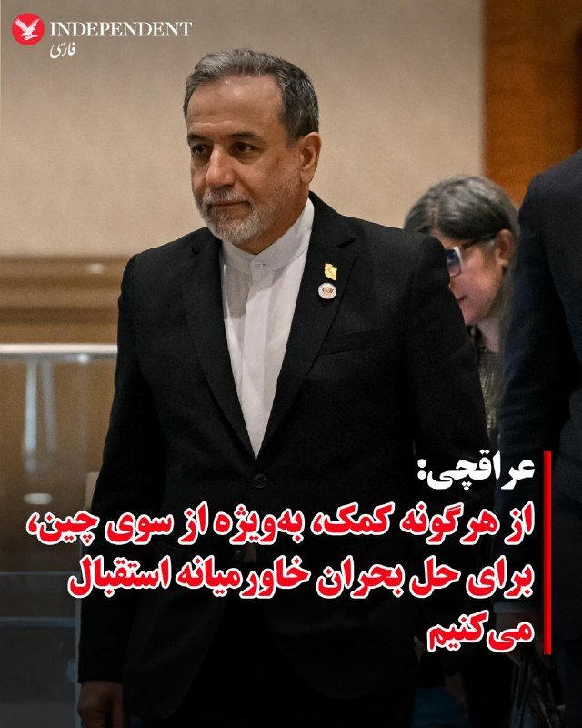
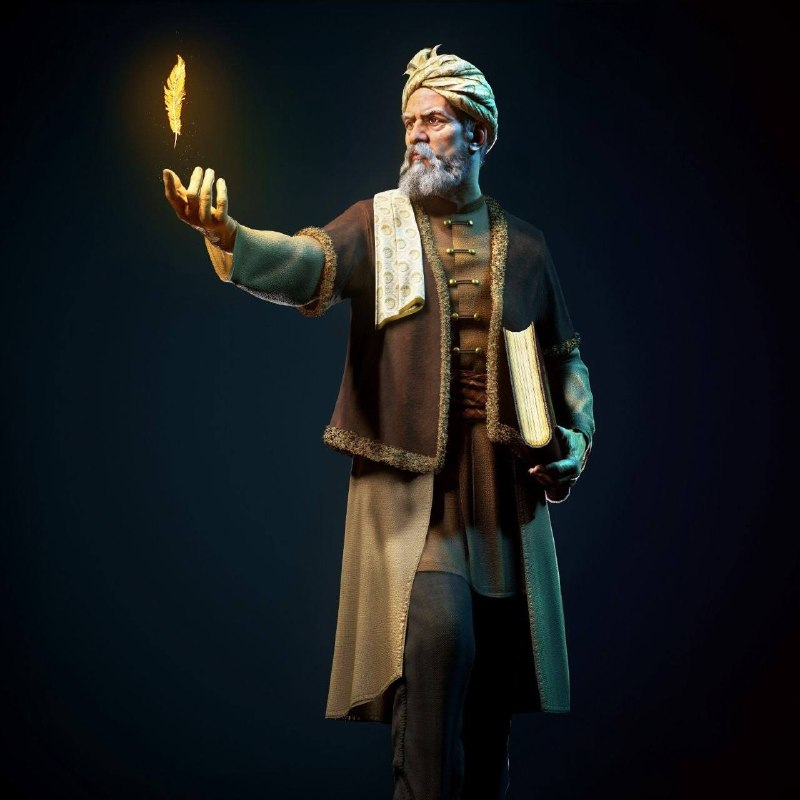
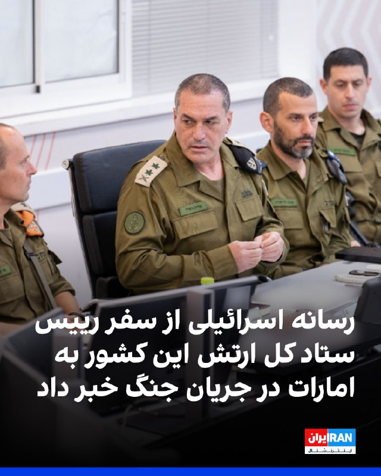
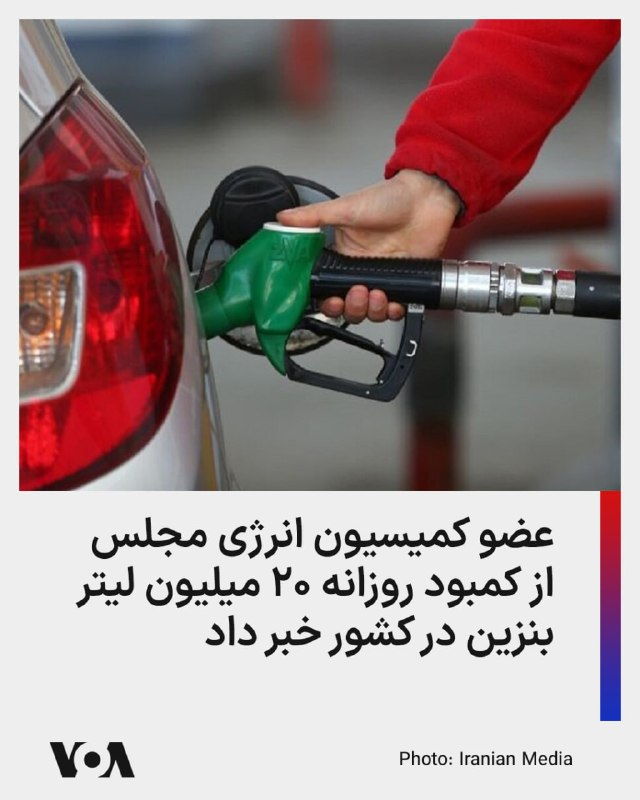
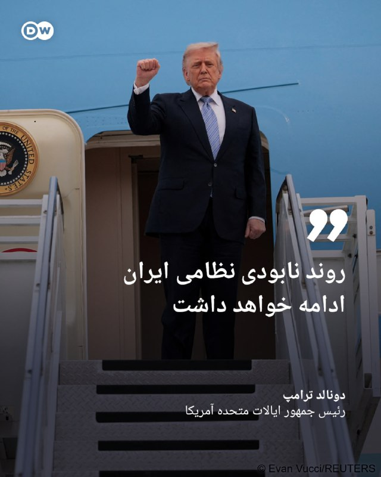
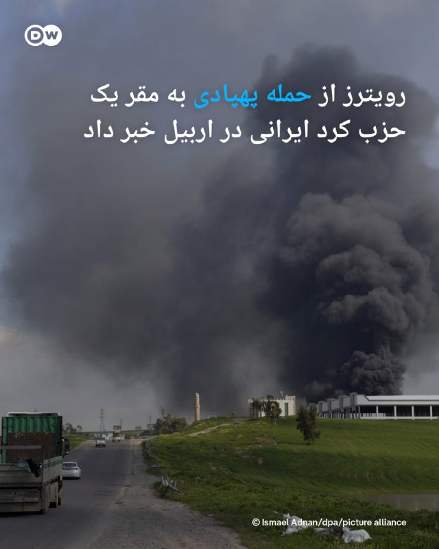
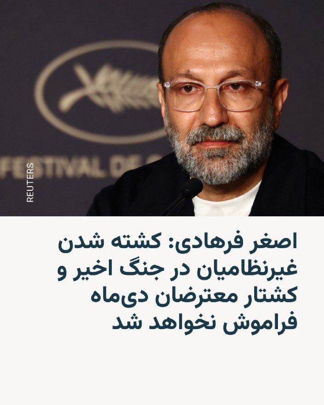
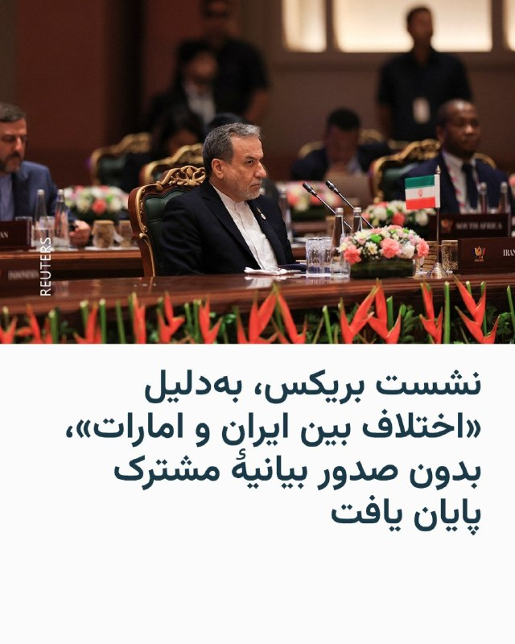
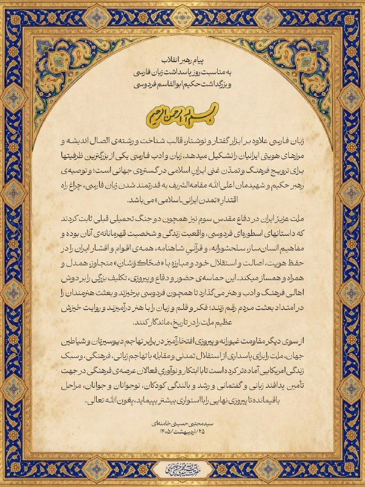

# خواننده تلگرام

<!-- TOP_NAV START -->

<a href="https://github.com/aliinreallife/aio-downloader/blob/main/telegram/content/archive_1.md" style="display:inline-block; padding:6px 12px; margin:0 4px; background-color:#2ea44f; color:white; text-decoration:none; border-radius:4px; font-weight:bold;">صفحه بعد</a>

<!-- TOP_NAV END -->

<!-- MSG START -->

---
📅 بروزرسانی: 1405/02/25 15:41
---

## VahidOOnLine — post 240299

  

⭕️ترامپ: مخالفتی با تعلیق ۲۰ ساله غنی‌سازی اورانیوم ایران ندارم ولی باید تعهد واقعی باشد

♦️دونالد ترامپ رئیس جمهوری ایالات متحده روز جمعه ۲۵ اردیبهشت و در زمان بازگشت از چین در هواپیمای ایرفورس وان به خبرنگاران گفت که مشکلی با تعلیق غنی‌سازی اورانیوم ایران به‌مدت ۲۰ سال ندارد اما این تعهد باید واقعی باشد.

ترامپ پیشتر گفته بود ایران دیگر هرگز نباید غنی‌سازی اورانیوم داشته باشد.

براساس گزارش‌های غیر رسمی مقام‌های جمهوری اسلامی بارها تاکید کرده‌اند که حداکثر غنی‌سازی ۵ ساله را می‌پذیرند. این در حالی است که اخیرا چند عضو مجلس شورای اسلامی گفته‌اند که تهران به‌هیچ وجه بحث تعلیق را نمی‌پذیرد.
‌🇸🇦 Indypersian

🤖 @VahidOOnLine

## VahidOOnLine — post 240298

  

شبکه کان اسرائیل گزارش داد ایال زمیر، رییس ستاد کل ارتش اسرائیل، در جریان جنگ علیه جمهوری اسلامی، به امارات متحده عربی سفر کرد. بر اساس این گزارش، زمیر در این سفر با مقام‌های اماراتی، از جمله محمد بن زاید آل نهیان، رییس این کشور، دیدار و گفت‌وگو کرده است.
‌🏁 🇬🇧 IranintlTV

🤖 @VahidOOnLine

## VahidOOnLine — post 240297

  

♦️عباس عراقچی، وزیر امور خارجه جمهوری اسلامی ایران، اعلام کرد تهران «هیچ اعتمادی» به ایالات متحده ندارد و فقط در صورتی به مذاکره با واشنگتن علاقه‌مند است که آمریکا در رویکرد خود «جدی» باشد.
عراقچی روز جمعه در جمع خبرنگاران در دهلی‌نو گفت پیام‌های متناقض آمریکا باعث شده ایران نسبت به نیت واقعی واشنگتن در مذاکرات تردید داشته باشد.
او همچنین درباره روند میانجی‌گری پاکستان گفت این روند شکست نخورده اما با «دشواری» مواجه شده است.
عراقچی تاکید کرد ایران تلاش می‌کند آتش‌بس فعلی حفظ شود تا فرصتی برای دیپلماسی فراهم شود، اما همزمان برای بازگشت به درگیری نیز آمادگی دارد.
اظهارات وزیر خارجه ایران چند ساعت پس از آن مطرح شد که دونالد ترامپ اعلام کرد صبرش در قبال ایران رو به پایان است و گفت در گفتگو با شی جین‌پینگ درباره لزوم بازگشایی تنگه هرمز توافق کرده است.
‌🇸🇦 Indypersian

🤖 @VahidOOnLine

## VahidOOnLine — post 240296

  

♦️دونالد ترامپ، رئیس جمهوری آمریکا روز جمعه ۲۵ اردیبهشت و در زمان بازگشت از چین به آمریکا در هواپیمای ایرفورس وان به خبرنگاران گفت با وجود آنکه نیروهای مسلح ایران در جنگ نابود شده‌اند، ممکن است نیاز به «یک پاکسازی کوچک» وجود داشته باشد.

ترامپ ساعاتی پیش در گفتگویی با فاکس‌نیوز هم گفته بود که نیروهای مسلح جمهوری اسلامی در چهار هفته گذشته، تلاش کرده‌اند تا تعدادی از پرتابگرهای موشکی را از زیر خاک بیرون بکشند و جای بعضی تجهیزات را عوض کنند، با این حال «آمریکا قادر است در دو روز همه این‌ها را نابود کند.»
‌🇸🇦 Indypersian

🤖 @VahidOOnLine

## VahidOOnLine — post 240295

  

⭕️ترامپ: شی تاکید دارد ایران نباید به سلاح هسته‌ای دست پیدا کند

♦️دونالد ترامپ، رئیس‌جمهوری آمریکا، روز جمعه اعلام کرد شی جین‌پینگ، رئیس‌جمهوری چین، «قویا» معتقد است که ایران نباید به سلاح هسته‌ای دست پیدا کند.

ترامپ در مسیر بازگشت از پکن به واشنگتن، در گفتگو با خبرنگاران در هواپیمای ایرفورس وان گفت: «او [شی] قویا معتقد است که آن‌ها نباید سلاح هسته‌ای داشته باشند.»

رئیس‌جمهوری آمریکا همچنین افزود که همتای چینی‌اش خواهان بازگشایی تنگه هرمز است.
ترامپ گفت: «او می‌خواهد تنگه [هرمز] باز شود.»
چین پیش‌تر خواستار برقراری آتش‌بس پایدار در خاورمیانه و بازگشایی سریع مسیرهای کشتیرانی شده بود.

پکن در دو روز گذشته میزبان دیدار تاریخی دونالد ترامپ، رئیس جمهوری آمریکا و همتای چینی‌اش، شی جی‌پینگ بود.
‌🇸🇦 Indypersian

🤖 @VahidOOnLine

## VahidOOnLine — post 240294

  <a href="telegram/content/VahidOOnLine_240294_1778847066.mp4" target="_blank">🎬 Download video</a>

بر اساس گزارش‌های منتشرشده توسط ایران اینترنشنال، ماموران حکومتی مانع برگزاری مراسم زادروز بهار شاه‌مهری بر مزار او شدند.

طبق این گزارش، خانواده بهار در روز تولدش قصد داشتند بر سر مزار او مراسم یادبود برگزار کنند، اما اجازه حضور و تجمع در محل خاکسپاری به آن‌ها داده نشد. در نتیجه، خانواده ناچار شدند مراسم را در خانه و در اتاق شخصی او برگزار کنند.

بر اساس این گزارش، افرادی ناشناس همچنین عکس بهار را که کنار مزارش قرار داشت، شکسته‌اند.
‌🏁 🇬🇧 IranintlTV

🤖 @VahidOOnLine

## VahidOOnLine — post 240293

  <a href="telegram/content/VahidOOnLine_240293_1778847068.mp4" target="_blank">🎬 Download video</a>

⭕️نخست وزیر هند در امارات: باز نگه داشتن تنگه هرمز بالاترین اولویت ماست

♦️نارندرا مودی، نخست‌وزیر هند، روز جمعه در آغاز سفر پنج‌کشوری خود وارد امارات متحده عربی شد، سفری که تحت تاثیر نگرانی‌ها از پیامدهای جنگ ایران بر بازار انرژی و زنجیره‌های تامین جهانی قرار گرفته است.

مودی که در بدو ورود با اسکورت جنگنده‌های نظامی همراهی شد، از سوی محمد بن زاید آل نهیان، رئیس امارات، مورد استقبال رسمی قرار گرفت.

مودی در دیدار با رئیس دولت امارات، با اشاره به اهمیت این آبراه هرمز گفت: «آزاد، باز و ایمن نگه داشتن تنگه هرمز بالاترین اولویت ما است و در این زمینه پایبندی به قوانین بین‌المللی ضروری است.»

وزارت خارجه هند اعلام کرد امارات و هند به توافق‌های راهبردی در حوزه نفت و گاز دست یافته‌اند و ابوظبی متعهد شده پنج میلیارد دلار در هند سرمایه‌گذاری کند، هرچند جزئیات بیشتری ارائه نشده است.

این سفر بخشی از تلاش گسترده‌تر هند برای گسترش شراکت‌های اقتصادی و راهبردی و کاهش وابستگی‌ها در شرایط تحولات ژئوپلیتیک ارزیابی می‌شود. مودی پس از امارات به هلند، سوئد، نروژ و ایتالیا سفر خواهد کرد.
‌🇸🇦 Indypersian

🤖 @VahidOOnLine

## VahidOOnLine — post 240292

  <a href="telegram/content/VahidOOnLine_240292_1778847071.mp4" target="_blank">🎬 Download video</a>

♦️عباس عراقچی، وزیر امور خارجه جمهوری اسلامی ایران، روز جمعه ۲۵ اردیبهشت ماه، در نشست خبری در دهلی‌نو اعلام کرد تهران پس از اظهارات اخیر دونالد ترامپ مبنی بر رد پیشنهاد تهران، پیام‌هایی از طرف آمریکا دریافت کرده که نشان می‌دهد واشنگتن همچنان خواهان ادامه گفتگوها و تعامل است.
عراقچی با اشاره به گزارش‌ها درباره رد شدن پیشنهاد یا پاسخ ایران از سوی آمریکا گفت: «اینکه مطرح شده آمریکا پیشنهاد یا پاسخ ایران را رد کرده، مربوط به چند روز پیش است؛ زمانی که آقای ترامپ در پیامی اعلام کرد این پیشنهاد غیرقابل قبول است.»
او افزود: «اما پس از آن، ما مجددا پیام‌هایی از طرف آمریکایی‌ها دریافت کردیم که مایل به ادامه گفتگوها و تعامل هستند.»
رسانه‌های ایران روز جمعه به‌نقل از تهران‌تایمز، نشریه انگلیسی‌زبان سازمان تبلیغات اسلامی‌گزارش داده بودند که آمریکا پیشنهاد ۱۴ ماده‌ای جمهوری اسلامی را رد کرده است‌.
‌🇸🇦 Indypersian

🤖 @VahidOOnLine

## VahidOOnLine — post 240291

  

تهران‌تایمز گزارش داد دولت آمریکا به پیشنهاد مکتوب جمهوری اسلامی درباره پایان جنگ پاسخ داده و پیشنهاد ۱۴ ماده‌ای تهران را رد کرده است.

بر اساس این گزارش، آمریکا با رد پیشنهادهای جمهوری اسلامی، بار دیگر مواضع خود، به‌ویژه در ارتباط با پرونده هسته‌ای را تکرار کرده است.

این روزنامه گزارش داد جمهوری اسلامی پیشنهاد خود را بر پایه روندی دو مرحله‌ای ارائه کرده بود؛ مرحله نخست به پایان جنگ در همه جبهه‌ها منجر می‌شد و در صورت برآورده شدن شروط تهران، مرحله دوم مذاکرات درباره موضوع هسته‌ای آغاز می‌شد.
‌🏁 🇬🇧 IranintlTV

🤖 @VahidOOnLine

## VahidOOnLine — post 240290

  

♦️عباس عراقچی، وزیر امور خارجه جمهوری اسلامی ایران، روز جمعه اعلام کرد تهران از هرگونه کمک برای حل بحران خاورمیانه، به‌ویژه از سوی چین، استقبال می‌کند.
عراقچی در جمع خبرنگاران در دهلی‌نو گفت: «از هر کشوری که توانایی کمک داشته باشد، قدردانی می‌کنیم؛ به‌ویژه چین.»
وزیر امور خارجه ایران با اشاره به روابط تهران و پکن افزود: «ما روابط بسیار خوبی با چین داریم و شریک راهبردی یکدیگر هستیم.»
او همچنین گفت: «می‌دانیم که چینی‌ها نیت خوبی دارند، بنابراین هر اقدامی که از سوی آن‌ها برای کمک به دیپلماسی انجام شود، از سوی جمهوری اسلامی مورد استقبال قرار خواهد گرفت.»
اظهارات عراقچی در حالی مطرح می‌شود که چین پیش‌تر خواستار برقراری آتش‌بس پایدار در خاورمیانه و بازگشایی سریع مسیرهای کشتیرانی شده بود.
پکن در دو روز گذشته میزبان دیدار تاریخی دونالد ترامپ، رئیس جمهوری آمریکا و همتای چینی‌اش، شی جی‌پینگ بود.
‌🇸🇦 Indypersian

🤖 @VahidOOnLine

## VahidOOnLine — post 240289

  

بلومبرگ به نقل از منابع آگاه گزارش داد امارات متحده عربی پس از آغاز حملات جمهوری اسلامی به کشورهای حوزه خلیج فارس، تلاش کرد کشورهای همسایه از جمله عربستان سعودی و قطر را برای مشارکت در یک پاسخ نظامی هماهنگ به حملات تهران متقاعد کند، اما با رد این درخواست از سوی آنها روبه‌رو شد.

به گفته این منابع، محمد بن زاید، رییس امارات متحده عربی مجموعه‌ای از تماس‌ها را با رهبران منطقه از جمله محمد بن سلمان، ولیعهد عربستان سعودی، برقرار کرد.

این منابع افزودند محمد بن زاید بر این باور بود که پاسخ گروهی کشورهای منطقه به ایران می‌تواند بازدارندگی ایجاد کند.
‌🏁 🇬🇧 IranintlTV

🤖 @VahidOOnLine

## VahidOOnLine — post 240288

  <a href="telegram/content/VahidOOnLine_240288_1778847076.mp4" target="_blank">🎬 Download video</a>

⭕️حمله پهپادی اوکراین به ساختمانی در ریازان روسیه سه کشته برجا گذاشت

♦️ویدیویی که روز جمعه در شبکه اجتماعی تلگرام منتشر شد، ساختمان مسکونی در حال سوختن و ستون‌های غلیظ دود در آسمان شهر ریازان روسیه را پس از حمله پهپادی اوکراین نشان می‌دهد.

خبرگزاری رویترز ضمن تایید این ویدیو، به نقل از پاول مالکوف، فرماندار منطقه ریازان گزارش کرد این حمله روز جمعه ۲۵ اردیبهشت رخ داده است و در جریان آن علاوه بر کشته شدن سه نفر، چند برج مسکونی و یک محوطه صنعتی آسیب دیده‌اند.
‌🇸🇦 Indypersian

🤖 @VahidOOnLine

## VahidOOnLine — post 240287

  

عباس عراقچی، وزیر خارجه جمهوری اسلامی، در یک نشست خبری در حاشیه اجلاس بریکس گفت جمهوری اسلامی در تلاش است آتش‌بس، «اگرچه بسیار ناپایدار است»، حفظ شود و به دیپلماسی فرصت داده شود.

او افزود: «به آمریکایی‌ها اعتماد نداریم و فقط در صورتی به مذاکرات علاقه‌مندیم که طرف مقابل جدی باشد.»

وزیر خارجه جمهوری اسلامی، در ادامه اظهاراتش گفت مذاکرات کنونی با آمریکا «از نبود اعتماد رنج می‌برد».

او همچنین گفت همه کشتی‌ها می‌توانند از تنگه هرمز عبور کنند، «به‌جز آن‌هایی که با ما در جنگ هستند».
‌🏁 🇬🇧 IranintlTV

🤖 @VahidOOnLine

## VahidOOnLine — post 240286

  <a href="telegram/content/VahidOOnLine_240286_1778847080.mp4" target="_blank">🎬 Download video</a>

یکی از مخاطبان ایران‌اینترنشنال که از بندرعباس پیام فرستاده، می‌گوید قیمت کالاها به‌شدت افزایش یافته و صف‌های طولانی در جایگاه‌های سوخت، زندگی روزمره مردم را مختل کرده است. او می‌گوید این شرایط در شهری رخ می‌دهد که قطب تجارت، صنعت و نفت و گاز ایران به شمار می‌رود. این پیام با هوش مصنوعی خوانده شده است.
‌🏁 🇬🇧 IranintlTV

🤖 @VahidOOnLine

## VahidOOnLine — post 240285

  

♦️امیر حاتمی، فرمانده کل ارتش جمهوری اسلامی، روز جمعه ۲۵ اردیبهشت ماه گفت «قدرت ایمان» جنگنده اف-۵ ایران را به مواضع نیروهای آمریکایی در کویت رسانده و از «پیشرفته‌ترین سامانه‌های پدافندی زمین‌پایه و هوایی» آنها عبور کرده است.
پیشتر شبکه خبری ان‌بی‌سی نیوز گزارش کرده بود که در روزهای ابتدایی جنگ یک جنگنده اف‌ــ۵ ایرانی توانسته است از سامانه‌های پدافندی عبور کند و پایگاه کمپ بوهرینگ در کویت را هدف قرار دهد.
جنگنده‌های ۶۰ ساله اف-۵ ارتش ایران، در دوره محمدرضا شاه خریداری شدند.
حاتمی در ادامه گفت: «نیروهای مسلح با تمام قوا از تمامیت ارضی، استقلال کشور و نظام جمهوری اسلامی ایران پاسداری خواهند کرد.»
‌🇸🇦 Indypersian

🤖 @VahidOOnLine

## VahidOOnLine — post 240284

  

کاظم غریب‌آبادی، معاون وزیر خارجه جمهوری اسلامی، امارات متحده عربی را به همکاری با آمریکا و اسرائیل در حملات علیه جمهوری اسلامی متهم کرد و گفت تهران در چارچوب «حق دفاع مشروع» به پایگاه‌ها و تاسیسات مورد استفاده آمریکا در امارات حمله کرده است.
‌🏁 🇬🇧 IranintlTV

🤖 @VahidOOnLine

## WithYashar — post 11290

  <a href="telegram/content/WithYashar_11290_1778847084.mp4" target="_blank">🎬 Download video</a>

🥲 @withyashar

## WithYashar — post 11289

  <a href="telegram/content/WithYashar_11289_1778847086.mp4" target="_blank">🎬 Download video</a>

امروز 25 اردیبهشت روز پاسداشت زبان فارسی و بزرگداشت فردوسیه
@withyashar

## WithYashar — post 11288

  <a href="telegram/content/WithYashar_11288_1778847088.mp4" target="_blank">🎬 Download video</a>

روانه شدن نفت در سواحل جزایر خلیج فارس جمهموری اسلامی داره نفتو تو دریا میریزه و جان موجودات دریایی و زیست بوم ها رو به خطر انداخته
@withyashar

## WithYashar — post 11287

  <a href="telegram/content/WithYashar_11287_1778847090.mp4" target="_blank">🎬 Download video</a>

کارشناس صداسیما : نتانیاهو نه خسته شده نه عقب میخواد بکشه بنظرم واقعا مَرده واقعا مَرده و میخواد ایرانو
از 100 درصد به 20 درصد برسونه

همین الانم اماده ترین عنصر برای
حمله به ایران؛ اسرائیله
نتانیاهو نه کم آورده نه علائمی از خستگی داره نه پشیمانه
@withyashar

## WithYashar — post 11286

ترامپ به فاکس‌نیوز: ما می‌توانستیم پل‌ها و شبکه‌های برق ایران را نابود کنیم و می‌توانیم ظرف دو روز همه چیز را در آنجا از بین ببریم.
@withyashar

## WithYashar — post 11285

ترامپ به فاکس‌نیوز : ما ارتش ایران را نابود کرده‌ایم و شاید باید یک پاکسازی سبک انجام دهیم.
میتوانیم نیروگاه‌های ایران را تنها در دو روز از بین ببریم
اگر ایران اورانیوم های غنی شده خودش رو تحویل نده وارد ایران میشیم
@withyashar

## WithYashar — post 11284

Voice message

## WithYashar — post 11283

مارو به قاهره میبره؟
خب پس بذار هرچی میخواد بگه

## WithYashar — post 11282

ترامپ به فاکس‌نیوز:
پیشنهاد ایرانیا که برام رسید همون‌ جمله ی اول متنشونو که خوندم برام قابل قبول نبود و سریع ردش کردم
@withyashar

## WithYashar — post 11281

  <a href="telegram/content/WithYashar_11281_1778847092.mp4" target="_blank">🎬 Download video</a>

ترامپ وسط پرواز به فاکس نیوز اعلام کرد که ممکن است توقف ۲۰ سالهٔ فعالیت هسته‌ای ایران را بپذیرد.

ترامپ:“بیست سال کافی است. اما میزان تضمینی که از طرف آن‌ها می‌گیریم… باید واقعاً یک بیست سالِ واقعی باشد.”»
@withyashar

## WithYashar — post 11280

ترامپ وسط‌ پرواز به فاکس‌نیوز : «من دیگر خیلی بیشتر از این صبر نخواهم کرد. آنها باید توافق را امضا کنند.»
«مواد هسته‌ای» ایران، ممکنه به چین یا آمریکا تحویل داده شه!
@withyashar

## WithYashar — post 11279

ترامپ وسط پرواز به فاکس نیوز :
اما در نهایت فکر می‌کنم الان آخرین چیزی که دنیا نیاز دارد جنگ است، مخصوصاً جنگی که هزاران کیلومتر دورتر است.

شی درباره مسائل مختلفی مثل ، حملات سایبری و جاسوسی صحبت کرد. گفت هم آن‌ها جاسوسی می‌کنند و هم ما. این یک واقعیت است و همه این کار را انجام می‌دهند، اما معمولاً درباره‌اش صحبت نمی‌شود.

او گفت آمریکا در چین جاسوسی می‌کند. من گفتم ما هم همین کار را انجام می‌دهیم. این یک واقعیت است و مسئله‌ای است که همه طرف‌ها درگیر آن هستند
@withyashar

## WithYashar — post 11278

ترامپ وسط پرواز به فاکس نیوز :
شین گفت برخورد شما قوی‌تر از قبل بوده، چون ما با انها(حکومت ایران) رابطه داریم و ما درباره این موضوع صحبت کردیم. من گفتم این مثل جنگ است و حق با من بود. موضوع قدرت بود و همه با آن درگیر شدیم. این موضوع روی رابطه ما تأثیر گذاشت، اما قبل و بعد از آن رابطه خوبی داشتیم و الان هم رابطه‌مان قوی است. حتی به جایی رفتم که او زندگی می‌کند، که اتفاق نادری است. با هم ناهار خوردیم و درک خوبی بین ما وجود دارد. فکر می‌کنم او معتقد است اتفاقات مثبتی بین دو کشور در حال رخ دادن است
@withyashar

## WithYashar — post 11277

ترامپ وسط پرواز به فاکس نیوز :
نیویورک تایمز هم گزارش‌هایی داده بود درباره تحریم شرکت‌های چینی که نفت ایران می‌خرند. درباره آن صحبت کردیم و بعداً هم صحبت خواهیم کرد
@withyashar

## WithYashar — post 11276

ترامپ وسط پرواز به فاکس نیوز : شین گفته جنگ باید متوقف شود. من چنین حرفی نمی‌زنم. فکر می‌کنم او آدم خوبی است، اما از بعضی حرف‌هایش خوشم نیامد. مثلاً گفته کشتی‌ها باید بعد از پایان کار نفت متوقف شوند. ما هم از نظر نظامی تقریباً کار را تمام کرده‌ایم، اما هنوز کامل نشده است.
ما حدود ۷۰ تا ۷۵ درصد کار را انجام داده‌ایم، نه همه‌اش را. برمی‌گردیم و بقیه را هم تمام می‌کنیم. بعضی بخش‌ها هنوز باقی مانده است. توان موشکی و پرتابگرهای موشک هنوز به طور کامل از بین نرفته‌اند، هرچند گفته می‌شود حدود ۸۰ درصد آن‌ها نابود شده است. تولید موشک هم بیشتر آن از بین رفته است
@withyashar

## mwarmonitor — post 9125

🔹خبرنگار: «فکر می‌کنید "شی" (رئیس‌جمهور چین) در معاملاتش با شما، نسبت به آخرین باری که با هم در ارتباط بودید، احساس قدرت بیشتری می‌کرد؟ قبل از اینکه کووید سر و کله‌اش پیدا شود...» 🔸ترامپ: «خب، من آن‌ها را بابت آن (کووید) مقصر دانستم. گفتم که کارِ "ووهان" بود…

## mwarmonitor — post 9124

🔹خبرنگار: «در مورد معاملات با چین چطور؟ آیا در مورد سویا به توافقی رسیدید؟ می‌دانید که کشاورزان...» 🔸ترامپ: «بله، کشاورزان خیلی خوشحال خواهند شد. آن‌ها قرار است میلیاردها دلار سویا بخرند. بله.» 🔹خبرنگار: «آقای رئیس‌جمهور، داشتیم در مورد بریتانیا صحبت می‌کردیم،…

## mwarmonitor — post 9123

🔸ترامپ: نمی‌خوام این رو بگم. یعنی دوست دارم بهتون بگم. دوست دارم بگم در یک ساعت خاص، در یک روز خاص، بمباران قراره... [اما] نمی‌خوام این رو بگم. فقط می‌تونم بگم که ایران... این رو با اطمینان بسیار بسیار قوی می‌تونم بگم... ایران هرگز سلاح هسته‌ای نخواهد داشت.…

## mwarmonitor — post 9122

🔹خبرنگار: می‌خوام متوجه بشم که او (شی جین‌پینگ) دقیقاً به چه چیزی متعهد شده، اصلاً تعهدی داده؟ 🔸ترامپ: خب، نمی‌خوام بگم کسی تعهدی داده، اما ما تفاهم خیلی خوبی با هم داریم. می‌دونید، مفهوم «خلع سلاح هسته‌ای»... 🔹خبرنگار: خلع سلاح هسته‌ای یا فقط تمدید (قراردادها)؟…

## mwarmonitor — post 9121

🔹خبرنگار: آقای رئیس‌جمهور، در شبکه "تروث سوشال" (Truth Social) گفتید که رئیس‌جمهور شی (رئیس‌جمهور چین) به افول ایالات متحده اشاره کرده است. ما نشنیدیم که او چنین چیزی بگوید، شاید چیزی بوده که در خلوت گفته است. اول از همه، او دقیقاً چه گفت که باعث شد شما آن…

## mwarmonitor — post 9120

...باز کردن تنگه [هرمز]. اما همان‌طور که او (رهبر چین) گفت، آن‌ها آن را بستند و بعد شما با یک لبخند آن‌ها را [مجبور به] بستن کردید. و این حقیقت دارد؛ ما کنترل تنگه را در دست داریم. و آن‌ها هیچ معامله‌ای انجام نداده‌اند، در واقع در دو هفته و نیم گذشته هیچ معامله‌ای…

## mwarmonitor — post 9119

🔸ترامپ: سلام به همگی. خب، ما اقامت بسیار خوبی داشتیم، دوران فوق‌العاده‌ای بود. رئیس‌جمهور شی (جین‌پینگ) آدم بی‌نظیریه. ما روی معاملات تجاری خیلی خوبی توافق کردیم، از جمله بیش از ۲۰۰ هواپیما از بوئینگ با وعده خرید تا ۷۵۰ هواپیما، که اگر ۲۰۰ تای اول رو به خوبی…

## mwarmonitor — post 9118

🇺🇸رئیس جمهور ترامپ در حال صحبت با مطبوعات در هواپیمای ایر فورس وان در مسیر انکوریج، آلاسکا، ۱۵ مه ۲۰۲۶ @mwarmonitor

## mwarmonitor — post 9117

🇺🇸رئیس جمهور ترامپ در حال صحبت با مطبوعات در هواپیمای ایر فورس وان در مسیر انکوریج، آلاسکا، ۱۵ مه ۲۰۲۶

@mwarmonitor

## mwarmonitor — post 9116

🦠«یک شیوع جدید از ویروس بسیار مسری ابولا در استان اییتوری در شرق کنگو تأیید شده است، به گفته نهاد اصلی بهداشت عمومی آفریقا. تاکنون ۲۴۶ مورد مشکوک و ۶۵ مرگ ثبت شده است.»

@mwarmonitor

## mwarmonitor — post 9115

🔴«بلومبرگ گزارش داد که امارات متحده عربی تلاش کرد عربستان سعودی و قطر را برای هماهنگی یک پاسخ مشترک علیه ایران در جریان جنگ هماهنگ کند، اما موفق نشد؛ به گفته افرادی مطلع از موضوع.»

@mwarmonitor

## mwarmonitor — post 9114

🇮🇷«وزیر امور خارجه عراقچی: همه کشتی‌ها می‌توانند از تنگه هرمز عبور کنند، به‌جز آن‌هایی که با ما در حال جنگ هستند.»

📝دفعه قبل که گفته بود «تنگه هرمز باز است»، سپاه هم ظاهراً در واکنشی کاملاً رسمی گفته بود:
«گُه زیاد نخور، برای دستگاه گوارشت خوب نیست!»

@mwarmonitor

## pm_afshaa — post 90787

  <a href="telegram/content/pm_afshaa_90787_1778847094.webm" target="_blank">🎬 Download video</a>

🔴ترامپ به فاکس‌نیوز: ما میتونستیم پل‌ها و شبکه‌های برق ایران رو نابود کنیم و میتونیم ظرف دو روز همه چیز رو در آنجا از بین ببریم.

💧 Rainbet.com the #1 Non-KYC Crypto Casino & Sportsbook @rainbetcom

😁 @Pm_Afshaa

## pm_afshaa — post 90786

  <a href="telegram/content/pm_afshaa_90786_1778847095.webm" target="_blank">🎬 Download video</a>

🔴بلومبرگ: امارات تلاش کرد عربستان و قطر رو برای مشارکت در یک پاسخ نظامی مشترک علیه جمهوری اسلامی همراه کنه، اما هر دو کشور این درخواست رو رد کردن.

💧 Rainbet.com the #1 Non-KYC Crypto Casino & Sportsbook @rainbetcom

😁 @Pm_Afshaa

## pm_afshaa — post 90785

امروز 25 اردیبهشت روز پاسداشت زبان فارسی و بزرگداشت فردوسیه 
💧 Rainbet.com the #1 Non-KYC Crypto Casino & Sportsbook @rainbetcom 
😁 @Pm_Afshaa

## pm_afshaa — post 90784

  

امروز 25 اردیبهشت روز پاسداشت زبان فارسی و بزرگداشت فردوسیه

💧 Rainbet.com the #1 Non-KYC Crypto Casino & Sportsbook @rainbetcom

😁 @Pm_Afshaa

## pm_afshaa — post 90783

  <a href="telegram/content/pm_afshaa_90783_1778847096.mp4" target="_blank">🎬 Download video</a>

روانه شدن نفت در سواحل جزایر خلیج فارس جمهموری اسلامی داره نفتو تو دریا میریزه و جان موجودات دریایی و زیست بوم ها رو به خطر انداخته

💧 Rainbet.com the #1 Non-KYC Crypto Casino & Sportsbook @rainbetcom

😁 @Pm_Afshaa

## pm_afshaa — post 90782

  <a href="telegram/content/pm_afshaa_90782_1778847099.webm" target="_blank">🎬 Download video</a>

🔴ترامپ: به رئیس جمهور چین گفتم در مورد پرونده تایوان صحبت نمی‌کنم.

💧 Rainbet.com the #1 Non-KYC Crypto Casino & Sportsbook @rainbetcom

😁 @Pm_Afshaa

## pm_afshaa — post 90781

  <a href="telegram/content/pm_afshaa_90781_1778847100.webm" target="_blank">🎬 Download video</a>

🔴ترامپ: من مشکلی ندارم که ایران برنامه هسته‌ای خودش رو به مدت 20 سال تعلیق کنه، اما این باید یک تعهد واقعی باشه.

💧 Rainbet.com the #1 Non-KYC Crypto Casino & Sportsbook @rainbetcom

😁 @Pm_Afshaa

## pm_afshaa — post 90780

  <a href="telegram/content/pm_afshaa_90780_1778847100.webm" target="_blank">🎬 Download video</a>

🔴ترامپ: وقتی به پیشنهاد ایران نگاه کردم، جمله اول رو دوست نداشتم و قابل قبول نبود، بنابراین پیشنهاد رو رد کردم.

💧 Rainbet.com the #1 Non-KYC Crypto Casino & Sportsbook @rainbetcom

😁 @Pm_Afshaa

## pm_afshaa — post 90779

  <a href="telegram/content/pm_afshaa_90779_1778847101.webm" target="_blank">🎬 Download video</a>

🔴ترامپ: ارتش ایران رو از بین بردیم و شاید باید یک عملیات پاکسازی سبک انجام دهیم.

💧 Rainbet.com the #1 Non-KYC Crypto Casino & Sportsbook @rainbetcom

😁 @Pm_Afshaa

## pm_afshaa — post 90778

🔴روبیو: اگر ایران فکر می‌کند ما برای رسیدن به توافق امتیازاتی می‌دهیم، سخت در اشتباه است

💧 Rainbet.com the #1 Non-KYC Crypto Casino & Sportsbook @rainbetcom

😁 @Pm_Afshaa

## pm_afshaa — post 90777

  <a href="telegram/content/pm_afshaa_90777_1778847102.webm" target="_blank">🎬 Download video</a>

🔴دونالد ترامپ: نیروی هوایی ایران رو به طور کامل حذف کردیم و از شر رهبران ایران خلاص شدیم.

💧 Rainbet.com the #1 Non-KYC Crypto Casino & Sportsbook @rainbetcom

😁 @Pm_Afshaa

## pm_afshaa — post 90776

  <a href="telegram/content/pm_afshaa_90776_1778847102.webm" target="_blank">🎬 Download video</a>

🔴ترامپ: من از رئیس جمهور چین نخواستم که به ایران برای باز کردن تنگه هرمز فشار بیاورد.

💧 Rainbet.com the #1 Non-KYC Crypto Casino & Sportsbook @rainbetcom

😁 @Pm_Afshaa

## pm_afshaa — post 90775

  <a href="telegram/content/pm_afshaa_90775_1778847103.webm" target="_blank">🎬 Download video</a>

🔴ترامپ به فاکس‌ نیوز: من دیگر خیلی بیشتر از این صبر نخواهم کرد. آنها باید توافق رو امضا کنند. مواد هسته‌ای ایران، ممکنه به چین یا آمریکا تحویل داده شه!

💧 Rainbet.com the #1 Non-KYC Crypto Casino & Sportsbook @rainbetcom

😁 @Pm_Afshaa

## pm_afshaa — post 90774

  

پس از سفر ترامپ و تیم اقتصادیش به چین، بازار سهام آمریکا باز هم رکورد تاریخی زد و حدود بیست درصد رشد رو تجربه کرد

💧 Rainbet.com the #1 Non-KYC Crypto Casino & Sportsbook @rainbetcom

😁 @Pm_Afshaa

## pm_afshaa — post 90773

وای‌نت: امارات متحده عربی تلاش کرد کشورهای همسایه رو برای حمله مشترک به جمهوری اسلامی متقاعد کنه.

💧 Rainbet.com the #1 Non-KYC Crypto Casino & Sportsbook @rainbetcom

😁 @Pm_Afshaa

## pm_afshaa — post 90772

  <a href="telegram/content/pm_afshaa_90772_1778847104.webm" target="_blank">🎬 Download video</a>

🔴ویکتور گائو، پژوهشگر چینی:
نشست ترامپ و شی ۹.۹۹ از ۱۰ بود. این دیدار بسیار موفق، دقیق برنامه‌ریزی‌شده و در عین حال پر از هیجان و خودجوشی بود؛ واقعا یک لحظه تاریخی.

سفر ترامپ به چین «گامی مهم در مسیر درست» برای روابط دو کشوره.

💧 Rainbet.com the #1 Non-KYC Crypto Casino & Sportsbook @rainbetcom

😁 @Pm_Afshaa

## pm_afshaa — post 90771

  <a href="telegram/content/pm_afshaa_90771_1778847105.webm" target="_blank">🎬 Download video</a>

🔴کانال 11 اسرائیل: گزینه حملات هدفمند به زیرساخت‌های انرژی در ایران روی میزه.

💧 Rainbet.com the #1 Non-KYC Crypto Casino & Sportsbook @rainbetcom

😁 @Pm_Afshaa

## DEJradio — post 4649

  <a href="telegram/content/DEJradio_4649_1778847106.mp4" target="_blank">🎬 Download video</a>

🚨
🔸 مستند؛
آمنه‌سادات ذبیح‌پور- خانم خبرنگار دست در دست نیروهای امنیتی

#نیروهای_امنیتی #بازجو_خبرنگار
@DEJradio

## IranIntlTV — post 337314

  

شبکه کان اسرائیل گزارش داد ایال زمیر، رییس ستاد کل ارتش اسرائیل، در جریان جنگ علیه جمهوری اسلامی، به امارات متحده عربی سفر کرد. بر اساس این گزارش، زمیر در این سفر با مقام‌های اماراتی، از جمله محمد بن زاید آل نهیان، رییس این کشور، دیدار و گفت‌وگو کرده است.
https://iranintl.com/202605157769

## IranIntlTV — post 337313

  

🔻علی تاجرنیا، رییس هیات مدیره باشگاه استقلال، در جمع خبرنگاران درباره معرفی این تیم به کنفدراسیون فوتبال آسیا به‌عنوان نماینده فوتبال ایران در لیگ نخبگان گفت: «اگر بقیه ناراحت نشوند، می‌گوییم استقلال فصل آینده نماینده ایران در لیگ نخبگان است.»

🔹او در ادامه درباره پیشنهاد برگزاری تورنمنت چندجانبه میان تیم‌های بالای جدول برای انتخاب قهرمان و نمایندگان آسیا گفت: «به هیچ عنوان زیر بار تورنمنت چندجانبه نمی‌رویم، در آن شرکت نمی‌کنیم و از فدراسیون فوتبال می‌خواهم هرچه زودتر نماینده‌های آسیایی را اعلام کند.»

🔹تاجرنیا درباره آخرین وضعیت پنجره نقل‌وانتقالاتی استقلال نیز گفت: «استقلال با بیشتر بازیکنان خود قرارداد دوساله دارد و قرارداد بخشی از بازیکنانی که قرارداد یک‌ساله دارند نیز تمدید می‌شود. پنجره باشگاه به‌زودی باز خواهد شد.»

🔹او افزود: «آن‌هایی که خود را دلسوز استقلال می‌دانند، بهتر است اجازه دهند صاحبان و تصمیم‌گیران باشگاه این دلسوزی را بیشتر نشان دهند.»

@iranintltvsport

## IranIntlTV — post 337312

  <a href="telegram/content/IranIntlTV_337312_1778847110.mp4" target="_blank">🎬 Download video</a>

بر اساس گزارش‌های منتشرشده توسط ایران اینترنشنال، ماموران حکومتی مانع برگزاری مراسم زادروز بهار شاه‌مهری بر مزار او شدند.

طبق این گزارش، خانواده بهار در روز تولدش قصد داشتند بر سر مزار او مراسم یادبود برگزار کنند، اما اجازه حضور و تجمع در محل خاکسپاری به آن‌ها داده نشد. در نتیجه، خانواده ناچار شدند مراسم را در خانه و در اتاق شخصی او برگزار کنند.

بر اساس این گزارش، افرادی ناشناس همچنین عکس بهار را که کنار مزارش قرار داشت، شکسته‌اند.

## IranIntlTV — post 337311

  <a href="telegram/content/IranIntlTV_337311_1778847113.mp4" target="_blank">🎬 Download video</a>

پیام‌های شهروندان به ایران‌اینترنشنال حاکی است نیروهای انتظامی جمهوری اسلامی، هفته‌ها پس از برقراری آتش‌بس، همچنان خارج از مقرهای نظامی مستقر هستند. برخی از گزارش‌های مردمی از استقرار این نیروها در اصفهان و کرمانشاه، در مکان‌هایی از جمله قبرستان‌ها و بیابان‌ها خبر می‌دهند.

گفت‌وگو با محسن مهیمنی، خبرنگار ایران‌اینترنشنال
@iranintltv

## IranIntlTV — post 337310

  <a href="telegram/content/IranIntlTV_337310_1778847114.mp4" target="_blank">🎬 Download video</a>

رسیدگی به پرونده متهمان حمله با کوکتل مولوتوف به پارکینگ ساختمان مجاور دفتر ایران اینترنشنال در لندن، در دادگاه اولد بیلی آغاز شد. سه متهم این پرونده با اتهام پرتاب مواد آتش‌زا و به خطر انداختن جان مردم محاکمه می‌شوند.
تاج‌الدین سروش، عضو تحریریه ایران‌اینترنشال، گزارش می‌دهد
@iranintltv

## IranIntlTV — post 337309

  <a href="telegram/content/IranIntlTV_337309_1778847116.mp4" target="_blank">🎬 Download video</a>

برد کوپر، فرمانده ستاد فرماندهی مرکزی ایالات متحده، سنتکام، تایید کرد تخریب یک مدرسه در ایران که مقام‌های جمهوری اسلامی مدعی کشته شدن ۱۷۵ نفر در آن هستند، ممکن است بر اثر اصابت یک بمب آمریکایی رخ داده باشد. او گفت این حادثه همچنان در دست بررسی است و ارتش آمریکا مسئولیت آن را نپذیرفته است.
جزییات بیشتر با علی شیرازی، عضو تحریریه ایران‌اینترنشنال
@iranintltv

## IranIntlTV — post 337308

  <a href="telegram/content/IranIntlTV_337308_1778847119.mp4" target="_blank">🎬 Download video</a>

عصر ۲۶ فروردین به پارکینگی در مجاورت دفتر ایران‌اینترنشنال در شمال لندن با دو کوکتل مولوتوف حمله شد. دادگاه اولد‌بِیلی لندن اعلام کرد رسیدگی به پرونده سه متهم این حمله آغاز شده است. اویسین مک‌گینس ۲۱ ساله، ناتان دان ۱۹ ساله و یک پسر ۱۶ ساله به اتهام پرتاب مواد آتش‌زا و به خطر انداختن جان مردم در این دادگاه محاکمه می‌شوند.
@iranintltv

## IranIntlTV — post 337307

  <a href="telegram/content/IranIntlTV_337307_1778847120.mp4" target="_blank">🎬 Download video</a>

ارتش تایوان روز چهارشنبه ۱۳ مه در شهرستان کینمن یک رزمایش با آتش واقعی برگزار کرد که در آن سناریوی دفاع در برابر تلاش نیروهای دشمن برای پیاده‌سازی در این جزیره شبیه‌سازی شد. به گزارش یوت دیلی نیوز، رسانه وابسته به وزارت دفاع تایوان، این رزمایش در نزدیکی فرودگاه کینمن برگزار شد و شامل استفاده از موشک‌های جاولین، هویتزرها، تانک‌های M60A3 و نفربرهای زرهی CM21 بود.
@iranintltv

## IranIntlTV — post 337306

  

تهران‌تایمز گزارش داد دولت آمریکا به پیشنهاد مکتوب جمهوری اسلامی درباره پایان جنگ پاسخ داده و پیشنهاد ۱۴ ماده‌ای تهران را رد کرده است.

بر اساس این گزارش، آمریکا با رد پیشنهادهای جمهوری اسلامی، بار دیگر مواضع خود، به‌ویژه در ارتباط با پرونده هسته‌ای را تکرار کرده است.

این روزنامه گزارش داد جمهوری اسلامی پیشنهاد خود را بر پایه روندی دو مرحله‌ای ارائه کرده بود؛ مرحله نخست به پایان جنگ در همه جبهه‌ها منجر می‌شد و در صورت برآورده شدن شروط تهران، مرحله دوم مذاکرات درباره موضوع هسته‌ای آغاز می‌شد.
https://iranintl.com/202605157552

## IranIntlTV — post 337305

  

بلومبرگ به نقل از منابع آگاه گزارش داد امارات متحده عربی پس از آغاز حملات جمهوری اسلامی به کشورهای حوزه خلیج فارس، تلاش کرد کشورهای همسایه از جمله عربستان سعودی و قطر را برای مشارکت در یک پاسخ نظامی هماهنگ به حملات تهران متقاعد کند، اما با رد این درخواست از سوی آنها روبه‌رو شد.

به گفته این منابع، محمد بن زاید، رییس امارات متحده عربی مجموعه‌ای از تماس‌ها را با رهبران منطقه از جمله محمد بن سلمان، ولیعهد عربستان سعودی، برقرار کرد.

این منابع افزودند محمد بن زاید بر این باور بود که پاسخ گروهی کشورهای منطقه به ایران می‌تواند بازدارندگی ایجاد کند.
https://iranintl.com/202605157589

## IranIntlTV — post 337304

  <a href="telegram/content/IranIntlTV_337304_1778847123.mp4" target="_blank">🎬 Download video</a>

اصغر فرهادی، کارگردان ایرانی، در نشست خبری فیلم «داستان‌های موازی» در جشنواره کن به لی‌لی نیکفر، خبرنگار ایران‌اینترنشنال، گفت کشته شدن تعداد زیادی از معترضان «بی‌گناه» در جریان اعتراضات دی‌ماه و همچنین کشته شدن غیرنظامیان در جنگ دردناک بود.

او افزود مخالفت با کشته شدن بی‌گناهان و غیرنظامیان در جنگ به معنی موافقت با کشته شدن معترضان نیست. فرهادی گفت کشته شدن هر انسانی جنایت است؛ چه در جنگ، چه با اعدام و چه در اعتراضات.
@iranintltv

## IranIntlTV — post 337303

  

عباس عراقچی، وزیر خارجه جمهوری اسلامی، در یک نشست خبری در حاشیه اجلاس بریکس گفت جمهوری اسلامی در تلاش است آتش‌بس، «اگرچه بسیار ناپایدار است»، حفظ شود و به دیپلماسی فرصت داده شود.

او افزود: «به آمریکایی‌ها اعتماد نداریم و فقط در صورتی به مذاکرات علاقه‌مندیم که طرف مقابل جدی باشد.»

وزیر خارجه جمهوری اسلامی، در ادامه اظهاراتش گفت مذاکرات کنونی با آمریکا «از نبود اعتماد رنج می‌برد».

او همچنین گفت همه کشتی‌ها می‌توانند از تنگه هرمز عبور کنند، «به‌جز آن‌هایی که با ما در جنگ هستند».
https://iranintl.com/202605155857

## IranIntlTV — post 337302

  <a href="telegram/content/IranIntlTV_337302_1778847126.mp4" target="_blank">🎬 Download video</a>

سرخط خبرهای جمعه ۲۵ اردیبهشت
@iranintltv

## IranIntlTV — post 337301

  <a href="telegram/content/IranIntlTV_337301_1778847128.mp4" target="_blank">🎬 Download video</a>

یکی از مخاطبان ایران‌اینترنشنال که از بندرعباس پیام فرستاده، می‌گوید قیمت کالاها به‌شدت افزایش یافته و صف‌های طولانی در جایگاه‌های سوخت، زندگی روزمره مردم را مختل کرده است. او می‌گوید این شرایط در شهری رخ می‌دهد که قطب تجارت، صنعت و نفت و گاز ایران به شمار می‌رود. این پیام با هوش مصنوعی خوانده شده است.

## IranIntlTV — post 337300

  

کاظم غریب‌آبادی، معاون وزیر خارجه جمهوری اسلامی، امارات متحده عربی را به همکاری با آمریکا و اسرائیل در حملات علیه جمهوری اسلامی متهم کرد و گفت تهران در چارچوب «حق دفاع مشروع» به پایگاه‌ها و تاسیسات مورد استفاده آمریکا در امارات حمله کرده است.
https://iranintl.com/202605156930

## FarsiVOA — post 217816

  

وزیر خارجه جمهوری اسلامی اعلام کرد که حکومت ایران از هرگونه تلاش دیپلماتیک چین برای کاهش تنش در درگیری با ایالات متحده استقبال خواهد کرد.

عباس عراقچی در یک کنفرانس خبری در دهلی نو و در جریان سفرش برای شرکت در نشست وزرای خارجه بریکس گفت: «ما از هر کشوری که بتواند به روند حل‌وفصل کمک کند استقبال می‌کنیم، به‌ویژه چین. چین در گذشته نیز در ازسرگیری روابط ایران و عربستان نقش مثبتی ایفا کرده است.»

او افزود: «ما روابط بسیار خوبی با چین داریم و دو کشور شرکای راهبردی یکدیگر هستند. می‌دانیم که چینی‌ها نیت خوبی دارند، بنابراین هر اقدامی که از سوی آن‌ها برای کمک به دیپلماسی انجام شود، از سوی جمهوری اسلامی ایران مورد استقبال قرار خواهد گرفت.»

چین شریک دیپلماتیک نزدیک جمهوری اسلامی و بزرگ‌ترین خریدار نفت ایران است.

خبرگزاری رویترز، ساعاتی پس از ترک پکن از سوی دونالد ترامپ، رئیس‌جمهور آمریکا گزارش داد که او اعلام کرده که با تعلیق برنامه هسته‌ای ایران به مدت ۲۰ سال موافق است، اما باید یک «تعهد واقعی» از سوی تهران وجود داشته باشد.
@FarsiVOA

## FarsiVOA — post 217815

  

یک رسانه اسرائیلی خبر داد که گفته می‌شود سپهبد ایال زمیر رئیس ستاد ارتش اسرائیل، در جریان جنگ علیه حکومت ایران از امارات متحده عربی بازدید کرده است.

طبق گزارش رسانه دولتی کان اسرائیل، دیگر مقام‌های نظامی این کشور زمیر را در این سفر همراهی کردند. بر اساس این گزارش، در طول این سفر، زمیر با مقام‌های اماراتی، از جمله محمد بن زاید، رئیس‌ امارات دیدار کرده است.

ارتش اسرائیل هنوز درباره این گزارش اظهار نظر نکرده است.

این موضوع پس از آن مطرح شد که بنیامین نتانیاهو نخست‌وزیر اسرائیل روز چهارشنبه گفت او نیز در جریان جنگ علیه رژیم ایران از امارات بازدید کرده است؛ امارات بعدا این سفر را تکذیب کرد.

همچنین گزارش شده است که رؤسای شین‌بت و موساد نیز در جریان جنگ از امارات بازدید کرده‌اند.

پیشتر، مقام‌های ارشد آمریکایی گزارش‌ها مبنی بر این که اسرائیل یک سامانه «گنبد آهنین» را به امارات ارسال کرده، تأیید کردند.
@FarsiVOA

## FarsiVOA — post 217814

  

خبرگزاری رویترز گزارش داد که دونالد ترامپ، رئیس‌جمهور آمریکا اعلام کرده که با تعلیق برنامه هسته‌ای ایران به مدت ۲۰ سال موافق است، اما باید یک تعهد «واقعی» از سوی تهران وجود داشته باشد.

بر اساس گزارش رویترز، ترامپ همچنین گفت: «طی چند روز آینده درباره لغو تحریم‌ها علیه شرکت‌های نفتی چینی که نفت ایران را می‌خرند تصمیم خواهم گرفت.»

رئیس‌جمهور آمریکا گزارش‌هایی را که ادعا می‌کنند جمهوری اسلامی ظرفیت موشکی خود را حفظ کرده، رد کرد و گفت ۸۰ درصد این توان از بین رفته است.

آقای ترامپ که ساعاتی است پکن را به مقصد واشنگتن ترک کرده، در جریان دیدارش با همتای چینی خود گفت که دو کشور در زمینه عدم دستیابی جمهوری اسلامی به سلاح اتمی هم‌نظرند.
@FarsiVOA

## FarsiVOA — post 217813

🔺وزرای بریکس در صدور یک بیانیه مشترک ناکام شدند

▪️نشست دو روزه وزیران خارجه کشورهای عضو گروه اقتصادهای نوظهور بزرگ موسوم به «بریکس» در دهلی نو بدون صدور بیانیه مشترک پایان یافت.

▪️عدم صدور یک بیانیه مشترک در شرایطی بود که به گفته هند، میزبان این نشست، «دیدگاه‌های متفاوتی میان برخی اعضا» درباره وضعیت خاورمیانه وجود داشت.

▪️بریکس شامل کشورهای برزیل، روسیه، هند، چین، آفریقای جنوبی، اتیوپی، مصر، ایران، امارات متحده عربی و اندونزی است.

▪️اختلافات میان اعضا در جریان جنگ اخیر خاورمیانه، به‌ویژه میان تهران و امارات متحده عربی، بیشتر آشکار شده است.

⬇️ بیشتر بخوانید:
https://ir.voanews.com/a/8150371.html

## FarsiVOA — post 217812

🔺۱۸۲۰ ساعت انزوای دیجیتال؛ میلیاردها تومان خسارت و افزایش نگرانی‌های روانی

▪️ایران در حالی وارد هفتاد و هفتمین روز از محدودیت‌ها و اختلال گسترده اینترنت بین‌المللی شده است که به گفته نت‌بلاکس، نهاد پایش دسترسی به اینترنت، مجموع ساعات قطعی یا اختلال شدید به بیش از هزار و ۸۲۴ ساعت رسیده است.

▪️بر اساس گزارش‌ها، در طول جنگ ۱۲ روزه، اینترنت در ایران ۹ روز قطع بوده است. همچنین در جریان اعتراضات دی‌ماه، این اختلال به ۲۱ روز رسیده و از ۹ اسفند تا امروز نیز ۷۷ روز محدودیت ثبت شده است.

▪️در مجموع، این دوره‌ها حدود ۱۰۷ روز خاموشی یا اختلال اینترنتی را شامل می‌شود؛ به این معنا که شهروندان ایرانی تقریباً یک‌سوم روزهای ۱۱ ماهه گذشته را در شرایط دسترسی محدود به اینترنت سپری کرده‌اند.

⬇️ بیشتر بخوانید:
https://ir.voanews.com/a/8150370.html

## FarsiVOA — post 217811

  

عضو کمیسیون انرژی مجلس شورای اسلامی، مصرف روزانه بنزین کشور را حدود ۱۳۰ تا ۱۳۵ میلیون لیتر بنزین عنوان و اعلام کرد که توان «تولید و تأمین» بنزین، تنها روزانه حدود ۱۱۰ تا ۱۱۵ میلیون‌ لیتر است.

رمضانعلی سنگدوینی، به خبرگزاری تسنیم وابسته به سپاه گفته است که این «ناترازی ۲۰ میلیون لیتری» در شرایط فعلی، مدیریت مصرف سوخت را به یک ضرورت جدی تبدیل کرده است.

به گفته او، فقط تهران روزانه حدود ۲۰ میلیون لیتر بنزین نیاز دارد.

پیشتر محمدصادق معتمدیان، استاندار تهران، اعلام کرده بود که در حمله اسرائیل به مخازن انرژی در تهران طی جنگ ۴۰ روزه، ۷۰ تا ۸۰ میلیون لیتر سوخت از بین رفت.
@FarsiVOA

## FarsiVOA — post 217810

🔺روسیه و اوکراین ۲۰۵ زندانی و اسیر را مبادله کردند

▪️روسیه و اوکراین هر کدام ۲۰۵ زندانی و اسیر را روز جمعه در چهارچوب ابتکار دونالد ترامپ رئیس‌جمهور آمریکا مبادله کردند.

▪️در چهارچوب ابتکار دونالد ترامپ، قرار است طرفین مناقشه هر کدام هزار زندانی و اسیر آزاد کنند.

▪️ماه گذشته در دو مرحله مجموعاً ۳۶۸ زندانی مبادله شد.

⬇️ بیشتر بخوانید:
https://ir.voanews.com/a/8150369.html

## DW_Farsi — post 124725

🔶 توقف موقت فعالیت‌های فرودگاه هلسینکی به دلیل مشاهده یک پهپاد

فرودگاه هلسینکی بامداد جمعه (۱۵ مه ۲۰۲۶) به‌دلیل هشدار امنیتی درباره احتمال حضور یک پهپاد، برای چند ساعت فعالیت‌های خود را متوقف کرد. مقام‌های فنلاندی بعدتر اعلام کردند خطر در منطقه اوسیما برطرف شده و رفت‌وآمد هوایی در فرودگاه از سر گرفته شده است.

خبرگزاری آلمان گزارش داد، نهادهای امنیتی برای منطقه اوسیما در جنوب فنلاند، که هلسینکی را نیز در بر می‌گیرد، هشدار خطر صادر کردند و از حدود ۱/۸ میلیون نفر از ساکنان این منطقه خواستند در خانه‌های خود بمانند.

در پی این هشدار، فرودگاه هلسینکی از حدود ساعت ۴ تا ۷ صبح به وقت محلی فعالیت خود را متوقف کرد.

در گزارش‌ها آمده است نیروهای مسلح فنلاند به‌طور موقت جنگنده‌هایی را به پرواز درآوردند و دیگر نهادهای امدادی و امنیتی نیز وارد عمل شدند.

@dw_farsi

## DW_Farsi — post 124724

  

🔶 عراقچی: تنگه هرمز تنها برای دشمنان ما بسته است

عباس عراقچی، وزیر خارجه جمهوری اسلامی در گفت‌وگو با یک رسانه هندی به موضوعاتی از جمله پیامدهای جنگ آمریکا و اسرائیل علیه جمهوری اسلامی پرداخت.

او با قدردانی از موضع بریکس در محکومیت حملات آمریکا و اسرائیل، این حملات را "تجاوزی برخلاف اصول اساسی حقوق بین‌الملل و منشور سازمان ملل متحد" توصیف کرد و گفت: «مسیر پیش‌روی بریکس ادامه حرکت بر پایه اصول این گروه و مسیری است که به‌طور مشترک آغاز کرده‌ایم.»

او افزود: «درباره غرب آسیا نیز معتقدم بهترین راه، دیپلماسی است.» عراقچی در ادامه بدون اشاره به حملات مداوم جمهوری اسلامی به کشورهای همسایه خلیج فارس در جریان جنگ اخیر مدعی شد: «هیچ راه‌حل نظامی‌ای وجود ندارد و فکر می‌کنم ایالات متحده باید این واقعیت را درک کند. آن‌ها دست‌کم دو بار ما را آزموده‌اند و اکنون به این نتیجه رسیده‌اند که راه‌حل نظامی وجود ندارد.»

وزیر خارجه جمهوری اسلامی افزود: «آن‌ها نمی‌توانند از طریق اقدامات نظامی به اهداف خود برسند، اما اگر مسیر دیپلماسی را دنبال کنند، موضوع متفاوت خواهد بود. ما پیش‌تر تعاملات را آغاز کرده‌ایم، اما همان‌طور که می‌دانید مشکلات زیادی در این مسیر وجود دارد. مهم‌ترین مشکل، پیام‌های متناقضی است که از سوی آمریکایی‌ها از طریق اظهارنظرها، مصاحبه‌ها و مواضع مختلف دریافت می‌کنیم.»

عراقچی همچنین با اشاره به اختلالات ایجادشده در تنگه هرمز که فشار زیادی بر زنجیره تامین جهانی و به‌ویژه در زمینه انرژی ایجاد کرده، جمهوری اسلامی را در این خصوص مقصر ندانست و گفت که حکومت ایران "آغازگر این جنگ" نبوده است.

عراقچی افزود: «ما فقط از خود دفاع می‌کنیم و معتقدم حق کامل دفاع مشروع را داریم. تا آنجا که به ما مربوط می‌شود، تنگه هرمز بسته نیست، به‌ویژه برای کشورهای دوست. این محدودیت تنها برای دشمنان ما اعمال می‌شود.»

وزیر خارجه جمهوری اسلامی در ادامه افزود: «کشتی‌های متعلق به کشورهای دوست و سایر کشورها فقط ملزم هستند عبور خود را با نیروهای نظامی ما هماهنگ کنند تا از هرگونه مانع احتمالی جلوگیری شود و عبوری امن داشته باشند. در روزهای گذشته نیز کشتی‌های زیادی با کمک نیروهای دریایی ما از این تنگهعبور کرده‌اند و این روند ادامه خواهد داشت.»

@dw_farsi

## DW_Farsi — post 124723

  

🔶 الهه و الناز محمدی برنده جایزه "شجاعت در روزنامه‌نگاری" شدند

بنیاد بین‌المللی رسانه زنان (IWMF) برنگان سی‌وهفتمین دوره سالانه جوایز "شجاعت در روزنامه‌نگاری" را معرفی کرد.

این جایزه از زنانی تقدیر می‌کند که تحت شرایط خطرناک و فشار شدید برای آشکار کردن حقیقت گزارش تهیه می‌کنند.

برندگان سال ۲۰۲۶ شامل الهه و الناز محمدی، خواهران ایرانی و خبرنگاران رسانه‌های چاپی؛ جورجیا فورت، خبرنگار تلویزیونی از ایالات متحده آمریکا؛ و نای مین نی (با استفاده از نام مستعار)، خبرنگار دیجیتال از میانمار هستند.

فرنچی می کامپیو، خبرنگار فیلیپینی که درباره خشونت حکومتی در فیلیپین گزارش تهیه می‌کند و اکنون در همان کشور زندانی است، جایزه "والیس آننبرگ برای عدالت برای زنان روزنامه‌نگار" بنیاد بین‌المللی رسانه زنان در سال ۲۰۲۶ را دریافت کرد؛ این جایزه‌ که هر سال به روزنامه‌نگاری اعطا می‌شود که به ناحق بازداشت، زندانی یا محبوس شده باشد.

برندگان جایزه شجاعت امسال از میان نامزدهایی از ۵۳ ملیت انتخاب شدند. به گفته ناظران، این امر نشان‌دهنده کاهش آزادی مطبوعات در جهان است و با ترکیبی از فشارهای حقوقی، ارعاب جنسیتی و هدف‌گیری دیجیتال تشدید شده است.

الیزا لیس مونوز، رئیس بنیاد بین‌المللی رسانه زنان با اشاره به برندگان جوایز امسال شجاعت در روزنامه‌نگاری گفت: «جرم‌انگاری حقیقت‌گویی همان چیزی است که شجاعت را به آینده روزنامه‌نگاری تبدیل می‌کند. برای زنانی که جرات گزارشگری دارند، خود روزنامه‌نگاری در حال بازتعریف شدن به‌عنوان عملی قابل مجازات است.»

او افزود: «ما دیگر در جهانی از سرکوب واکنشی زندگی نمی‌کنیم، بلکه در جهانی از بازدارندگی پیش‌دستانه هستیم؛ جایی که خودِ گزارشگری به یک مسئولیت خطرناک تبدیل شده است. بنیاد بین‌المللی رسانه زنان با افتخار از الهه، الناز، فرنچی، جورجیا و نای، زنانی که با همان خطری زندگی می‌کنند که درباره آن گزارش تهیه می‌کنند، امسال با جوایز شجاعت تقدیر می‌کند.»

@dw_farsi

## DW_Farsi — post 124722

  

🔶 ترامپ: روند نابودی نظامی ایران ادامه خواهد داشت

دونالد ترامپ، رئیس ‌جمهور ایالات متحده آمریکا، در یک پست طولانی در شبکه اجتماعی خود تروث سوشال، هنگام فهرست کردن آنچه موفقیت‌های دولتش خواند، از "درهم‌کوبیدن نظامی ایران" نام برد.

او در ادامه جمله مربوط به ایران، داخل پرانتز نوشت: «ادامه دارد»؛ عبارتی که به گفته ناظران سیاسی ممکن است نشان‌دهنده این باشد که او پس از بازگشت از سفرش به چین در روز جمعه، جنگ علیه جمهوری اسلامی را از سر بگیرد.

همزمان برخی منابع خبری اسرائیلی گزارش داده‌اند که در اسرائیل این باور وجود دارد که ترامپ، پس از بازگشت از سفرش به چین در پایان هفته، درباره ازسرگیری جنگ علیه ایران تصمیم خواهد گرفت.

بر اساس اعلام منابع اسرائیلی، رئیس ‌جمهور آمریکا با دو گزینه اصلی روبه‌رو است: ازسرگیری درگیری‌ها، همان‌طور که گفته می‌شود بنیامین نتانیاهو، نخست‌وزیر اسرائیل، این گزینه را ترجیح می‌دهد، یا گزینه دوم یعنی ازسرگیری محاصره تنگه هرمز در چارچوب آنچه عملیات آمریکایی "پروژه آزادی" توصیف شده است.

در عین حال، بر اساس گزارش شبکه ۱۲ اسرائیل (کان)، ترامپ همچنین ممکن است در پایان سفر تاریخی خود به چین تصمیم بگیرد که "هیچ تصمیمی" نگیرد.

در همین راستا منابع اسرائیلی به روزنامه هاآرتص گفته‌اند اگرچه در حال حاضر، وضعیت هشدار غیرعادی وجود ندارد، اما احتمال ازسرگیری درگیری‌ها در روزهای آینده همچنان وجود دارد.

@dw_farsi

## DW_Farsi — post 124721

  

🔶 رویترز از حمله پهپادی به مقر یک حزب کرد ایرانی در اربیل خبر داد

خبرگزاری رویترز به نقل از منابع امنیتی، از حمله دو پهپاد به یک مقر احزاب کرد ایرانی مخالف جمهوری اسلامی در شمال اربیل در اقلیم کردستان عراق خبر داد.
این خبرگزاری نوشت که این حمله توسط دو پهپاد روز جمعه صورت گرفته است. با این حال رویترز نام این حزب را ذکر نکرده و جزئیات بیشتری در خصوص خسارات و تلفات احتمالی این حمله منتشر نکرده است.

پیش از این این، حزب دموکرات کردستان ایران از حمله پهپادی مجدد جمهوری اسلامی به کمپ‌های این حزب در شامگاه چهارشنبه، ۲۳ اردیبهشت‌ماه ۱۴۰۵، ساعت ۲۱:۳۰ به وقت محلی خبر داده بود.

بر اساس اطلاعیه این حزب، جمهوری اسلامی در این حمله با دو پهپاد، کمپ "جژنیکان" متعلق به حزب دموکرات کردستان ایران در نزدیکی اربیل را هدف قرار داد که گفته شده "محل استقرار خانواده‌ها و پناهجویان این حزب است".

این کمپ به گفته حزب دموکرات کردستان از ابتدای جنگ۴۰ روزه، "تاکنون بارها هدف حملات مستقیم قرار گرفته است".

حزب دموکرات کردستان پیش از این اعلام کرده بود که حکومت ایران از زمان آغاز درگیری‌ها با آمریکا و اسرائیل، "با بیش از ۱۲۶ فروند موشک و پهپاد، کمپ‌های مدنی، مراکز درمانی و نهادهای آموزشی حزب دموکرات کوردستان ایران را هدف قرار داده است".

@dw_farsi

## DW_Farsi — post 124720

  

🔶 رئیس کمیسیون امنیت ملی مجلس: ۵۰ میلیون یورو پاداش برای کشتن ترامپ

ابراهیم عزیزی، رئیس کمیسیون امنیت ملی و سیاست خارجی مجلس در شورای اسلامی، در اظهار نظری درباره طرح جمهوری اسلامی برای اقدامات بعدی جنگ در برابر آمریکا مدعی شد: «چند طرح را از زمان شروع جنگ سوم، آماده کردیم که طرح اقدام متقابل توسط نیروهای نظامی و امنیتی از جمله آنها است.»

عزیزی با اشاره به طرحی با عنوان "اقدام متقابل توسط نیروهای نظامی و امنیت" گفت: «پیش بینی کرده‌ایم که دولت به هر فرد حقیقی و حقوقی که این رسالت دینی (کشتن ترامپ) را انجام دهد به عنوان پاداش ۵۰ میلیون یورو بپردازد.»

او همچنین خواستار هدف قرار گرفتن دونالد ترامپ، رئیس جمهور آمریکا، بنیامین نتانیاهو، نخست‌وزیر اسرائیل و همچنین فرمانده سنتکام شد و گفت این افراد "باید مورد برخورد و اقدام متقابل قرار بگیرند".

رئیس کمیسیون امنیت ملی و سیاست خارجی مجلس در شورای اسلامی همچنین مدعی شد: «ما این حق را با پایان جنگ و پیروزی‌هایی که در جنگ به دست آوردیم، جدا می‌دانیم.»

عزیزی گفت همان‌طور که ترامپ دستور کشتن علی خامنه‌ای، رهبر پیشین جمهوری اسلامی را صادر کرده، خود او "باید به دست هر مسلمان و آزاده‌ای مورد برخورد قرار بگیرد."

@dw_farsi

## Persian_Trend_Official — post 14189

ترامپ مدعی شد: رئیس جمهور چین به من اطمینان داد که با داشتن سلاح هسته‌ای توسط ایران مخالف است. 🔹من از رئیس جمهور چین چیزی در رابطه با ایران نخواستم. 🔹من از رئیس جمهور چین نخواستم که به ایران برای باز کردن تنگه هرمز فشار بیاورد. 🔹ظرف چند روز آینده در مورد…

## Persian_Trend_Official — post 14188

  <a href="telegram/content/Persian_Trend_Official_14188_1778847137.webm" target="_blank">🎬 Download video</a>

🔴ترامپ: «من دیگر خیلی بیشتر از این صبر نخواهم کرد. آنها باید توافق را امضا کنند.» 💢آخرین چیزی که الان به آن نیاز داریم جنگ است، ایران میتواند اورانیوم غنی شده خود را به چین یا آمریکا تحویل دهد 🫆:Tony 📌 @persian_trend_official پرشین ترند | متفاوت‌ترین کانال…

## Persian_Trend_Official — post 14187

🔴ترامپ اشاره کرد که می‌تواند توقف ۲۰ ساله فعالیت‌های هسته‌ای ایران را بپذیرد: ۲۰ سال کافی است. اما سطح تضمین از طرف آنها... باید واقعاً ۲۰ سال باشد. 🫆:Tony 📌 @persian_trend_official پرشین ترند | متفاوت‌ترین کانال نظامی

## Persian_Trend_Official — post 14186

  <a href="telegram/content/Persian_Trend_Official_14186_1778847137.mp4" target="_blank">🎬 Download video</a>

🔴ترامپ اشاره کرد که می‌تواند توقف ۲۰ ساله فعالیت‌های هسته‌ای ایران را بپذیرد:

۲۰ سال کافی است. اما سطح تضمین از طرف آنها... باید واقعاً ۲۰ سال باشد.

🫆:Tony

📌 @persian_trend_official
پرشین ترند | متفاوت‌ترین کانال نظامی

## Persian_Trend_Official — post 14184

  <a href="telegram/content/Persian_Trend_Official_14184_1778847139.mp4" target="_blank">🎬 Download video</a>

💢عراقچی: خبر رد پیشنهاد جمهوری اسلامی توسط آمریکا برای چند روز پیش هست/ پیام‌های از آمریکا گرفتیم که مایل به ادامه گفتگو و تعامل هستند

🔹وزیر امورخارجه در نشست خبری:

💢اینکه مطرح شده آمریکا پیشنهاد یا پاسخ ایران را رد کرده مربوط به چند روز پیش هست که آقای ترامپ توییت زد و گفت که غیر قابل قبول هست و ولی بعد از ما مجدد پیام‌هایی را از طرف آمریکایی‌ها گرفتیم که مایل به ادامه گفتگوها و ادامه تعامل هستند.

💢اینکه امروز چطوری دوباره این موضوع در رسانه‌ها برجسته شده، من اطلاع ندارم ولی قضیه مربوط به چند روز پیش هست.

🫆:Tony

📌 @persian_trend_official
پرشین ترند | متفاوت‌ترین کانال نظامی

## RadioFarda — post 157211

ایالات متحده ۱.۸ میلیارد دلار دیگر برای عملیات امدادرسانی سازمان ملل اختصاص داد

🔸ایالات متحده از اختصاص ۱.۸ میلیارد دلار کمک بشردوستانهٔ جدید برای عملیات امدادرسانی تحت هدایت سازمان ملل در سراسر جهان، از جمله ادامهٔ حمایت از اوکراین، خبر داد.

🔸مقام‌های ارشد آمریکا و سازمان ملل در نشستی که ۲۴ اردیبهشت به میزبانی مرکز مطبوعاتی خارجی وزارت خارجهٔ آمریکا برگزار شد، گفتند این بستهٔ جدید بر پایهٔ توافق «بازتنظیم بشردوستانه» میان واشینگتن و دفتر هماهنگی امور بشردوستانهٔ سازمان ملل، اوچا، در دسامبر ۲۰۲۵ تهیه شده است.

🔸با این کمک تازه، مجموع حمایت آمریکا در چارچوب این توافق به ۳.۸ میلیارد دلار برای ۲۱ کشور بحران‌زده می‌رسد.

🔸مایک والتز، سفیر آمریکا در سازمان ملل، گفت این کمک هم «جان انسان‌های بیشتری را در سراسر جهان نجات خواهد داد» و هم به اصلاحاتی کمک می‌کند که هدف آن‌ها افزایش «کارآمدی، پاسخگویی و اثرگذاری پایدار» است.

🔸این بودجه به صندوق‌های مشترک اوچا و برنامه‌های اضطراری در کشورهایی از جمله اوکراین، سودان، سوریه، هائیتی، لبنان و ونزوئلا اختصاص می‌یابد.

🔸آنتونیو گوترش، دبیرکل سازمان ملل، از این تصمیم استقبال کرد و گفت این کمک به نهادهای امدادرسان امکان می‌دهد «به میلیون‌ها نفر در بحرانی‌ترین مناطق جهان، کمک‌های نجات‌بخش برسانند.»

🔸نسخه کامل این گزارش را در وب‌سایت رادیوفردا بخوانید.

## RadioFarda — post 157210

  <a href="https://t.me/radiofarda/157210" target="_blank">📎 Download file</a>

📻بشنوید: ساعت ۱۴ با رادیوفردا، ۲۵ اردیبهشت ۱۴۰۵‌

@Radiofarda

## RadioFarda — post 157209

  

🔸اصغر فرهادی، کارگردان سرشناس، در نشست خبری فیلم تازه‌اش در جشنوارهٔ کن گفت کشته شدن غیرنظامیان در جنگ اخیر و کشتار معترضان دی‌ماه هر دو دردناک بودند و فراموش نخواهند شد.

🔸فرهادی که با فیلم «داستان‌های موازی» محصول فرانسه در بخش رقابتی جشنواره کن حضور دارد، به اعتراضات سراسری دی‌ماه و جنگ آمریکا و اسرائیل با ایران اشاره کرد و گفت: «من تا هفتهٔ پیش در تهران بودم و هنوز اثر این اتفاقات دردناک با من همراه است؛ کشته شدن بسیاری انسان‌های بی‌گناه، کودکان و غیرنظامیان در جنگ؛ پیش از آن نیز کشته شدن معترضان در خیابان‌ها در دی‌ماه که تعداد زیادی هم آن‌جا کشته شدند، آدم‌های بی‌گناهی که معترض بودند. هر دو برای من بسیار دردناک است و فراموش نخواهد شد.»

🔸اصغر فرهادی در بخش دیگری از سخنان خود تأکید کرد که «همدلی با کشته شدن بی‌گناهان و غیرنظامیان و آدم‌های معمولی معنایش موافقت با کشته شدن آن بخش دیگر در خیابان‌ها نیست.»

🔸او گفت: «همدلی با کشته‌شدگانی که در خیابان‌ها بودند نیز به معنای همدلی نکردن با کسانی که در جنگ کشته شدند، نیست. کشتن و قتل انسان‌ها برای من قابل پذیرش نیست.»

@RadioFarda

## RadioFarda — post 157208

  

🔸نشست وزیران خارجهٔ کشورهای عضو بریکس در دهلی‌نو، پایتخت هند، به‌دلیل اختلاف‌نظر میان اعضا به‌خصوص بین ایران و امارات متحدهٔ عربی بر سر جنگ ایران، بدون صدور بیانیهٔ مشترک پایان یافت.

🔸به‌گزارش رویترز، هند روز جمعه ۲۵ اردیبهشت اعلام کرد به‌جای بیانیهٔ مشترک، «بیانیهٔ رئیس» منتشر شده است، زیرا برخی اعضا دربارهٔ تحولات خاورمیانه دیدگاه‌های متفاوتی داشتند.

🔸گروه بریکس شامل برزیل، روسیه، هند، چین، آفریقای جنوبی، اتیوپی، مصر، ایران، امارات متحدهٔ عربی و اندونزی است.

🔸روز پنجشنبه رسانه‌های ایران از تنش لفظی در این نشست خبر دادند و نوشتند عباس عراقچی، وزیر خارجه ایران، امارات را به مشارکت مستقیم در جنگ آمریکا و اسرائیل علیه ایران متهم کرد و گفت میزبانی پایگاه‌های نظامی آمریکا از سوی ابوظبی و همکاری امنیتی این کشور با اسرائیل، آن را به بخشی از جنگ تبدیل کرده است.

🔸روزنامهٔ لبنانی الاخبار نوشت که در مقابل، هیئت اماراتی خواهان آن بود که هر بیانیهٔ نهایی، حملات موشکی جمهوری اسلامی ایران به این کشور و توقیف کشتی‌ها را محکوم کند، در حالی که تهران بر درج محکومیت صریح حملات آمریکا و اسرائیل اصرار داشت.

@RadioFarda

## RadioFarda — post 157207

  <a href="https://t.me/radiofarda/157207" target="_blank">📎 Download file</a>

🟥جمهوری اسلامی سوم؛ قدرت در ایران در دست کیست؟

🟡قدرت در ایران امروز از لولهٔ تفنگ سپاه عبور می‌کند، اما در همان‌جا شکل نهایی نمی‌یابد؛ در قرارگاه جنگ سازمان می‌گیرد، در شورای عالی امنیت ملی صورت‌بندی می‌شود، در حلقه‌های امنیتی پنهان پردازش می‌شود، در قوهٔ قضائیه به تهدید و مجازات تبدیل می‌شود، در مجلس و دولت لباس رسمی می‌پوشد و نهایتاً از بیت رهبر و شخص مجتبی خامنه‌ای است که مشروعیت می‌گیرد.
این قدرت متمرکز و آرام نیست؛ قدرتی است جنگی، اضطراری، استثنایی، چندپاره و چندلایه، خشن، و در جست‌وجوی یک مرکز تازه.
گزارش وحید پوراستاد را بشنوید

متن کامل این مطلب را اینجا بخوانید.

@RadioFarda

## RadioFarda — post 157205

انتقادها از تعطیل ماندن مجلس شورای اسلامی با وجود ادامه آتش‌بس بالا گرفت

🔸در روزهای اخیر انتقادها به ادامهٔ تعطیلی صحن علنی مجلس شورای اسلامی بیش از یک ماه پس از آغاز آتش‌بس میان ایران و آمریکا در میان نمایندگان مجلس بالا گرفته و در مواردی به جدل‌های لفظی هم رسیده است.

🔸با آغاز حمله مشترک آمریکا و اسرائیل به خاک ایران در روز ۹ اسفند ۱۴۰۴، ادارات و نهادها و مدارس و بانک‌ها در کشور به حالت تعطیل یا نیمه‌تعطیل درآمد.

🔸در حالی که بیش از ۷۰ روز از آغاز جنگ و بیش از یک ماه از آغاز آتش‌بس گذشته است،‌ این برخی از این مراکز و نهادها در ایران هنوز یا تعطیل هستند یا همچون مدارس به‌طور مجازی کار می‌کنند.

🔸در این میان، ادامهٔ تعطیلی کار مجلس، به‌عنوان یکی از مهم‌ترین نهادهای تصمیم‌گیری و قانونگذاری در کشور، اعتراض و انتقاد چند نمایندهٔ مجلس را به دنبال داشته است.

🔸مصطفی پوردهقان، دبیر دوم کمیسیون صنایع و معادن در مجلس، روز پنج‌شنبه، ۲۴ اردیبهشت، در گفت‌و‌گو با باشگاه خبرنگاران جوان تعطیل ماندن مجلس را «بدتر از» قطع اینترنت دانسته و گفته است:‌ «اکنون مجلس با بسیاری از وزرای دولت به لحاظ نظارتی هیچ ارتباط خاصی درخصوص عملکردشان ندارد.»

🔸او در ادامه گفت: «جلسه‌ وبیناری فقط در جهت استماع صحبت‌های آقای وزیر است و مجلس هیچ ابزاری برای اقناع یا عدم اقناع ندارد. ما الان در کمیسیون صنایع حدود ۳۰۰ سؤال از نمایندگان مختلف از وزیر صنعت و وزیر اقتصاد داریم، اما کدام‌یک را می‌توانیم مطرح کنیم؟»

🔸با شروع جنگ در ایران، آمریکا و به‌ویژه اسرائیل با اشراف اطلاعاتی قابل توجه دست به شناسایی و کشتن مقامات عالی‌رتبه جمهوری اسلامی زدند،؛ اقدامی که مخصوصاً در دو هفتهٔ اول جنگ بسیار نمود داشت و با کشتن علی خامنه‌ای و ده‌ها مقام لشکری و کشوری در روز اول حملات آغاز شد.

🔸نسخه کامل این گزارش را در وب‌سایت رادیوفردا بخوانید.

@RadioFarda

## IranianMinds — post 20190

🔴 ترامپ:

تنها کشورهایی که قادر به خارج کردن غبار هسته‌ای از ایران هستند، آمریکا و چین هستند.

@IranianMinds

## IranianMinds — post 20189

🔴 ترامپ:

می‌توانستیم پل‌ها و شبکه‌های برق ایران را نابود کنیم و همه چیز را آن‌جا طی دو روز از بین ببریم.

@IranianMinds

## IranianMinds — post 20188

🔴 ترامپ:

اگر ۹ ماه پیش از بمب‌های B-2 استفاده نکرده بودم، ایران اکنون قادر به دستیابی به سلاح هسته‌ای بود.

@IranianMinds

## IranianMinds — post 20187

🔴 ترامپ:

رئیس ‌جمهور چین با عدم دستیابی ایران به سلاح هسته‌ای موافق است و می‌خواهد ایران تنگه هرمز را باز کند.

@IranianMinds

## IranianMinds — post 20186

🔴 ترامپ:

تحقیقات درباره هدف قرار گرفتن مدرسه‌ای در ایران ( مدرسه میناب ) در جریان است.

@IranianMinds

## IranianMinds — post 20185

🔴 ترامپ:

پیشنهاد ایرانیا که برام رسید همون‌ جمله ی اول متنشونو که خوندم برام قابل قبول نبود و سریع ردش کردم

@IranianMinds

## IranianMinds — post 20184

🔴 ترامپ:

ارتش ایران را نابود کردیم و شاید لازم باشد یک عملیات پاکسازی سبک دیگر‌ هم انجام دهیم.

@IranianMinds

## IranianMinds — post 20183

🔴 ترامپ:

نیروی هوایی ایران را کاملا نابود کردیم و از شر رهبران ایرانی خلاص شدیم.

@IranianMinds

## IranianMinds — post 20182

🔴 ترامپ:

ایران هرگز به سلاح هسته‌ای دست نخواهد یافت و تحت هیچ شرایطی فرصتی برای آن نخواهد داشت.

@IranianMinds

## IranianMinds — post 20181

  <a href="telegram/content/IranianMinds_20181_1778847143.mp4" target="_blank">🎬 Download video</a>

🔴 ترامپ درباره رهبر کره شمالی :

من رابطه خیلی خوبی با کیم جونگ‌اون دارم.

او به کشور ما احترام گذاشته است و من می‌خواهم همین احترام را ادامه دهد.

@IranianMinds

## IranianMinds — post 20180

🔴 ترامپ:

80 درصد از توان موشکی ایران نابود شده است

@IranianMinds

## IranianMinds — post 20179

  <a href="telegram/content/IranianMinds_20179_1778847146.mp4" target="_blank">🎬 Download video</a>

🔴 ترامپ در مورد توقف فعالیت هسته ای ایران:

۲۰ سال کافی است. اما میزان تضمینی که از طرف آن‌ها داده می‌شود… باید واقعاً ۲۰ سال باشد

@IranianMinds

## IranianMinds — post 20178

🔴 ترامپ:

در مورد تایوان هیچ تعهدی به رئیس جمهور چین ندادم.

@IranianMinds

## IranianMinds — post 20177

🔴 ترامپ:

رئیس‌ جمهور چین به من اطمینان داد که با داشتن سلاح هسته‌ای ایران مخالف است

@IranianMinds

## IranianMinds — post 20176

🔴 ترامپ به رویترز :

من مانعی ندارم که ایران برنامه هسته‌ای خود را برای ۲۰ سال متوقف کند، اما این باید یک تعهد واقعی باشد!

@IranianMinds

## IranianMinds — post 20175

  

😂😂😂

@IranianMinds

## IranianMinds — post 20174

🔴 عراقچی:

موضوع اورانیوم غنی شده بسیار پیچیده است و ما با واشنگتن به تفاهم رسیدیم تا آن را به مرحله دیگری از مذاکرات موکول کنیم.

@IranianMinds

## BBCPersian — post 281131

  

🔻امارات متحده عربی از تسریع ساخت خط‌ لوله‌ای خبر داده است که این کشور امیدوار است با اتکا به آن ظرفیت صادرات نفت خود از مسیر فجیره را تا سال ۲۰۲۷ دو برابر کند و وابستگی به تنگه هرمز را کاهش دهد.

دفتر رسانه‌ای دولت ابوظبی روز جمعه گزارش داد که شیخ خالد بن محمد بن زاید، ولیعهد این شیخ‌نشین، به شرکت ملی نفت امارات دستور داده است که پروژه خط لوله غرب به شرق با سرعت بیشتری اجرا شود. به گفته مقام‌های اماراتی، این پروژه هم‌اکنون در حال ساخت است.

امارات در حال حاضر از طریق خط لوله حبشان–فجیره، که ظرفیت انتقال روزانه تا ۱/۸ میلیون بشکه نفت خام را دارد، بخشی از صادرات نفت خود را بدون عبور از تنگه هرمز انجام می‌دهد. این خط لوله نقش مهمی در انتقال مستقیم نفت به سواحل دریای عمان ایفا کرده است.

در میان کشورهای حوزه خلیج فارس، تنها امارات متحده عربی و عربستان سعودی دارای خطوط لوله‌ای هستند که امکان صادرات نفت خام را خارج از مسیر تنگه هرمز فراهم می‌کند.

عمان هم به‌دلیل داشتن خط ساحلی طولانی در دریای عمان، دسترسی مستقیم‌تری به آب‌های آزاد دارد.

📸 Getty

https://bbc.in/3R12525
@BBCPersian

## BBCPersian — post 281130

🔻دیدار نخست‌وزیر هند و رئیس‌ امارات؛ مودی حملات به امارات را محکوم کرد

نارندرا مودی، نخست‌وزیر هند در دیدار با محمد بن زاید آل نهیان،‌ رئیس امارات، ضمن قدرانی از او برای حمایت از جامعه هندی‌های مقیم امارات،‌ حملات به این کشور را «به‌شدت» محکوم کرد.

آقای مودی روز جمعه ۲۵ اردیبهشت پیش از آغاز مجموعه سفرش به کشورهای اروپایی هلند، سوئد،‌ نروژ و ایتالیا وارد ابوظبی شد. سفر او در سایه نگرانی‌ها درباره تنش‌ در خلیج فارس و مساله تامین انرژی انجام می‌شود.

دفتر آقای مودی در شبکه ایکس اعلام کرد که در این سفر «توافق‌نامه‌های مهم در زمینه انرژی، دفاع، زیرساخت‌ها، کشتیرانی و فناوری پیشرفته امضا شده است.»

هند همچنین می‌گوید که ابوظبی متعهد شده است که ۵ میلیارد دلار در هند سرمایه‌گذاری کند، هرچند جزئیات بیشتری ارائه نشده است.

آقای مودی در ویدئویی که وزارت خارجه هند منتشر کرد، گفت: «حفظ آزادی، باز بودن و امنیت تنگه هرمز بالاترین اولویت ماست و در این زمینه، پایبندی به قوانین بین‌المللی ضروری است.»

رئیس امارات شخصا از نخست وزیر هند استقبال کرد. اقدامی که حاکی از روابط دوستانه و عمیق میان دو کشور ارزیابی شده است.

امارات متحده عربی در یک اقدام ویژه، با جنگنده‌های اف‌۱۶ هواپیمای حامل نارندرا مودی،‌ نخست‌وزیر هند را از بدو ورود به حریم هوایی امارات، اسکورت کرد.

آقای مودی در دیدار با محمد بن زاید آل نهیان،‌ رئیس امارات، گفت: «نحوه‌ای که نیروی هوایی شما امروز من را اسکورت کرد،‌ افتخاری برای مردم هند است.»

https://bbc.in/3R12525
@BBCPersian

## BBCPersian — post 281129

  

🔻وزیر خارجه ایران آمریکا را به ارسال پیام‌های‌ متناقض متهم کرده و جدیت واشنگتن را در مورد مذاکره زیر سوال برده است.

عباس عراقچی که در حاشیه نشست بریکس در دهلی نو صحبت می‌کرد، گفت: «آمریکایی‌ها پیام‌های متناقضی می‌فرستند، ما نمی‌دانیم که دقیقا نیت آمریکایی ها چیست.»

وزیر خارجه ایران افزود: «در مورد جدییت آمریکایی‌ها در مذاکرات تردید داریم؛ اما به محض اینکه احساس کنیم و اطمینان حاصل کنیم آنها جدی هستند و آماده یک توافق عادلانه هستند ما به مذاکرات برمی‌گردیم.»

آقای عراقچی همچنین آتش‌بس را «ناپایدار» توصیف کرد اما گفت که ایران سعی دارد آن را حفظ کند.

او در عین حال تاکید کرد که برای این مناقشه «هیچ راه‌ حل نظامی وجود ندارد.»

«ما در برابر هرگونه فشار و تحریم مقاومت می‌کنیم. کشور من بیش از چهل سال هدف تحریم‌های شدید آمریکا بوده اما این سیاست‌های ما را تغییر نداد.»

📷 EPA
https://bbc.in/4wwmkVm
@BBCPersian

## BBCPersian — post 281128

🔻پایان نشست وزرای خارجه بریکس بدون صدور بیانیه مشترک

نشست وزیران خارجه گروه بریکس بدون صدور بیانیه مشترک پایان یافت؛ موضوعی که نشان‌دهنده اختلافات عمیق میان اعضا بر سر جنگ ایران و بحران خاورمیانه است.

این نشست دو روزه در دهلی‌ نو برگزار شد و کشورهای عضو درباره موضوعاتی مانند امنیت دریایی،‌ حاکمیت کشورها، وضعیت تنگه هرمز و جنگ غزه گفت‌وگو کردند.

با این حال اختلاف دیدگاه‌ها به ویژه میان ایران و امارات متحده عربی،‌ مانع دستیابی به موضعی واحد شد.

ایران خواستار آن بود که بریکس اقدامات آمریکا و اسرائیل را محکوم کند.

عباس عراقچی، وزیر خارجه ایران، از کشورهای عضو خواست در برابر «سیاسی کردن نهادهای بین‌المللی» مقاومت کنند و موضعی قاطع‌تر بگیرند. اما برخی اعضا از جمله امارات متحده عربی با این رویکرد موافق نبودند.

در پایان، هند که ریاست دوره‌ای بریکس را برعهده دارد،‌ به جای بیانیه مشترک فقط «بیانیه رئیس نشست» را منتشر کرد،‌ اقدامی که معمولا زمانی انجام می‌شود که اعضا نتوانند بر سر متن نهایی به توافق برسند.

در بیانیه ریاست نشست که توسط وزارت خارجه هند منتشر شد، آمده است که «دیدگاه‌های متفاوتی در بین برخی از اعضا درباره وضعیت در منطقه غرب آسیا/ خاورمیانه» وجود دارد.

این اختلافات نشان می‌دهد که بریکس گسترش یافته، که اکنون شامل کشورهایی مانند ایران،‌ امارات،‌ مصر، اتیوپی و اندونزی هم هست،‌ در حفظ انسجام سیاسی با چالش روبرو شده است،‌ به ویژه زمانی که اعضای آن در بحران‌های منطقه‌ای در جبهه‌های متفاوت قرار دارند.

https://bbc.in/3R12525
@BBCPersian

## BBCPersian — post 281125

🔻روابط عمومی سپاه پاسداران استان لرستان از خنتی‌‌سازی یک بمب از زمان جنگ اسرائیل و آمریکا با ایران در شهرستان دلفان خبر داد. آلبوم را ورق بزنید و در این باره بیشتر بخوانید.

📷 Mehr New Agency / IRIB
https://bbc.in/4wOawOH
@BBCPersian

## BBCPersian — post 281124

🔻عراقچی: پیام‌های آمریکایی‌ها متناقض و نیت‌شان نامشخص است

وزیر خارجه ایران آمریکا را به ارسال پیام‌های‌ متناقض متهم کرده و جدیت واشنگتن را در مورد مذاکره زیر سوال برده است.

عباس عراقچی که در حاشیه نشست بریکس در دهلی نو صحبت می‌کرد، گفت: «آمریکایی‌ها پیام‌های متناقضی می‌فرستند، ما نمی‌دانیم که دقیقا نیت آمریکایی ها چیست.»

وزیر خارجه ایران افزود: «در مورد جدییت آمریکایی‌ها در مذاکرات تردید داریم؛ اما به محض اینکه احساس کنیم و اطمینان حاصل کنیم آنها جدی هستند و آماده یک توافق عادلانه هستند ما به مذاکرات برمی‌گردیم.»

آقای عراقچی همچنین آتش‌بس را «ناپایدار» توصیف کرد اما گفت که ایران سعی دارد آن را حفظ کند.

او در عین حال تاکید کرد که برای این مناقشه «هیچ راه‌ حل نظامی وجود ندارد.»

«ما در برابر هرگونه فشار و تحریم مقاومت می‌کنیم. کشور من بیش از چهل سال هدف تحریم‌های شدید آمریکا بوده اما این سیاست‌های ما را تغییر نداد.»

https://bbc.in/3R12525
@BBCPersian

## BBCPersian — post 281123

  <a href="telegram/content/BBCPersian_281123_1778847150.mp4" target="_blank">🎬 Download video</a>

🔻کل‌بی، شرکت بزرگ تولید تنقلات در ژاپن اعلام کرده که به‌دلیل اختلال در تامین مواد اولیه جوهر چاپ در پی جنگ ایران و توقف نفتکش‌ها در تنگه هرمز، بسته‌بندی‌ بعضی میان‌وعده‌‌هایش را به‌طور موقت سیاه‌وسفید کرده است.

بنابر اعلام این شرکت، ۱۴ محصول از جمله چیپس و میگوی ترد آن از ۲۵ مه در این بسته‌بندی‌های جدید در فروشگاه‌های ژاپن عرضه می‌شود.

چاپ سیاه‌وسفید در مقایسه با چاپ با جوهرهای رنگی ارزان‌تر تمام می‌شود، اما بعضی تحلیلگران معتقدند این اقدام ممکن است نوعی ترفند بازاریابی برای این شرکت ژاپنی، همزمان با بسته بودن تنگه هرمز باشد.

بسته بودن تنگه هرمز بر قیمت بسیاری مواد اولیه تاثیر گذاشته است. ایران در واکنش به حملات آمریکا و اسرائیل، عملا تنگه راهبردی هرمز را بسته و در نتیجه، حجم عظیمی از نفت پشت این تنگه متوقف شده است.

@BBCPersian

## idfinfarsi — post 11582

  <a href="telegram/content/idfinfarsi_11582_1778847152.mp4" target="_blank">🎬 Download video</a>

🎬 Video

## idfinfarsi — post 11581

«*توجه فرمائید - دارای محدودیت انتشار قبل از ساعت 14:30 به وقت اسرائیل*»

در طول هفته گذشته حدود ۶۰ تروریست به هلاکت رسیدند: لشکر ۱۴۶ به عملیات خود در جنوب لبنان ادامه می‌دهد

نیروهای تیم‌های رزمی تیپ‌های ۵۵۱، ۴۰۱ و ۳۰۰ تحت فرماندهی لشکر ۱۴۶ همچنان در جنوب خط دفاعی مقدم برای رفع تهدیدها علیه شهروندان اسرائیل به عملیات خود ادامه می‌دهند.

در هفته گذشته، نیروهای تیم رزمی تیپ ۵۵۱ بیش از ۱۰۰ زیرساخت تروریستی، از جمله انبارهای تسلیحاتی و مواضع دیده‌بانی متعلق به حزب‌الله، را هدف قرار دادند. در یکی از عملیات‌ها، یک انبار تسلیحاتی در منطقه رأس‌البیاضه شناسایی شد و در زمان کوتاهی مورد حمله قرار گرفته و منهدم شد.

نیروهای تیم رزمی تیپ ۴۰۱ نیز طی هفته گذشته بیش از ۵۰ مورد تجهیزات نظامی را در منطقه شناسایی کرده و ده‌ها زیرساخت تروریستی را منهدم کردند.

نیروهای تیپ ۳۰۰ همچنان در نقاط کلیدی منطقه برای دفاع از ساکنان جلیل غربی فعالیت می‌کنند. این تیپ تاکنون صدها زیرساخت تروریستی را منهدم کرده است.

ارتش اسرائیل به مقابله با تهدیدها علیه شهروندان این کشور و نیروهای خود ادامه داده و بر اساس دستورالعمل‌های مقامات سیاسی عمل می‌کند.

## Dirty_Kids — post 389493

ایران حتی تبریک تولدهامون‌ هم نفرینه
ایشالله خودت ۱۲۰ ساله بشی بی‌شرف

@Dirty_Kids 👻

## Dirty_Kids — post 389492

  <a href="telegram/content/Dirty_Kids_389492_1778847154.mp4" target="_blank">🎬 Download video</a>

آنلاین شاپا باز شروع کردن...

@Dirty_Kids 👻

## Dirty_Kids — post 389491

  <a href="https://t.me/Dirty_Kids/389491" target="_blank">📎 Download file</a>

✅ اپلیکیشن اندروید سایت جهانی دربی بت

💰اولین سایت جهانی با امکان شارژ و برداشت ریالی(کارت به کارت)

🔗 برای ورود فیلترشکن روی کشور مناسب قرار دهید مانند فنلاند و المان و....

😀Telegram Channel
👇
https://t.me/+bcynkEgSW2dlYTc0

## Dirty_Kids — post 389490

  

😤دنبال یه سایت شرط بندی بین المللی بودی که به ایرانیا خدمات بده؟!
⛔

👍دربی بت همون انتخاب  100%

💎ویژگی های سایت جهانی Derby Bet:

⬅️امکان شارژ امن با کارت بانکی

⬅️واریز اول دوبل شارژ می شوید(بونوس۱۰۰٪)

⬅️پر اپشن ترین سایت فعال در ایران

⬅️تسویه حساب کمتر از 5 دقیقه

⬅️برگشت بخشی از باخت به صورت هفتگی

🚨کد هدیه ثبت نام:GG007

⚠️برای دانلود اپلکیشن کلیک کنید
👉

🔔کانال دربی بت :

🪙https://t.me/+bcynkEgSW2dlYTc0

## Dirty_Kids — post 389489

  <a href="telegram/content/Dirty_Kids_389489_1778847158.mp4" target="_blank">🎬 Download video</a>

در مورد پروپوزال ایران:
ترامپ: جمله اولش رو که خوندم انداختمش دور!
خبرنگار: جمله اول چی بود؟
ترامپ: یه‌ چیز غیرقال قبول! ما نمیخوایم ایران غنی سازی کنه!!
خبرنگار: یعنی ۲۰ سال توقف غنی سازی کافی نیس؟
ترامپ: ۲۰ سال کافیه ولی باید واقعی باشه و تضمین بدن!

@Dirty_Kids 👻

## Dirty_Kids — post 389488

  

مجتبی خامنه‌ای به مناسبت روز بزرگداشت فردوسی، این پیام رو منتشر کرد:

همین که یک تازی راهزن بیابانگرد رافضی به ارزش‌های زبان و ادبیات فارسی اعتراف می‌کند می‌تواند جالب باشد.

@Dirty_Kids 👻

## Dirty_Kids — post 389487

  

شاشیدم تو تار به تار سیبیلاتون.

@Dirty_Kids 👻

## Dirty_Kids — post 389486

  

قیمت جهانی استارلینک مینی با تخفیف به زیر ۲۰۰دلار (۳۶میلیون تومن) رسیده و پایین‌تر هم میاد. سایز دیشش هم اندازه‌ی یه کاغذ A4 هس و براحتی همه جا مخفی میشه و با وضعیت ایران هیچ رقمه نمیشه جلوی موج قاچاقش رو گرفت.

رویای آخوند برای کنترل بلند مدت اینترنت فقط یه توهمه.

@Dirty_Kids 👻

## Dirty_Kids — post 389485

  

🌪وقتی اینترنت طوفانیه... کافیه بادبان ها رو بکشی تا

⚫️با بالاترین کیفیت ممکن
⚡️ 

⚫️100 هزار تومان شارژ هدیه 
🎁

⚫️پایین ترین قیمت گیگی 250
🌐 

⚫️و ارائه پورسانت %10 در ازای هر معرفی
💼

بتونی یه اتصال پایدار با پشتیبانی 24 ساعته داشته باشی
🚀

بادبان راهتو باز می‌کنه
⛵️

R25

🛡@BadBan_VPN | کانال 

🤖@BadBan_VPNBot | ربات 

📞@BadBan_VPNSupport | پشتیبانی

## alonews — post 120181

  <a href="telegram/content/alonews_120181_1778847161.webm" target="_blank">🎬 Download video</a>

👈خبرنگار : خب آمریکا که شانسی نداشت. این همه بمبارون رو چرا تکرار می‌کنید؟ ۳۸ روز زدید، آخرشم تغییر سیاسی تو ایران اتفاق نیفتاد

🔴ترامپ : نه، اتفاقاً ما یه پیروزی کامل نظامی داشتیم

🔴 مشکل اینه که سیاسی‌بازایی مثل تو حقیقتو نمی‌نویسن

🔴 ما کل نیروی دریایی‌شونو زدیم، نیروی هواییشونو نابود کردیم، پدافندشونو خوابوندیم، راداراشونو ترکوندیم

🔴 همه فرمانده‌های رده اولشونو زدیم، بعد رده دوم و حتی کلی از رده سومی‌ها رو هم زدیم. الان کاملاً گیج و به‌هم‌ریخته‌ان

🔴 این یه پیروزی کامل بود، جز توی رسانه‌هایی مثل نیویورک تایمز و CNN که حقیقتو نمی‌گن

🔴حتی به نظرم چیزی که می‌نویسید یه جور خیانته

✅ @AloNews خبر جنگ

## alonews — post 120180

  <a href="telegram/content/alonews_120180_1778847161.mp4" target="_blank">🎬 Download video</a>

👈خبرنگار : در مورد ایران، دقیقاً قدم بعدی چیه؟ دوباره می‌خواید با تهدید بمبارون فشار بیارید؟ چقدر واقعیه؟

🔴 ترامپ : نمی‌خوام بگم فلان ساعت و فلان روز بمبارون دوباره شروع میشه

🔴 فقط اینو با اطمینان خیلی زیاد میگم

🔴 ایران هیچ‌وقت به اون چیزی که می‌خواست نمی‌رسه و قرار هم نبود برسه

✅ @AloNews خبر جنگ

## alonews — post 120179

  <a href="telegram/content/alonews_120179_1778847164.webm" target="_blank">🎬 Download video</a>

👈مذاکرات بریکس بدون بیانیه مشترک پایان یافت

✅ @AloNews خبر جنگ

## alonews — post 120178

  <a href="telegram/content/alonews_120178_1778847164.webm" target="_blank">🎬 Download video</a>

👈آسوشیتدپرس گزارش داد دور سوم مذاکرات لبنان و اسرائیل امروز در واشنگتن آغاز شده تا دو طرف درباره آتش بس تازه، کاهش درگیری‌ها و مسائل امنیتی جنوب لبنان گفت وگو کنند.

🔴لبنان خواستار عقب نشینی نیروهای اسرائیلی از جنوب این کشور است، اما اسرائیل بحث خلع سلاح حزب الله را جلو کشیده. همین موضوع گره اصلی مذاکرات است، چون حزب الله پشت میز حضور ندارد، اما بخش مهمی از پرونده امنیتی لبنان به آن گره خورده است.

🔴این مذاکرات برای تهران هم پیام دارد. هر فشار تازه روی حزب الله، یکی از مهم‌ترین بازوهای منطقه‌ای جمهوری اسلامی را محدودتر میکند، آن هم بدون اینکه تهران مستقیما در اتاق مذاکره باشد

✅ @AloNews خبر جنگ

## alonews — post 120177

  <a href="telegram/content/alonews_120177_1778847164.mp4" target="_blank">🎬 Download video</a>

👈ترامپ درباره دیکتاتور بودن شی: این را شما باید تشخیص دهید

🔴خبرنگاری از دونالد ترامپ پرسید آیا شی جین پینگ را دیکتاتور میداند یا نه.

🔴ترامپ پاسخ داد: «او حاکم چین است، رئیس جمهور چین است. من به این موضوع فکر نمیکنم. شما با چیزی که وجود دارد طرف میشوید. من به او احترام میگذارم، خیلی باهوش است و کشورش را دوست دارد.»

🔴ترامپ در ادامه گفت: «اینکه او دیکتاتور هست یا نه، چیزی است که شما باید تشخیص دهید.»

🔴ترامپ در برابر چین، انتقاد حقوق بشری را عقب میگذارد و بیشتر روی معامله، رابطه شخصی و مدیریت قدرت تمرکز میکند. برای پکن، همین ادبیات یعنی واشنگتن فعلا دنبال درگیری لفظی تازه نیست

✅ @AloNews خبر جنگ

## alonews — post 120176

👈فروش کانفیگ متصل پایدار با ساب و مورد تایید مجموعه الونیوز
⬇️

🔔@FastProxyMakerBot

🔔@FastProxyMakerBot

✔️با خیال راحت و بدون دغدغه خرید کنید

## alonews — post 120175

  <a href="telegram/content/alonews_120175_1778847167.webm" target="_blank">🎬 Download video</a>

👈عراقچی: این جنگ، جایگاه و اقتدار ایران رو در دنیا ارتقا داد

✅ @AloNews خبر جنگ

## alonews — post 120174

  <a href="telegram/content/alonews_120174_1778847167.webm" target="_blank">🎬 Download video</a>

👈دونالد ترامپ: درخواستی برای باز شدن تنگه هرمز از رئیس جمهور چین نداشتم

✅ @AloNews خبر جنگ

## alonews — post 120173

  <a href="telegram/content/alonews_120173_1778847168.webm" target="_blank">🎬 Download video</a>

👈عراقچی: موضوع مواد غنی‌شده ما مسئله‌ای بسیار پیچیده است و اکنون با آمریکایی‌ها به این نتیجه رسیده‌ایم که چون در این مورد خاص تقریباً به بن‌بست رسیده‌ایم، بهتر است بررسی آن را به مراحل بعدی مذاکرات موکول کنیم

✅ @AloNews خبر جنگ

## alonews — post 120172

  <a href="telegram/content/alonews_120172_1778847168.webm" target="_blank">🎬 Download video</a>

👈ترامپ به خبرنگار نیویورک تایمز:
پوشش نیویورک تایمز برای جنگ ایران نشان دهنده خیانت بزرگ است

✅ @AloNews خبر جنگ

## alonews — post 120171

  <a href="telegram/content/alonews_120171_1778847168.webm" target="_blank">🎬 Download video</a>

👸سفر رسمی علیاحضرت شهبانو فرح پهلوی، به چین سال ۱۳۵۱ انجام شده است. 
🤔آن زمان، چین فقیر بود و ایران ثروتمند. 
✅@AloNews

## alonews — post 120170

  <a href="telegram/content/alonews_120170_1778847169.webm" target="_blank">🎬 Download video</a>

👈ارتش اسرائیل دستور تخلیه به ساکنان: عین بعال، الخریب، الزراریه، عرب سلیم و عرب الجل (صیدا) در جنوب لبنان صادر کرده است

✅ @AloNews خبر جنگ

## alonews — post 120169

  <a href="telegram/content/alonews_120169_1778847169.webm" target="_blank">🎬 Download video</a>

👈ترامپ: اگر 9 ماه پیش از بمب‌ افکن‌های B-2 استفاده نمی‌کردم، ایران اکنون می‌توانست به سلاح هسته‌ای دست یابد

✅ @AloNews خبر جنگ

## alonews — post 120168

  <a href="telegram/content/alonews_120168_1778847169.webm" target="_blank">🎬 Download video</a>

👈ترامپ: به رئیس جمهور چین گفتم در مورد پرونده تایوان صحبت نمی کنم

🔴چینی ها عملیات جاسوسی انجام می دهند و ما نیز عملیات جاسوسی انجام می دهیم

✅ @AloNews خبر جنگ

## alonews — post 120167

  <a href="telegram/content/alonews_120167_1778847169.webm" target="_blank">🎬 Download video</a>

👈ترامپ: میتوانیم نیروگاه‌های ایران را تنها در دو روز از بین ببریم

🔴اگر ایران اورانیوم های غنی شده خودش رو تحویل نده وارد ایران میشیم

✅ @AloNews خبر جنگ

## alonews — post 120166

  <a href="telegram/content/alonews_120166_1778847170.webm" target="_blank">🎬 Download video</a>

👈ترامپ: ما ارتش ایران را نابود کرده‌ایم و شاید باید یک پاکسازی سبک انجام دهیم.

✅ @AloNews خبر جنگ

## alonews — post 120165

  <a href="telegram/content/alonews_120165_1778847170.webm" target="_blank">🎬 Download video</a>

👈ترامپ: وقتی به پیشنهاد ایران نگاه کردم، جمله اول را دوست نداشتم و قابل قبول نبود، بنابراین پیشنهاد را رد کردم

🔴تحقیقات درباره هدف قرار دادن مدرسه در ایران در حال انجام است

✅ @AloNews خبر جنگ

## alonews — post 120164

  <a href="telegram/content/alonews_120164_1778847170.webm" target="_blank">🎬 Download video</a>

👈ترامپ: من به جایی رفتم که شی زندگی می کند، چیزی که به ندرت اتفاق می افتد.

🔴خبرنگار: اونجا بودی؟

🔴ترامپ: آره قشنگ بود.منظورم این است که مردم هرگز آن را ندیده اند

✅ @AloNews خبر جنگ

## alonews — post 120163

  <a href="telegram/content/alonews_120163_1778847171.mp4" target="_blank">🎬 Download video</a>

👈ترامپ: رابطه بسیار خوبی با کیم جونگ اون دارم

🔴دونالد ترامپ گفت با کیم جونگ اون، رهبر کره شمالی، «رابطه بسیار خوبی» دارد و او تا امروز نسبت به آمریکا محترمانه رفتار کرده است.

🔴ترامپ اضافه کرد که میخواهد این احترام ادامه داشته باشد. این اظهارات در حالی مطرح میشود که پرونده کره شمالی دوباره به یکی از آزمون‌های مهم سیاست خارجی واشنگتن تبدیل شده، جایی که ترامپ مثل همیشه روی رابطه شخصی با رهبران سختگیر حساب باز میکند.

✅ @AloNews خبر جنگ

## alonews — post 120162

  <a href="telegram/content/alonews_120162_1778847173.webm" target="_blank">🎬 Download video</a>

👈ترامپ: 80 درصد از توان موشکی ایران نابود شده است

✅ @AloNews خبر جنگ

<!-- MSG END -->

<!-- NAV START -->

<a href="https://github.com/aliinreallife/aio-downloader/blob/main/telegram/content/archive_1.md" style="display:inline-block; padding:6px 12px; margin:0 4px; background-color:#2ea44f; color:white; text-decoration:none; border-radius:4px; font-weight:bold;">صفحه بعد</a>

<!-- NAV END -->
