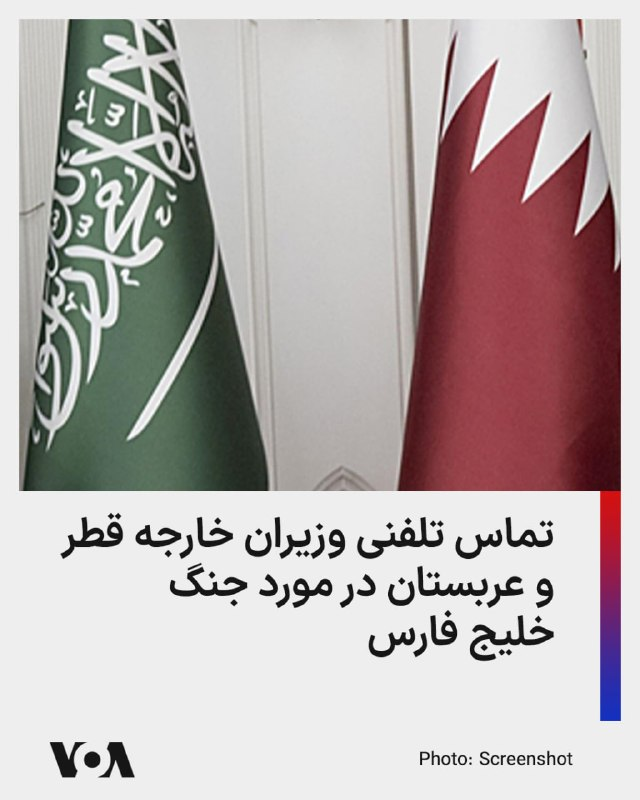
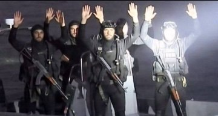
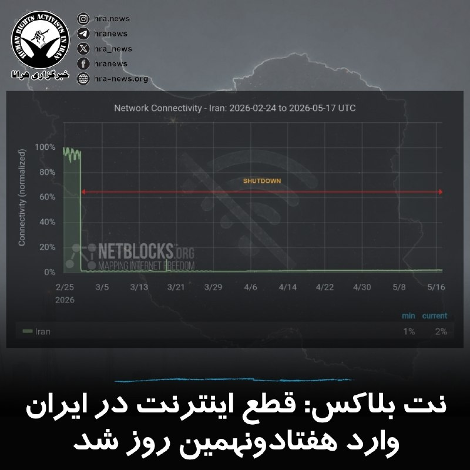
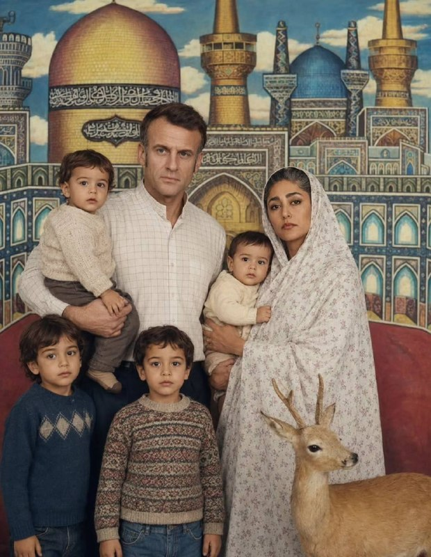

# خواننده تلگرام

<!-- TOP_NAV START -->

<a href="https://github.com/aliinreallife/aio-downloader/blob/main/telegram/content/archive_1.md" style="display:inline-block; padding:6px 12px; margin:0 4px; background-color:#2ea44f; color:white; text-decoration:none; border-radius:4px; font-weight:bold;">صفحه بعد</a>

<!-- TOP_NAV END -->

<!-- MSG START -->

---
📅 بروزرسانی: 1405/02/27 12:53
---

## VahidOOnLine — post 240599

♦️ویدیوهای منتشرشده در شبکه‌های اجتماعی که گفته می‌شود مربوط به جزیره مارو (شیدور) و مناطق اطراف جزیره لاوان است، آلودگی گسترده نفتی در آب‌ها و سواحل خلیج فارس را در روز جمعه ۲۵ اردیبهشت نشان می‌دهد. در این تصاویر، لکه‌های وسیع نفتی، تغییر رنگ آب دریا و آلودگی شدید نوار ساحلی قابل مشاهده است.
خبرگزاری رویترز نیز با استناد به تصاویر ماهواره‌ای ثبت‌شده از وقوع یک نشت نفتی گسترده در نزدیکی جزیره خارگ، مهم‌ترین پایانه صادرات نفت ایران، خبر داده است. بر اساس این گزارش، لکه نفتی مشاهده‌شده در تصاویر ماهواره‌های کوپرنیک، منطقه‌ای حدود ۴۵ تا ۹۵ کیلومتر مربع را در غرب جزیره خارگ پوشش داده است.
فعالان محیط زیست و کاربران شبکه‌های اجتماعی، وضعیت جزیره مارو (شیدور) معروف به «مالدیو ایران» را «فاجعه‌بار» توصیف کرده‌اند. برخی گزارش‌ها علت این آلودگی را حملات انجام‌شده به تاسیسات نفتی جزیره لاوان در فروردین‌ماه عنوان می‌کنند.
در برخی ویدیوهای منتشرشده، علاوه بر آب‌های آلوده، تصاویری از دود و انفجار در جزیره نیز دیده می‌شود. گفته می‌شود این حملات توسط امارات متحده عربی انجام شده است.
‌🇸🇦 Indypersian

🤖 @VahidOOnLine

## VahidOOnLine — post 240598

  

♦️علاءالدین بروجردی، عضو کمیسیون امنیت ملی مجلس روز یکشنبه درباره مذاکرات با آمریکا گفت:  جمهوری اسلامی ایران از حقوق خود در تنگه هرمز و همچنین مسائل هسته‌ای کوتاه نمی‌آید.

بروجردی  با بیان اینکه مذاکره بدون پذیرش شروط ایران بی‌معناست، گفت: «طرف مقابل باید بپذیرد که جمهوری اسلامی حاکم بر تنگه هرمز است. بدانند که موضوع هسته‌ای هیچ ارتباطی با آمریکا ندارد و به هیچ‌وجه حاضر نیستیم از آن کوتاه بیاییم.»

این عضو کمیسیون امنیت ملی مجلس درباره شروط جمهوری اسلامی برای حضور در مذاکرات، گفت: «آنها باید بپذیرند که هرگونه توافق در مذاکرات احتمالی آینده، توافق با کل جبهه مقاومت اعم از لبنان، عراق و یمن خواهد بود. اگر این قواعد را قبول نداشته باشند، ورود به مذاکره بی‌فایده خواهد بود.»

علاءالدین بروجردی همچنین تاکید کرد که «آنها باید بپذیرند اموال بلوکه‌شده آزاد شود و تحریم‌ها برداشته شوند. پذیرش این شروط الزامی است.»

این اظهارات در حالی مطرح شده است که دونالد ترامپ، روز شنبه ۲۶ اردیبهشت به جمهوری اسلامی هشدار داد که اگر به‌زودی بر سر یک توافق صلح موافقت نکند، «دوران بسیار سختی» را پیش رو خواهد داشت.
‌🇸🇦 Indypersian

🤖 @VahidOOnLine

## VahidOOnLine — post 240597

  

خبرگزاری میزان، رسانه قوه قضاییه جمهوری اسلامی، از برگزاری نخستین جلسه دادگاه رسیدگی به اتهامات صادق ساعدی‌نیا، مدیرعامل مجموعه «املاک و صنایع ساعدی‌نیا» و از حامیان اعتصاب‌ها و اعتراضات دی‌ماه، در دادگاه انقلاب قم خبر داد.
طبق این گزارش، ساعدی‌نیا با اتهاماتی از جمله «فعالیت تبلیغی یا رسانه‌ای برخلاف امنیت کشور»، «اقدام عملیاتی در راستای فراخوان‌های گروه‌های معاند برای برهم زدن امنیت کشور» و «فعالیت تبلیغی علیه نظام» روبه‌رو است.
انتشار استوری، فعالیت در فضای مجازی، حضور در تجمعات اعتراضی، تعطیل کردن کافه‌ها و مغازه‌های متعلق به خود و تشویق برخی کارکنانش به حضور در اعتراضات از مصادیق اتهامات مطرح‌شده علیه او عنوان شده است.
نماینده دادستان، مواردی مانند فعالیت‌های ساعدی‌نیا در فضای مجازی، تهیه کلیپی از یکی از کارکنانش با نوشته «جاوید شاه» روی دست، ایجاد و مدیریت گروه واتساپی کارکنان کافه‌ها، انتشار پیام صوتی درباره خاموش کردن گوشی برای جلوگیری از ردیابی، حضور برخی کارکنان در اعتراضات و برنامه‌ریزی برای تعطیلی کافه‌ها و کارخانه‌ها همزمان با فراخوان‌های اعتراضی را از مصادیق اتهامات مطرح‌شده علیه او عنوان کرد.
‌🏁 🇬🇧 IranintlTV

🤖 @VahidOOnLine

## VahidOOnLine — post 240596

  

ابوالفضل شکارچی، سخنگوی ارشد نیروهای مسلح جمهوری اسلامی، گفت که دونالد ترامپ باید بداند در صورت عملی شدن تهدیدها و حمله مجدد به جمهوری اسلامی، دارایی‌ها و ارتش آمریکا با «سناریوهای جدید، هجومی، غافلگیرکننده و طوفانی» روبه‌رو خواهند شد و در «باتلاق خودساخته‌» فرو خواهند رفت.
‌🏁 🇬🇧 IranintlTV

🤖 @VahidOOnLine

## VahidOOnLine — post 240595

  <a href="telegram/content/VahidOOnLine_240595_1779009802.mp4" target="_blank">🎬 Download video</a>

‌🏁 🇬🇧 ManotoTV

🤖 @VahidOOnLine

## VahidOOnLine — post 240594

🗣روایت شما از زندگی در آتش‌بس- یکشنبه۲۷ اردیبهشت ۱۴۰۵

🔹چیزی به اسم ساعت مرگ شنیدین؟ ساعتی که همه‌چیز، از جمله انگیزه از بین میره. برای من، اون روزی بود که مجبور شدم به خاطر شرایط تحمیل‌شده، ۶ نفر از ۱۴ نفر از نیروهام رو تعدیل کنم.

🔹هنوز نتونستم میوه این فصل رو به دلیل قیمت‌های وحشتناک گرون برای خانواده بخرم؛ توت‌فرنگی، گوجه‌سبز و زردآلو.

🔹قبل از جنگ می‌خواستم یه هارد بخرم، ۵۰ میلیون تومان بود و الان شده ۱۶۰ میلیون تومان.

🔹نان سنگک ساده شده ۱۷ هزار تومان، کنجدی هم شده ۲۵ هزار تومان. نانوایی‌ها یه ترفند زدن؛ یک نون بزرگ‌تر با کنجد زیاد درست کردن به قیمت ۸۰ هزار تومان می‌فروشن. کسانی که حوصله صف ندارن، مجبورن همون نون گرون رو بخرن.

🔹من خانم هستم و آتلیه عروسی داشتم. شغل ما همیشه زیر سایه تهدید شدید اماکن بوده و اجازه گذاشتن نمونه‌ کار نداشتیم. الان با این گرونی و قطعی اینترنت کلا نابود شدیم، چون هیچ عروسی برگزار نمی‌شه.

🔹من تریدرم و از وقتی اینترنت قطع شده، درآمد ندارم. چند سال زحمت کشیدم اما تریدینگ‌ویو، ابزار کارم باز نمی‌شه. برای ترید نیاز به اینترنت پایدار و آرامش دارم که هیچ‌کدوم نیست.

🔹در بلوچستان هر ۲۰ لیتر بنزین آزاد، بین یک میلیون و ۳۰۰ هزار تومان تا یک میلیون و ۵۰۰ هزار تومان هست؛ یعنی حدودا لیتری ۶۰ تا ۷۰ هزار تومان.

🔹دارم خونه می‌سازم و هر لحظه قیمت‌ها بیشتر می‌شه. کل هزینه ساختن تا قبل از عید یک میلیارد و نیم بود اما الان کابینت جنس معمولی شده یک میلیارد تومان.
‌🏁 🇬🇧 IranintlTV

🤖 @VahidOOnLine

## VahidOOnLine — post 240593

  

♦️کمیته آزادی آکادمیک وابسته به انجمن ایران‌پژوهی (AIS) با انتشار بیانیه‌ای رسمی خطاب به مقام‌های ارشد سازمان ملل، اتحادیه اروپا و ایالات متحده، نسبت به آنچه «هدف قرار گرفتن سیستماتیک دانشگاه‌ها، مدارس و مراکز پژوهشی ایران» در جریان جنگ اخیر خوانده، هشدار داد.
در این بیانیه که برای مقام‌هایی از جمله ولکر تورک، کمیسر عالی حقوق بشر سازمان ملل، آدری آزولای، مدیرکل یونسکو و مارکو روبیو، وزیر خارجه آمریکا ارسال شده، آمده است که مراکز آموزشی و پژوهشی ایران به «خط مقدم جنگ» تبدیل شده‌اند و حمله به آن‌ها نقض آشکار قوانین بشردوستانه بین‌المللی و کنوانسیون ژنو محسوب می‌شود.
بر اساس آمار ارائه‌شده در این گزارش، تنها در فاصله اسفند ۱۴۰۴ تا فروردین ۱۴۰۵، بیش از ۲۱ دانشگاه در ایران هدف حملات قرار گرفته‌اند و ۱۵۴ ساختمان و مرکز دانشگاهی آسیب دیده یا تخریب شده‌اند.
‌🇸🇦 Indypersian

🤖 @VahidOOnLine

## VahidOOnLine — post 240592

  

علاءالدین بروجردی، عضو کمیسیون امنیت ملی مجلس، درباره مذاکرات با آمریکا، گفت: «طرف مقابل باید بپذیرد که جمهوری اسلامی حاکم بر تنگه هرمز است. بدانند که موضوع هسته‌ای هیچ ارتباطی با آمریکا ندارد و به هیچ‌وجه حاضر نیستیم از آن کوتاه بیاییم.»

بروجردی درباره شروط جمهوری اسلامی برای حضور در مذاکرات، گفت: «آنها باید بپذیرند که هرگونه توافق در مذاکرات احتمالی آینده، توافق با کل جبهه مقاومت اعم از لبنان، عراق و یمن خواهد بود. اگر این قواعد را قبول نداشته باشند، ورود به مذاکره بی‌فایده خواهد بود.»

عضو کمیسیون امنیت ملی گفت: «آنها باید بپذیرند که اموال بلوکه‌شده آزاد شود. همچنین باید تحریم‌ها برداشته شوند. پذیرش این شروط الزامی است.»
‌🏁 🇬🇧 IranintlTV

🤖 @VahidOOnLine

## VahidOOnLine — post 240591

  

علاءالدین بروجردی، عضو کمیسیون امنیت ملی مجلس، درباره مذاکرات با آمریکا، گفت: «طرف مقابل باید بپذیرد که جمهوری اسلامی حاکم بر تنگه هرمز است. بدانند که موضوع هسته‌ای هیچ ارتباطی با آمریکا ندارد و به هیچ‌وجه حاضر نیستیم از آن کوتاه بیاییم.»

بروجردی درباره شروط جمهوری اسلامی برای حضور در مذاکرات، گفت: «آنها باید بپذیرند که هرگونه توافق در مذاکرات احتمالی آینده، توافق با کل جبهه مقاومت اعم از لبنان، عراق و یمن خواهد بود. اگر این قواعد را قبول نداشته باشند، ورود به مذاکره بی‌فایده خواهد بود.»

عضو کمیسیون امنیت ملی گفت: «آنها باید بپذیرند که اموال بلوکه‌شده آزاد شود. همچنین باید تحریم‌ها برداشته شوند. پذیرش این شروط الزامی است.»
‌🏁 🇬🇧 IranintlTV

🤖 @VahidOOnLine

## VahidOOnLine — post 240590

♦️از کوچه‌باغ‌های کاشان تا دامنه‌های میمند فارس، عطر دل‌انگیز گل محمدی در هوا می‌پیچد و روح آدم را تازه می‌کند. فصل اردیبهشت و خرداد، فصل عاشقی طبیعت با انسان است، فصلی که سنت هزارساله گلاب‌گیری دوباره جان می‌گیرد و دیگ‌های مسی، روایتگر یکی از اصیل‌ترین آیین‌های ایرانی می‌شوند.
باستان‌شناسان معتقدند ایرانیان از حدود هفت هزار سال پیش گل سرخ یا همان گل محمدی را پرورش می‌دادند و بیش از هزار سال است که هنر گلاب‌گیری در ایران جریان دارد.
امروز شهرهایی مانند کاشان، نیاسر، قمصر، میمند فارس، لاله‌زار کرمان، سمنان و مناطق مختلف دیگر، میزبان جشنواره‌های گل و گلاب هستند.
صبح زود، پیش از طلوع کامل خورشید، گل‌چین‌ها با دستانی پر از عطر، گل‌های تازه را جمع می‌کنند تا عطر و کیفیت گل‌ها حفظ شود. سپس گل‌ها داخل دیگ‌های بزرگ مسی ریخته می‌شوند و با حرارت آرام، بخار خوشبوی گل محمدی تبدیل به گلاب ناب ایرانی می‌شود.
در تقویم ملی ایران نیز روز ۲۰ اردیبهشت به نام «روز گل محمدی و گلاب» ثبت شده است، روزی برای پاسداشت عطری که قرن‌هاست در حافظه ایران مانده است.
‌🇸🇦 Indypersian

🤖 @VahidOOnLine

## VahidOOnLine — post 240589

  

فارس، خبرگزاری وابسته به سپاه پاسداران، گزارش داد که محمدباقر قالیباف، رییس مجلس شورای اسلامی، نماینده ویژه جمهوری اسلامی در امور چین شد. پیش‌تر علی لاریجانی با حکم علی خامنه‌ای و پس از آن عبدالرضا رحمانی‌فضلی با حکم مسعود پزشکیان این سمت را در اختیار داشتند.
‌🏁 🇬🇧 IranintlTV

🤖 @VahidOOnLine

## VahidOOnLine — post 240588

  <a href="telegram/content/VahidOOnLine_240588_1779009806.mp4" target="_blank">🎬 Download video</a>

گردهمایی ایرانیان ملبورن استرالیا، یکشنبه ۲۷ اردیبهشت
‌🏁 🇬🇧 ManotoTV

🤖 @VahidOOnLine

## VahidOOnLine — post 240587

  <a href="telegram/content/VahidOOnLine_240587_1779009808.mp4" target="_blank">🎬 Download video</a>

تجمع ایرانیان ساکن اورلاندو فلوریدا، آمریکا
۲۶ اردیبهشت
‌🏁 🇬🇧 ManotoTV

🤖 @VahidOOnLine

## VahidOOnLine — post 240586

  <a href="telegram/content/VahidOOnLine_240586_1779009810.mp4" target="_blank">🎬 Download video</a>

ویدیوهای رسیده به ایران‌اینترنشنال نشان می‌دهند ایرانیان مقیم فرانسه و ایتالیا روز شنبه ۲۶ اردیبهشت علیه جمهوری اسلامی و قطع اینترنت ایران در شهرهای بوردو و تورین تجمع کردند.
‌🏁 🇬🇧 IranintlTV

🤖 @VahidOOnLine

## VahidOOnLine — post 240585

  

♦️بری روزن، گروگان پیشین آمریکایی در ایران، روز یکشنبه ۲۷ اردیبهشت نسبت به افزایش «سریع و نگران‌کننده» اعدام‌ها در ایران هشدار داد.

او در شبکه اجتماعی ایکس نوشت: «همزمان با آتش‌بس ایالات متحده و ایران، افزایش سریع و نگران‌کننده اعدام‌ها توسط ایران، نشان‌دهنده یک استراتژی حساب‌شده برای سرکوب هرگونه مخالفت است.»

بری روزن با اشاره به گزارش‌ها درباره افزایش اعدام‌ها در ایران نوشت: «گروه‌های حقوق بشری تأکید می‌کنند که این افزایش در اعدام‌ها در مقطعی حساس رخ می‌دهد؛ زمانی که ممکن است توجه بین‌المللی در خلال آتش‌بس رو به کاهش باشد.»

او اضافه کرد: «مرکز حقوق بشر در ایران تأکید می‌کند که این سرکوب وحشیانه، به‌ویژه در زندان‌ها و دادگاه‌ها، در حال تشدید است.»

گروگان پیشین آمریکایی در ایران به نقل از نیویورک تایمز نوشت «به نظر می‌رسد سرعت صدور احکام و اعدام‌ها در دو ماه گذشته افزایش یافته است و مقامات در تلاشند تا ایرانیان را از بازگشت به خیابان‌ها بترسانند.»

جمهوری اسلامی در هفته‌های اخیر و همزمان با قطعی سراسری اینترنت، روند سرکوب‌ها و به ویژه اعدام‌ها را سرعت داده است.
‌🇸🇦 Indypersian

🤖 @VahidOOnLine

## VahidOOnLine — post 240584

  

بر اساس گزارش نت‌بلاکس، نهاد پایش وضعیت اینترنت در جهان، قطع سراسری اینترنت در ایران وارد هفتادونهمین روز خود در دوازدهمین هفته شده است: «این اقدام گسترده سانسور، ماهیت مشارکت مدنی را دگرگون کرده و کنترل اطلاعات به ابزاری برای تقلیل شهروندان عادی به ناظران تحولات تبدیل شده است.»
‌🏁 🇬🇧 IranintlTV

🤖 @VahidOOnLine

## VahidOOnLine — post 240583

  <a href="telegram/content/VahidOOnLine_240583_1779009815.mp4" target="_blank">🎬 Download video</a>

بر اساس ویدیوهای ارسال‌شده‌ به ایران‌اینترنشنال، ایرانیان مقیم کانادا شنبه ۲۶ اردیبهشت علیه جمهوری اسلامی و قطع اینترنت ایران در مونترال تجمع کردند و شعار «مرگ بر جمهوری اسلامی» سردادند.
‌🏁 🇬🇧 IranintlTV

🤖 @VahidOOnLine

## VahidOOnLine — post 240582

  

فرمانده پلیس راه سیراف عسلویه اعلام کرد که در پی واژگونی اتوبوس در محور عسلویه به کنگان، هشت نفر در محل حادثه جان خود را از دست دادند. کارشناسان پلیس راه علت این واژگونی را نقص فنی در سیستم ترمز تشخیص داده‌اند.
‌🏁 🇬🇧 IranintlTV

🤖 @VahidOOnLine

## WithYashar — post 11467

## WithYashar — post 11466

داداش شما رئیس سواک میشی شک نکن

## WithYashar — post 11465

فک کنم ساواک روزی که برگرده باید اول به من بگه دادچ آرشیوتو بیار 🤣

## WithYashar — post 11464

  <a href="telegram/content/WithYashar_11464_1779009819.mp4" target="_blank">🎬 Download video</a>

الان بحث داغه دیدن این ویدیو شاهین نجفی هم که در اوایل شروع ‌به کارش برام فرستاد خالی از‌ لطف نیست ، من امید وارم همه با هم متحد باشن و مشکلات تموم بشه
@withyashar

## WithYashar — post 11463

  <a href="telegram/content/WithYashar_11463_1779009821.mp4" target="_blank">🎬 Download video</a>

اینا همش به تاریخ پیوست…
@withyashar

## WithYashar — post 11462

تو اين مدت هر وقت كه ولنجك رد ميشم ياد شما ميافتم، هميشه و هميشه و هميشه اين ويديو رو براى شما گرفتم و صميم قلبم آرزو كردم به زودى خود شمارو تو ايران ببينيم🌸

## WithYashar — post 11461

عباس عراقچی، اعلام کرد که کتاب «قدرت مذاکره» او به چاپ پنجم رسیده و در چاپ جدید این کتاب، بخش جدیدی با عنوان «دیپلماسی زیر آتش» درباره روند «مذاکرات غیرمستقیم با آمریکا در جنگ ۱۲ روزه» به آن افزوده شده است.
@withyashar

## WithYashar — post 11460

تو اين مدت هر وقت كه ولنجك رد ميشم ياد شما ميافتم، هميشه و هميشه و هميشه اين ويديو رو براى شما گرفتم و صميم قلبم آرزو كردم به زودى خود شمارو تو ايران ببينيم🌸

## WithYashar — post 11459

تو اين مدت هر وقت كه ولنجك رد ميشم ياد شما ميافتم، هميشه و هميشه و هميشه
اين ويديو رو براى شما گرفتم و صميم قلبم آرزو كردم به زودى خود شمارو تو ايران ببينيم🌸

## WithYashar — post 11458

## WithYashar — post 11457

## WithYashar — post 11456

## mwarmonitor — post 9186

🔴دیوان کیفری بین‌المللی در لاهه به‌طور محرمانه احکام بازداشت علیه سه سیاستمدار اسرائیلی و دو افسر نظامی صادر کرده است.(هاآرتص)

@mwarmonitor

## mwarmonitor — post 9185

🇮🇷🇨🇳 انتصاب محمدباقر قالیباف به‌عنوان نماینده ویژه ایران نزد چین.

@mwarmonitor

## pm_afshaa — post 90887

🔴سی‌ان‌ان: ایران به کابل‌های اینترنتی تنگه هرمز چشم دوخته

💧 Rainbet.com the #1 Non-KYC Crypto Casino & Sportsbook @rainbetcom

😁 @Pm_Afshaa

## pm_afshaa — post 90886

قالیباف نمایندۀ ویژۀ ایران در امور چین شد

💧 Rainbet.com the #1 Non-KYC Crypto Casino & Sportsbook @rainbetcom

😁 @Pm_Afshaa

## pm_afshaa — post 90880

  <a href="telegram/content/pm_afshaa_90880_1779009824.mp4" target="_blank">🎬 Download video</a>

بزرگ‌ترین راهپیمایی ملی‌گرایانه در لندن طی سال‌های اخیر

تامِی رابینسون ده‌ها هزار نفر را به خیابان‌ها آورد و تجمع کنندگان خواستار پایان دادن به مهاجرت غیرقانونی و حفاظت از ارزش‌های سنتی مسیحی شدن

💧 Rainbet.com the #1 Non-KYC Crypto Casino & Sportsbook @rainbetcom

😁 @Pm_Afshaa

## mamlekate — post 103545

  <a href="telegram/content/mamlekate_103545_1779009825.mp4" target="_blank">🎬 Download video</a>

بر اساس گزارش‌ها در پی بارش‌های اخیر وضعیت دریاچه ارومیه در مقایسه زمان‌های مشابه سال‌های گذشته بهتر شده است. در یکی از آخرین ویدئوها از دریاچه ارومیه به تاریخ ۲۵ اردیبهشت رنگین‌کمانی بزرگ پس از بارش بهاری بر فراز این دریاچه نقش بسته است.

insta
@mamlekate

## mamlekate — post 103544

  

📝 وضعیت نامعلوم سپاهی‌های بازداشتی در آب‌های کویت

🎖 جلوی مردم بی‌سلاح ایران گودزیلان، جلو نیروهای مسلح دیگه موش آب‌کشیده [عکسی که پخش شده ممکنه تصویرسازی خبر باشه]

@mamlekate

## mamlekate — post 103543

📝 بزرگترین ناو هواپیمابر جهان پس از مشارکت در عملیات نظامی علیه جمهوری اسلامی و دستگیری مادورو به ویرجینیا بازگشت

ناو هواپیمابر یو‌اس‌اس جرالد آر. فورد، بزرگترین ناو هواپیمابر جهان، روز شنبه پس از ۱۱ ماه استقرار، طولانی‌ترین مدت از زمان جنگ ویتنام، به خانه خود در ایالت ویرجینیا بازگشت.

این ناو عظیم هواپیمابر در ماموریت‌هایی از جمله پشتیبانی از عملیات مشترک نظامی آمریکا و اسرائيل علیه جمهوری اسلامی که به کشته شدن علی خامنه‌ای انجامید و دستگیری نیکلاس مادورو در زمان ریاست او بر ونزوئلا شرکت داشت.

آسوشیتدپرس در گزارشی نوشت که پیشرفته‌ترین ناو جنگی ایالات متحده و دو ناوشکن همراه آن در ایستگاه دریایی نورفولک پهلو گرفتند و حدود ۵۰۰۰ ملوان برای اولین بار از ماه ژوئن منتظر دیدار خانواده‌های خود بودند.

پیت هگست، وزیر جنگ آمریکا، برای استقبال از بازگشت کشتی‌های جنگی حضور داشت. هگست از ملوانان آمریکایی به خاطر «کار خوب انجام شده» تقدیر کرد.

استار اند استرایپز نیز به نقل از وزیر جنگ نوشت گفت: «گروه ضربت ناو هواپیمابر فورد کار فوق‌العاده‌ای انجام داد. تنها داستانی که امروز می‌توانیم بگوییم، قهرمانی، مهارت و حرفه‌ای‌گری این ملوانان است که سه بار به دور دنیا رفتند تا از آن پرچم در همانجا دفاع کنند.»

+ تعمیر و نگهداری هواپیمای سوخت‌رسان آمریکایی در منطقه سنتکام

+ ترامپ: این آرامش پیش از طوفان است

@mamlekate

## mamlekate — post 103542

📝 کاخ کرملین: پوتین روز سه‌شنبه به چین سفر می‌کند

پس از سفر دونالد ترامپ به پکن، کرملین اعلام کرد ولادیمیر پوتین هفته آینده به چین می‌رود؛ سفری که در میانه جنگ اوکراین، بحران ایران و رقابت قدرت‌های جهانی اهمیت ویژه‌ای پیدا کرده است.

@mamlekate

## mamlekate — post 103541

📝 سازمان بهداشت جهانی در پی شیوع اِبولا در کنگو وضعیت اضطراری بین‌المللی اعلام کرد

در پی شیوع دوباره بیماری اِبولا در جمهوری دموکراتیک کنگو در آفریقا و مرگ ده‌ها تن، سازمان بهداشت جهانی روز یک‌شنبه، ۲۷ اردیبهشت، «وضعیت اضطراری بین‌المللی» اعلام کرد.

@mamlekate

## IranIntlTV — post 337595

  

خبرگزاری میزان، رسانه قوه قضاییه جمهوری اسلامی، از برگزاری نخستین جلسه دادگاه رسیدگی به اتهامات صادق ساعدی‌نیا، مدیرعامل مجموعه «املاک و صنایع ساعدی‌نیا» و از حامیان اعتصاب‌ها و اعتراضات دی‌ماه، در دادگاه انقلاب قم خبر داد.
طبق این گزارش، ساعدی‌نیا با اتهاماتی از جمله «فعالیت تبلیغی یا رسانه‌ای برخلاف امنیت کشور»، «اقدام عملیاتی در راستای فراخوان‌های گروه‌های معاند برای برهم زدن امنیت کشور» و «فعالیت تبلیغی علیه نظام» روبه‌رو است.
انتشار استوری، فعالیت در فضای مجازی، حضور در تجمعات اعتراضی، تعطیل کردن کافه‌ها و مغازه‌های متعلق به خود و تشویق برخی کارکنانش به حضور در اعتراضات از مصادیق اتهامات مطرح‌شده علیه او عنوان شده است.
نماینده دادستان، مواردی مانند فعالیت‌های ساعدی‌نیا در فضای مجازی، تهیه کلیپی از یکی از کارکنانش با نوشته «جاوید شاه» روی دست، ایجاد و مدیریت گروه واتساپی کارکنان کافه‌ها، انتشار پیام صوتی درباره خاموش کردن گوشی برای جلوگیری از ردیابی، حضور برخی کارکنان در اعتراضات و برنامه‌ریزی برای تعطیلی کافه‌ها و کارخانه‌ها همزمان با فراخوان‌های اعتراضی را از مصادیق اتهامات مطرح‌شده علیه او عنوان کرد.

## IranIntlTV — post 337594

  

ابوالفضل شکارچی، سخنگوی ارشد نیروهای مسلح جمهوری اسلامی، گفت که دونالد ترامپ باید بداند در صورت عملی شدن تهدیدها و حمله مجدد به جمهوری اسلامی، دارایی‌ها و ارتش آمریکا با «سناریوهای جدید، هجومی، غافلگیرکننده و طوفانی» روبه‌رو خواهند شد و در «باتلاق خودساخته‌» فرو خواهند رفت.
https://iranintl.com/202605170463

## IranIntlTV — post 337593

  <a href="telegram/content/IranIntlTV_337593_1779009829.mp4" target="_blank">🎬 Download video</a>

روزنامه اسرائیلی معاریو به نقل از ارزیابی نهادهای اطلاعاتی اسرائیل گزارش داد جمهوری اسلامی همچنان بیش از هزار موشک بالستیک دوربرد و ۲۰۰ پرتابگر در اختیار دارد که قادر به هدف قرار دادن خاک اسرائیل هستند.
جزییات بیشتر با اشکان صفائی، خبرنگار ایران‌اینترنشنال
@iranintltv

## IranIntlTV — post 337592

🗣روایت شما از زندگی در آتش‌بس- یکشنبه۲۷ اردیبهشت ۱۴۰۵

🔹چیزی به اسم ساعت مرگ شنیدین؟ ساعتی که همه‌چیز، از جمله انگیزه از بین میره. برای من، اون روزی بود که مجبور شدم به خاطر شرایط تحمیل‌شده، ۶ نفر از ۱۴ نفر از نیروهام رو تعدیل کنم.

🔹هنوز نتونستم میوه این فصل رو به دلیل قیمت‌های وحشتناک گرون برای خانواده بخرم؛ توت‌فرنگی، گوجه‌سبز و زردآلو.

🔹قبل از جنگ می‌خواستم یه هارد بخرم، ۵۰ میلیون تومان بود و الان شده ۱۶۰ میلیون تومان.

🔹نان سنگک ساده شده ۱۷ هزار تومان، کنجدی هم شده ۲۵ هزار تومان. نانوایی‌ها یه ترفند زدن؛ یک نون بزرگ‌تر با کنجد زیاد درست کردن به قیمت ۸۰ هزار تومان می‌فروشن. کسانی که حوصله صف ندارن، مجبورن همون نون گرون رو بخرن.

🔹من خانم هستم و آتلیه عروسی داشتم. شغل ما همیشه زیر سایه تهدید شدید اماکن بوده و اجازه گذاشتن نمونه‌ کار نداشتیم. الان با این گرونی و قطعی اینترنت کلا نابود شدیم، چون هیچ عروسی برگزار نمی‌شه.

🔹من تریدرم و از وقتی اینترنت قطع شده، درآمد ندارم. چند سال زحمت کشیدم اما تریدینگ‌ویو، ابزار کارم باز نمی‌شه. برای ترید نیاز به اینترنت پایدار و آرامش دارم که هیچ‌کدوم نیست.

🔹در بلوچستان هر ۲۰ لیتر بنزین آزاد، بین یک میلیون و ۳۰۰ هزار تومان تا یک میلیون و ۵۰۰ هزار تومان هست؛ یعنی حدودا لیتری ۶۰ تا ۷۰ هزار تومان.

🔹دارم خونه می‌سازم و هر لحظه قیمت‌ها بیشتر می‌شه. کل هزینه ساختن تا قبل از عید یک میلیارد و نیم بود اما الان کابینت جنس معمولی شده یک میلیارد تومان.

## IranIntlTV — post 337591

  <a href="telegram/content/IranIntlTV_337591_1779009831.mp4" target="_blank">🎬 Download video</a>

همزمان با انتشار گزارش‌ها از احتمال ازسرگیری حملات آمریکا و اسرائیل علیه جمهوری اسلامی، دونالد ترامپ، رییس‌جمهوری ایالات متحده، گفت اگر جمهوری اسلامی توافق نکند، روزگار بسیار بدی خواهد داشت.

گفت‌وگو با علی شیرازی، عضو تحریریه ایران‌اینترنشنال
@iranintltv

## IranIntlTV — post 337590

یک شهروند از بندرعباس با ارسال ویدیویی به ایران‌اینترنشنال، صف طولانی خودروها مقابل پمپ‌بنزین را نشان می‌دهد و می‌گوید: «به عنوان مقابله با قاچاق، کارت‌های سوخت جایگاه‌ها را برداشته و به هر جایگاه فقط یک کارت داده‌اند.»

## IranIntlTV — post 337588

  

علاءالدین بروجردی، عضو کمیسیون امنیت ملی مجلس، درباره مذاکرات با آمریکا، گفت: «طرف مقابل باید بپذیرد که جمهوری اسلامی حاکم بر تنگه هرمز است. بدانند که موضوع هسته‌ای هیچ ارتباطی با آمریکا ندارد و به هیچ‌وجه حاضر نیستیم از آن کوتاه بیاییم.»

بروجردی درباره شروط جمهوری اسلامی برای حضور در مذاکرات، گفت: «آنها باید بپذیرند که هرگونه توافق در مذاکرات احتمالی آینده، توافق با کل جبهه مقاومت اعم از لبنان، عراق و یمن خواهد بود. اگر این قواعد را قبول نداشته باشند، ورود به مذاکره بی‌فایده خواهد بود.»

عضو کمیسیون امنیت ملی گفت: «آنها باید بپذیرند که اموال بلوکه‌شده آزاد شود. همچنین باید تحریم‌ها برداشته شوند. پذیرش این شروط الزامی است.»
https://iranintl.com/202605174982

## IranIntlTV — post 337587

  

🔻مهدی تاج، رییس فدراسیون فوتبال پس از جلسه با دبیرکل فیفا گفت: «جلسه خیلی خوبی بود؛ ۱۰ موردی که گفته بودیم را شنیدند و برای هر کدام راه حل‌هایی ارائه کردند. امیدوارم که تیم ملی به جام جهانی برود و نتایج خوبی بگیرد.» این درحالی است که ماتیاس گرافستروم از اظهارنظر دراین‌باره خودداری کرد.

🔹ماتیاس گرافستروم، دبیرکل فیفا پس از جلسه با مهدی تاج، در پاسخ به سوالی درباره تضمین‌های مورد نظر فدراسیون فوتبال ایران برای ویزا و ورود تیم ملی به آمریکا و کانادا گفت: «ما درباره تمام مسائل مرتبط گفت‌وگو کردیم.»

🔹او گفت: «فکر می‌کنم اینجا جای مطرح کردن جزئیات نیست. اما در مجموع نشست بسیار مثبتی بود و مشتاق ادامه گفت‌وگوها هستیم. درست مانند گفت‌وگوهایی که با همه فدراسیون‌های عضو داریم و مشتاق برگزاری جام جهانی هیجان‌انگیزی در آمریکا، کانادا و مکزیک هستیم. متشکرم.»

🔹گرافستروم گفت: «فرصت داشتیم درباره برخی مسائل اجرایی صحبت کنیم؛ همان‌طور که با تمام فدراسیون‌های عضو این کار را انجام می‌دهیم.»

@iranintltvsport

## IranIntlTV — post 337586

  <a href="telegram/content/IranIntlTV_337586_1779009836.mp4" target="_blank">🎬 Download video</a>

یک شهروند با ارسال ویدیویی از اصفهان به ایران‌اینترنشنال، تجمع حامیان حکومت را در شامگاه جمعه ۲۵ اردیبهشت نشان می‌دهد و از آزار و اذیت خیابانی آنها می‌گوید: «راه را بند آورده‌اند و ترافیک ایجاد کرده‌اند. اینها شریک جناینکاران هستند و برخلاف مردم، آزادی کامل دارند.»

## IranIntlTV — post 337585

  <a href="telegram/content/IranIntlTV_337585_1779009839.mp4" target="_blank">🎬 Download video</a>

امیر قلعه‌نویی فهرست ۳۰ نفره‌ تیم فوتبال ایران برای جام جهانی ۲۰۲۶ را اعلام کرد. جنجالی‌ترین نکته این فهرست، غیبت سردار آزمون، رکورددار بیشترین گل ملی ایران پس از علی دایی است.

گفت‌وگو با آیدین مقیمی، عضو تحریریه ایران‌اینترنشنال
@iranintltv

## IranIntlTV — post 337584

  <a href="telegram/content/IranIntlTV_337584_1779009841.mp4" target="_blank">🎬 Download video</a>

علی باقری، معاون دبیر شورای عالی امنیت ملی جمهوری اسلامی، در سفر به ترکیه با هاکان فیدان، وزیر خارجه این کشور، دیدار و گفت‌وگو کرد. منابع دیپلماتیک اعلام کردند دو طرف درباره تحولات سیاسی و امنیتی منطقه و همچنین همکاری‌های دوجانبه رایزنی کردند.
جزییات بیشتر با نرگس هورخش، خبرنگار ایران‌اینترنشنال
@iranintltv

## IranIntlTV — post 337583

  

فارس، خبرگزاری وابسته به سپاه پاسداران، گزارش داد که محمدباقر قالیباف، رییس مجلس شورای اسلامی، نماینده ویژه جمهوری اسلامی در امور چین شد. پیش‌تر علی لاریجانی با حکم علی خامنه‌ای و پس از آن عبدالرضا رحمانی‌فضلی با حکم مسعود پزشکیان این سمت را در اختیار داشتند.
https://iranintl.com/202605178453

## IranIntlTV — post 337582

  <a href="telegram/content/IranIntlTV_337582_1779009845.mp4" target="_blank">🎬 Download video</a>

ویدیوهای رسیده به ایران‌اینترنشنال نشان می‌دهند ایرانیان مقیم فرانسه و ایتالیا روز شنبه ۲۶ اردیبهشت علیه جمهوری اسلامی و قطع اینترنت ایران در شهرهای بوردو و تورین تجمع کردند.

## IranIntlTV — post 337581

  

بر اساس گزارش نت‌بلاکس، نهاد پایش وضعیت اینترنت در جهان، قطع سراسری اینترنت در ایران وارد هفتادونهمین روز خود در دوازدهمین هفته شده است: «این اقدام گسترده سانسور، ماهیت مشارکت مدنی را دگرگون کرده و کنترل اطلاعات به ابزاری برای تقلیل شهروندان عادی به ناظران تحولات تبدیل شده است.»
https://iranintl.com/202605174006

## IranIntlTV — post 337580

  <a href="telegram/content/IranIntlTV_337580_1779009848.mp4" target="_blank">🎬 Download video</a>

بر اساس ویدیوهای ارسال‌شده‌ به ایران‌اینترنشنال، ایرانیان مقیم کانادا شنبه ۲۶ اردیبهشت علیه جمهوری اسلامی و قطع اینترنت ایران در مونترال تجمع کردند و شعار «مرگ بر جمهوری اسلامی» سردادند.

## IranIntlTV — post 337579

  

فرمانده پلیس راه سیراف عسلویه اعلام کرد که در پی واژگونی اتوبوس در محور عسلویه به کنگان، هشت نفر در محل حادثه جان خود را از دست دادند. کارشناسان پلیس راه علت این واژگونی را نقص فنی در سیستم ترمز تشخیص داده‌اند.
https://iranintl.com/202605172998

## IranIntlTV — post 337578

ایرانیان مقیم ملبورن استرالیا در یکی دیگر از آخر هفته‌های اعتراضی ایرانیان خارج از کشور، با حضور در مرکز این شهر و در حمایت و همبستگی با مردم ایران، سرود «ای‌ایران» را هم‌خوانی کردند.
گزارش علیرضا محبی، خبرنگار ایران‌اینترنشنال
@iranintltv

## ManotoTV — post 105550

  <a href="telegram/content/ManotoTV_105550_1779009852.mp4" target="_blank">🎬 Download video</a>

🎬 Video

## ManotoTV — post 105549

  <a href="telegram/content/ManotoTV_105549_1779009853.mp4" target="_blank">🎬 Download video</a>

گردهمایی ایرانیان ملبورن استرالیا، یکشنبه ۲۷ اردیبهشت

## ManotoTV — post 105548

  <a href="telegram/content/ManotoTV_105548_1779009855.mp4" target="_blank">🎬 Download video</a>

تجمع ایرانیان ساکن اورلاندو فلوریدا، آمریکا
۲۶ اردیبهشت

## FarsiVOA — post 217952

🔺خاموشی اینترنت وارد روز ۷۹ شد؛ نت‌بلاکس: مردم ایران به ناظر تبدیل شده‌اند

▪️داده‌های شبکه نشان می‌دهد خاموشی اینترنت در ایران همچنان ادامه دارد و وارد روز هفتادونهم، در هفته دوازدهم، شده است.

▪️به این ترتیب، شهروندان عادی در ایران بیش از ۱۸۷۰ ساعت است که از دسترسی عادی به اینترنت جهانی محروم مانده‌اند؛ وضعیتی که منتقدان آن را نوعی حصر دیجیتال می‌دانند.

▪️به گفته نت‌بلاکس، این اقدام گسترده سانسور دیجیتال، ماهیت مشارکت مدنی در ایران را تغییر داده است. این نهاد می‌گوید کنترل اطلاعات باعث شده افکار عمومی، به جای مشارکت فعال در تحولات کشور، به «ناظرانی» محدود در سرنوشت خود تبدیل شوند.

▪️این هشدار فقط درباره قطع اتصال نیست؛ درباره تغییر جایگاه شهروند در فضای عمومی است.

⬇️ بیشتر بخوانید:
https://ir.voanews.com/a/8150869.html

## FarsiVOA — post 217951

🔺اعتراض انجمن داروسازان ایران: بدهی سازمان‌های بیمه چهار برابر شده است

▪️یک عضو هیئت مدیره و مدیر روابط عمومی انجمن داروسازان ایران به پرداخت نشدن و انباشت مطالبات داروخانه‌ها از سوی سازمان‌های بیمه اعتراض کرد و خبر داد این مطالبات در ماه‌های گذشته «۴ برابر» شده است.

▪️او می‌گوید: «تأمین اجتماعی هر ماه ۳ هزار میلیارد تومان (همت) بدهکاری به داروخانه‌های بخش خصوصی دارد و با پرداخت آذر ماه، این سازمان هنوز ۱۵ همت به داروخانه ها بدهکار است.»

▪️در شرایطی که بیمه‌ها از پس تامین هزینه‌ها برنمی‌آیند و قیمت‌ها همچنان در حال افزایش است، بسیاری از بیماران با چالش جدی در تأمین داروهای مورد نیاز خود مواجه‌اند.

▪️همچنین در هفته‌های اخیر گزارش‌هایی از کمبود برخی داروها منتشر شده است.

⬇️ بیشتر بخوانید:
https://ir.voanews.com/a/8150868.html

## FarsiVOA — post 217950

  

دادستان استان کرمان از تشکیل ۳۵ پرونده قضایی برای ایرانیان خارج از کشور خبر داد و آنان را به «همکاری با دشمن» متهم کرد. مهدی بخشی گفت که این پرونده‌ها «با هدف پیگیری قضایی و مصادره اموال تشکیل شده است.»

رئیس کل دادگستری استان آذربایجان غربی نیز روز شنبه ۲۶ اردیبهشت از صدور دستور توقیف اموال ۱۲۹ نفر از مخالفان جمهوری اسلامی در این استان خبر داد.

همزمان در روز شنبه، مقامات قضائی استان یزد نیز از توقیف اموال ۵۱ تن از اهالی این استان خبر دادند و آنها را به «جاسوسی و همکاری با کشور‌های متخاصم و گروه‌های معاند» متهم کردند.

همچنین رسانه‌های ایران گزارش داده بودند که از ابتدای جنگ اخیر تا روز جمعه، در پرونده‌های سیاسی دست‌کم «۲۶۲ فقره ملک در سراسر کشور توقیف شده است.»

اموال توقیف شده «شامل وجوه نقد بانکی، اموال منقول و غیرمنقول، سهام شرکت‌ها و حتی اموال وکالتی» مردم است. این اقدامات جمهوری اسلامی از سوی ناظران، نقض حقوق شهروندی توصیف شده است.

جمهوری اسلامی در هفته‌های اخیر و همزمان با قطعی سراسری اینترنت، روند سرکوب‌ها و به ویژه اعدام‌ها را سرعت داده است.
@FarsiVOA

## FarsiVOA — post 217949

  

خبرگزاری رسمی قطر، قنا، گزارش داد محمد بن عبدالرحمن آل ثانی، نخست‌وزیر و وزیر خارجه قطر، با فیصل بن فرحان، وزیر خارجه عربستان سعودی، تلفنی گفت‌وگو کرد.

دو طرف در این تماس روابط دوجانبه و راه‌های تقویت آن را بررسی کردند و درباره تحولات منطقه، به‌ویژه موضوعات مرتبط با آتش‌بس میان آمریکا و جمهوری اسلامی و تلاش‌ها برای کاهش تنش گفت‌وگو کردند.

قنا همچنین نوشت وزیر خارجه قطر بر اهمیت پاسخ مثبت همه طرف‌ها به تلاش‌های میانجی‌گرانه تأکید کرده است؛ تلاش‌هایی که به گفته او می‌تواند راه را برای رسیدگی به ریشه‌های بحران از طریق گفت‌وگو و راه‌های مسالمت‌آمیز باز کند و به توافقی پایدار برای جلوگیری از بازگشت تنش منجر شود.

قطر و عربستان در هفته‌های گذشته از آتش‌بس میان آمریکا و جمهوری اسلامی حمایت کرده و خواستار کاهش تنش و حل بحران از مسیر گفت‌وگو شده‌اند.

قطر، که در تماس‌های میانجی‌گرانه با تهران نقش داشته، هم حمله سپاه پاسداران به پایگاه العدید را محکوم کرده و هم بر مخالفت خود با گسترش جنگ تأکید کرده است.
@FarsiVOA

## FarsiVOA — post 217948

🔺شلیک راکت و پهپادهای حزب‌الله به نیروهای اسرائیلی در جنوب لبنان

▪️ارتش اسرائیل اعلام کرد حزب‌الله از شب گذشته تا صبح یکشنبه چند راکت و پهپاد انفجاری را به سوی نیروهای اسرائیلی مستقر در جنوب لبنان شلیک کرده است.

▪️یکی از پهپادها همچنین باعث فعال شدن آژیر هشدار در شهرک مرزی میسگاو عام در شمال اسرائیل شد.

▪️در سمت مقابل، حملات اسرائیل به جنوب لبنان نیز ادامه داشته است.

⬇️ بیشتر بخوانید:
https://ir.voanews.com/a/8150867.html

## DW_Farsi — post 124789

🔶 تأمین‌کننده مالی نسل‌کشی رواندا در زندان درگذشت

به گفته یک دادگاه سازمان ملل متحد، فلیسین کابوگا، از متهمان اصلی طراحی نسل‌کشی رواندا در جریان دوران بازداشت خود در بیمارستانی در لاهه هلند درگذشت.

فلیسین کابوگا متهم بود یکی از مسئولان اصلی نشل‌کشی و خونریزی‌هایی بوده که در سال ۱۹۹۴ به کشته شدن دست‌کم ۸۰۰ هزار نفر انجامید.

سازوکار دادگاه‌های بین‌المللی جنایی سازمان ملل (IRMCT)، در بیانیه‌ای اعلام کرد که مسئول پزشکی بازداشتگاه سازمان ملل بلافاصله در جریان قرار گرفته است. همچنین تحقیقاتی درباره شرایط و جزئیات مرگ کابوگا آغاز شده است.

این تاجر رواندایی که ثروتی چند میلیون دلاری داشته، به نسل‌کشی در کشورش و همچنین مشارکت و تحریک به آن در موارد متعدد متهم شده بود.

@dw_farsi

## DW_Farsi — post 124788

  

🔶 بریتانیا موشک‌های ارزان‌قیمت ضد پهپاد به خاورمیانه می‌فرستد

وزارت دفاع بریتانیا اعلام کرد که جنگنده‌های "تایفون" این کشور در خاورمیانه، به موشک‌های جدید و مقرون‌به‌صرفه‌ای مجهز می‌شوند که به طور ویژه برای مقابله با پهپادها طراحی شده‌اند.

با این موشک‌ها، انهدام دقیق اهداف ممکن می‌شود، آن هم با هزینه‌ای که تنها بخشی از هزینه موشک‌های مورد استفاده فعلی است.

در ادامه این بیانیه آمده است که این سامانه تسلیحاتی ظرف چند ماه از اولین آزمایش‌ها به مرحله تحویل و ارسال به خاورمیانه رسیده است.

لوک پولارد، وزیر دفاع بریتانیا در این باره گفت که این اقدام به نیروی هوایی کمک خواهد کرد تا پهپادهای بسیار بیشتری را با هزینه‌ای بسیار کمتر سرنگون کند.

@dw_farsi

## DW_Farsi — post 124787

🔶 ونزوئلا متحد نزدیک مادورو را به آمریکا تحویل داد

اداره مهاجرت ونزوئلا اعلام کرد که الکس صعب، تاجر ونزوئلایی و متحد نزدیک نیکلاس مادورو، رئیس جمهور برکنارشده این کشور، را به آمریکا تحویل داده است.
الکس صعب در ماه فوریه گذشته در کاراکاس، پایتخت ونزوئلا، طی عملیاتی مشترک میان نهادهای آمریکایی و ونزوئلایی، بازداشت شده بود.

بازداشت و استرداد او نشانه سطح تازه‌ای از همکاری میان نهادهای مجری قانون آمریکا و ونزوئلا تحت ریاست جمهوری دلسی رودریگز به شمار می‌رود.

به گفته منابع آگاه از موضوع، صعب می‌تواند اطلاعاتی را در اختیار مقام‌های آمریکایی قرار دهد که اتهامات آنها علیه مادورو را تقویت کند.

مادورو و همسرش، سیلیا فلورس، در ماه ژانویه گذشته در جریان عملیات نظامی آمریکا در کاراکاس بازداشت و به نیویورک منتقل شدند.

@dw_farsi

## DW_Farsi — post 124786

🔶 مذاکرات فیفا با ایران در استانبول؛ حمایت از حضور ایران در جام جهانی

فدراسیون جهانی فوتبال نسبت به حضور تیم ملی ایران در جام جهانی فوتبال ۲۰۲۶ در آمریکا ابراز اطمینان کرد.

فیفا اعلام کرد که در جریان دیداری در استانبول، به فدراسیون فوتبال ایران حمایت لازم برای حضور در مسابقات وعده داده شده است.

ماتیاس گرافستروم، دبیرکل فیفا تاکید کرد که همکاری نزدیکی میان دو طرف وجود دارد.

او افزود که فدراسیون جهانی فوتبال مشتاق است از ایران در جام جهانی استقبال کند.

جمهوری اسلامی شامگاه چهارشنبه ۲۳ اردیبهشت با حضور هزاران هوادار در میدان انقلاب تهران، مراسم بدرقه تیم ملی فوتبال برای جام جهانی را برگزار کرد.

انتشار تصاویر شعارهایی مانند "مرگ بر آمریکا" در این مراسم بازتاب گسترده‌ای در رسانه‌ها و شبکه‌های اجتماعی داشت.

بازیکنان قرار است هفته آینده تمرینات خود را در اردوی آماده‌سازی در ترکیه آغاز کنند.
مهدی تاج، رئیس فدراسیون فوتبال ایران پیش از این به دلیل ارتباط با سپاه پاسداران انقلاب اسلامی، اجازه ورود به کانادا برای شرکت در کنگره فیفا را دریافت نکرد.

@dw_farsi

## DW_Farsi — post 124785

  

🔶 کرملین از گفت‌وگوی پوتین با رئیس دولت امارات متحده عربی خبر داد

کرملین روز شنبه در بیانیه‌ای اعلام کرد که ولادیمیر پوتین، رئیس‌جمهور روسیه، با رئیس امارات متحده عربی، محمد بن زاید آل نهیان، درباره مناقشه ایران گفتگو کرده است.

در بیانیه کرملین آمده است: «دو طرف بر اهمیت ادامه روند سیاسی و دیپلماتیک با هدف دستیابی به توافق‌های صلح تاکید کردند.»

امارات متحده عربی هدف اصلی حملات موشکی و پهپادی ایران در طول جنگ منطقه‌ای بود؛ جنگی که ۲۸ فوریه با حملات ایالات متحده و اسرائیل شعله‌ور شد.

این مناقشه بخش عمده‌ای از صادرات نفت امارات را قطع کرده و به تصویر آن به‌عنوان پناهگاهی امن، جایگاهی که به تبدیل شدنش به قطب مالی منطقه کمک کرده بود، آسیب رسانده است.

@dw_farsi

## DW_Farsi — post 124784

  

📸 عکس روز: بلغارستان بر قله مسابقات یوروویژن

بلغارستان با پیروزی در مسابقات آواز یوروویژن امسال در وین، عنوان قهرمانی را به دست آورد. "دارا" خواننده بلغاری، با ترانه "بانگارانگا" موفق به کسب مقام اول شد.
"دارا" هم در رأی داوران و هم در رأی‌گیری تماشاگران پیروز شد و با ترانه شاد و رقصی هیجان‌انگیز‌ با اختلاف قابل‌توجهی بالاتر از ۲۴ کشور شرکت‌کننده دیگر قرار گرفت. خواننده اسرائیلی دوم شد و آلمان مقام ۲۳ را کسب کرد.

@dw_farsi

## Persian_Trend_Official — post 14314

⭕️ دوستان، این حساب رسمی نیست. این اکانت صرفاً با پرداخت حدود ۱۰۰۰ دلار در ماه، تیک زرد (تأیید اشتراکی) دریافت کرده است. حساب‌های رسمی دولتی و سازمانی معمولاً تیک خاکستری دارند و اطلاعات هویتی و سازمانی آن‌ها به‌صورت شفاف در بخش Bio یا مشخصات حساب ثبت شده…

## Persian_Trend_Official — post 14313

  

💢توییت اتاق جنگ اسرائیل 🫆:Tony 📌 @persian_trend_official پرشین ترند | متفاوت‌ترین کانال نظامی

## Persian_Trend_Official — post 14312

خبرگزاری میزان

💢دادگاه رسیدگی به اتهامات صادق ساعدی‌نیا برگزار شد

🔹جلسه رسیدگی به اتهامات صادق ساعدی‌نیا، مدیرعامل شرکت صنعت غذایی و مدیر کافه‌های زنجیره‌ای ساعدی‌نیا از متهمان کودتای آمریکایی صهیونیستی دی ۱۴۰۴ در دادگاه انقلاب قم با حضور رئیس و مستشاران دادگاه، نماینده دادستان، متهم صادق ساعدی‌نیا و وکلای متهم برگزار شد.

🫆:Tony

📌 @persian_trend_official
پرشین ترند | متفاوت‌ترین کانال نظامی

## Persian_Trend_Official — post 14311

  <a href="telegram/content/Persian_Trend_Official_14311_1779009862.webm" target="_blank">🎬 Download video</a>

🔴 نشان ویژه برای خدمه ناو هواپیمابر «جرالد آر. فورد» و ناو گروه آن پس از جنگ ایران

💢سرپرست وزارت نیروی دریایی آمریکا اعلام کرد گروه ضربت ناو هواپیمابر «جرالد آر. فورد» و نیروهای گروه ضربت ناو هواپیمابر ۱۲ به‌دلیل عملکردشان در خاورمیانه طی جنگ اخیر ایران، نشان «واحد ریاست جمهوری» دریافت کرده‌اند.

💢بر اساس این بیانیه:

▪️ این گروه رزمی در عملیات‌های گسترده علیه اهداف ایرانی مشارکت داشته است
▪️ ادعا شده ۱۲۵ شناور جنگی ایرانی هدف قرار گرفته‌اند
▪️ همچنین ۲۰۷ موشک کروز «تاماهاوک» به اهدافی در ایران شلیک شده است

🔻در ادامه آمده:

💢 هواگردهای مستقر بر ناو «جرالد آر. فورد» بیش از ۱۷۰۰ سورتی پرواز رزمی از مدیترانه و دریای سرخ انجام داده‌اند

🫆:Tony

📌 @persian_trend_official
پرشین ترند | متفاوت‌ترین کانال نظامی

## Persian_Trend_Official — post 14310

  <a href="telegram/content/Persian_Trend_Official_14310_1779009862.webm" target="_blank">🎬 Download video</a>

⭕️ سی‌ان‌ان: ایران به کابل‌های اینترنتی تنگه هرمز چشم دوخته است!

📝 Nick

📌 @persian_trend_official
پرشین ترند | متفاوت‌ترین کانال نظامی

## Persian_Trend_Official — post 14309

  

💢توییت اتاق جنگ اسرائیل

🫆:Tony

📌 @persian_trend_official
پرشین ترند | متفاوت‌ترین کانال نظامی

## Persian_Trend_Official — post 14308

  

❌️ این عکس را چندین بار در گوگل لنز جست‌وجو کردیم، اما هیچ منبع معتبر یا رسانه قابل‌اعتمادی برای آن پیدا نشد.

به همین دلیل، به‌نظر می‌رسد این تصویر با هوش مصنوعی ساخته شده و واقعی نیست.

📝 Nick

📌 @persian_trend_official
پرشین ترند | متفاوت‌ترین کانال نظامی

## Persian_Trend_Official — post 14307

  <a href="telegram/content/Persian_Trend_Official_14307_1779009864.webm" target="_blank">🎬 Download video</a>

💢محمدباقر قالیباف، نمایندۀ ویژۀ ایران در امور چین شد

🔹پیش‌تر « علی لاریجانی» و «عبدالرضا رحمانی فضلی» چنین مسئولیتی را برعهده داشتند.

🫆:Tony

📌 @persian_trend_official
پرشین ترند | متفاوت‌ترین کانال نظامی

## Persian_Trend_Official — post 14306

  

🔴دیلی میل: نخست وزیر انگلیس استعفا می‌دهد

💢دیلی میل گزارش داد استارمر نخست وزیر انگلیس در بحبوحه شورش فزاینده در حزبش، به نزدیکانش اطلاع داده است که قصد استعفا دارد.

💢بیش از ۹۰ نماینده مجلس از حزب کارگر در روزهای اخیر خواستار استعفای او شده‌اند.

🫆:Tony

📌 @persian_trend_official
پرشین ترند | متفاوت‌ترین کانال نظامی

## RadioFarda — post 157282

  

🔸خبرگزاری فارس، نزدیک به سپاه پاسداران، روز یک‌شنبه ۲۷ اردیبهشت نوشت که محمدباقر قالیباف، رئیس مجلس شورای اسلامی و عضو سابق سپاه، به عنوان نماینده ویژه ایران در امور چین تعیین شده است.

🔸این خبرگزاری امنیتی بدون هیچ توضیح دیگری تنها نوشته است:‌ «پیشتر علی لاریجانی و عبدالرضا رحمانی‌ فضلی چنین مسئولیتی را برعهده داشتند.»

🔸در این خبر نه توضیح داده شده که چه کسی یا چه نهادی قالیباف را به این سمت منصوب کرده است و نه برهه کنونی چه اهمیتی دارد که حکومت تصور کرده است به این نماینده ویژه نیاز دارد.

🔸اعلام تعیین قالیباف به عنوان نماینده ویژه در امور چین دو روز پس از دیدار رسمی رئیس جمهور آمریکا از کشور چین رخ می‌دهد که در آن یکی از موضوعات گفت‌وگو ایران و تنگه هرمز بود.

🔸کاخ سفید روز پنجشنبه ۲۴ اردیبهشت اعلام کرد دونالد ترامپ، رئیس‌جمهور آمریکا، و شی جین‌پینگ، رئیس‌جمهور چین، در دیدار خود درباره گسترش همکاری‌های اقتصادی، باز ماندن تنگه هرمز و جلوگیری از دستیابی ایران به سلاح هسته‌ای گفت‌وگو و توافق کردند.

@RadioFarda

## RadioFarda — post 157281

  

🔸دبیرکل فیفا، روز شنبه ۲۶ اردیبهشت پس از دیدار با رئیس فدراسیون فوتبال ایران، ابراز امیدواری کرد که تیم فوتبال این کشور بدون مشکل در جام جهانی حضور یابد.

🔸 ماتیاس گرافستروم درباره دیدارش با مهدی تاج به ‌جزئیاتی درباره صدور ویزای آمریکا و شرایط ورود بازیکنان ایرانی به‌ این کشور اشاره نکرد.

🔸رئیس فدراسیون فوتبال ایران هم پس از دیدار با دبیرکل فیفا در استانبول این ملاقات را «مثبت» ارزیابی و ابراز خوشحالی کرد که مقامات فیفا به تمام ۱۰ نکته‌ مورد نظر ایران گوش و برای هر یک از آنها راه‌حل ارائه کردند.

🔸مهدی تاج درباره جزئیات نکات مورد نظر ایران و راه‌حل‌های فیفا توضیح نداد.

🔸بر اساس برنامه رقابت‌های جام جهانی، تیم فوتبال ایران قرار است هر سه دیدار مرحله گروهی خود را در ایالات متحده برگزار کند.

🔸پیش‌تر فدراسیون فوتبال جمهوری اسلامی درخواست کرده بود مسابقاتش به مکزیک منتقل شود، اما جیانی اینفانتینو، رئیس فیفا، با این درخواست مخالفت کرد.

@RadioFarda

## RadioFarda — post 157280

  <a href="telegram/content/RadioFarda_157280_1779009867.mp4" target="_blank">🎬 Download video</a>

🔸پلیس نیویورک صدها موتورسیکلت‌ و اسکوتر متخلف را با استفاده از بولدوزر منهدم کرد.

🔸پلیس نیویورک گزارش داده که از ابتدای سال جاری میلادی (نزدیک به شش ماه) بیش از پنج‌هزار و ۷۰۰ دستگاه از این وسایل نقلیه «خطرناک» و «متخلف» را توقیف کرده است.

🔸نیویورک یکی شلوغ‌ترین و پرترافیک‌ترین شهرهای جهان است.

@RadioFarda

## RadioFarda — post 157279

🔸بر اساس گزارش‌ها در پی بارش‌های اخیر وضعیت دریاچه ارومیه در مقایسه زمان‌های مشابه سال‌های گذشته بهتر شده است.

🔸کاوه مدنی، مدیر مؤسسه آب، محیط‌زیست و سلامت دانشگاه سازمان ملل، در هفته‌های گذشته با انتشار یک گزارش تصویری از وضعیت دریاچه ارومیه طی یک دهه گذشته گفته بود: «وضعیت دریاچه در فروردین امسال بهتر از چند سال اخیر است اما در صورت عدم تداوم بارندگی‌ها، با شروع فصل گرما، آب دریاچه دوباره تبخیر و دریاچه دوباره خشک خواهد شد.»

🔸در یکی از آخرین ویدئوها از دریاچه ارومیه به تاریخ ۲۵ اردیبهشت رنگین‌کمانی بزرگ پس از بارش بهاری بر فراز این دریاچه نقش بسته است.

🔸مدیرعامل شرکت آب منطقه‌ای آذربایجان‌غربی سوم اردیبهشت از افزایش چشمگیر وسعت دریاچه ارومیه طی ماه‌های اخیر خبر داده و گفته بود که پهنه آبی این دریاچه نسبت به ۶ ماه گذشته حدود ۵ برابر رشد داشته است.

@RadioFarda

## IranianMinds — post 20271

  

🔴 خبرگزاری فارس :

قالیباف نماینده ویژه جمهوری اسلامی در امور چین شد

قبل از قالیباف علی لاریجانی این سمت رو داشت که ترور شد.

@IranianMinds

## IranianMinds — post 20270

  <a href="telegram/content/IranianMinds_20270_1779009871.webm" target="_blank">🎬 Download video</a>

🎉 ۵۰۰٬۰۰۰ تومان رایگان-بونوس ویژه ثبت‌نام

🔥 با هر ثبت نام 
🅰️
🅰️
🅰️ هزار تومن جایزه بگیرید

⬅️ شرط‌بندی کنید و بونوس را به موجودی واقعی تبدیل کنید

🔥 وقتشه بازی رو یه جور دیگه ببینی
⚽️  پوشش کامل مسابقات ورزشی 

📊  پیش‌بینی با بهترین ضرایب 

⚡️  تجربه سریع و حرفه‌ای

😀 پرداخت مستقیم و سریع بدون واسطه، بدون دردسر، واریز و برداشت در سریع‌ترین زمان ممکن 

😀 کانال تلگرام: 

🔴 @winro_io  

😀 هدیه خود را با ثبت نام در سایت دریافت کنید: 

🔴 Winro.io
R27
سایت اصلی در روزهای آینده بازگشایی خواهد شد 
✅

## IranianMinds — post 20269

  

🔴 نت بلاکس :

قطعی اینترنت در ایران وارد ۷۹ امین روز خودش شد.

@IranianMinds

## BBCPersian — post 281287

  

🔻رئیس‌کل دادگستری استان قم از مصادره سه آپارتمان مهدی نصیری و «وابستگانش» خبر داد.

بنابر اعلام دادگستری قم این آپارتمان‌ها «در حوزه ثبتی استان قم» بوده است.

کاظم موسوی گفت این اموال با گزارش اطلاعات سپاه و پیگیری دادسرای مرکز استان قم توقیف شده است.

قوه قضائیه ایران حدود دو هفته پیش گفته بود که «با دستور مقام قضائی»،اموال آقای نصیری و ۲۱ نفر دیگر که «علیه امنیت و ثبات کشور» اقدام کرده بودند در استان سمنان، مصادره شده است.

مهدی نصیری که مدتی مدیر مسئول روزنامه کیهان بود در سال‌های اخیر مخالف حکومت و از ایران خارج شد.

قوه قضائیه پس از جنگ اخیر برای کسانی که«هم‌صدا» یا «همراه» دشمن می‌خواند، پرونده تشکیل می‌دهد و با استناد به قانون «تشدید مجازات جاسوسی»، مجازات‌هایی مثل ممنوعیت فعالیت و توقیف اموال در نظر می‌گیرد.

قوه قضائیه فهرستی هم از افرادی منتشر کرده که برای «حمایت از جنگ»، اموالشان توقیف یا مصادره شده است.

با تشدید ضبط اموال طیف وسیعی از اقشار جامعه از خبرنگار تا بازیگر و فعال سیاسی و هنرمند و ورزشکار، قوه قضائیه جلوگیری از انتقال اموال را آغاز کرده است.

📸TABNAK
https://bbc.in/4dOlJHf
@BBCPersian

## BBCPersian — post 281286

  

🔻مهدی تاج دیدار و مداکره با دبیر کل فیفا «مثبت» خواند.
رئیس فدراسیون فوتبال ایران در استانبول با ماتیاس گرافستروم، دبیر کل فیفا، دیدار و گفت‌گو کرد.
آقای تاج گفت که در این دیدار مقامات فیفا به «۱۰ نکته‌ای که ایران مطرح کرد، گوش دادند و برای هر یک از آنها راه‌حل ارائه کردند.»
او ابراز امیدواری کرد که تیم ملی فوتبال ایران بتواند بدون هیچ مشکلی به جام جهانی برود.
ماتیاس گرافستروم هم گفت: «نشست بسیار خوب و سازنده‌ای با فدراسیون فوتبال ایران داشتیم. ما همکاری نزدیکی داریم و مشتاقانه منتظر استقبال از آنها در جام جهانی فیفا هستیم.»
تیم ملی فوتبال ایران قرار است فردا تهران را به مقصد ترکیه ترک کند. اردوی آماده سازی تیم ملی در ترکیه برگزار می‌شود.

📸Reuters
https://bbc.in/4uTejZc
@BBCPersian

## Dirty_Kids — post 389600

  

دوران اوباما
Vs
دوران ترامپ

اینو برای عمو ترامپ درست کردن میخوام براش بفرستیم تو بزاره تو صفحه تروث‌مدیاش

@Dirty_Kids 👻

## Dirty_Kids — post 389599

  <a href="telegram/content/Dirty_Kids_389599_1779009874.mp4" target="_blank">🎬 Download video</a>

اتفاقا نه تنها بی‌ناموس بلکه بقیه موارد مرتبط با قضیه ناموس رو هم هستی «دکتر» قلابی!

@Dirty_Kids 👻

## Dirty_Kids — post 389598

‏از جمهوری اسلامی فقط؛

۴۰۰ کیلو اورانیوم مونده با یه مشت گشنه‌ی کلاشینکف به دست.

@Dirty_Kids 👻

## Dirty_Kids — post 389596

سپاهیا در برابر مردم بی دفاع
&
سپاهیا در برابر ارتش دیگر کشورها

@Dirty_Kids 👻

## Hranews — post 112980

عباس ماموسی بازداشت و به زندان ایلام منتقل شد

❗️
❗️
❗️
❗️
❗️ – عباس ماموسی، اهل شهرستان دهلران روز پنجشنبه ۲۴ اردیبهشت ماه، توسط نیروهای امنیتی #بازداشت و به زندان ایلام منتقل شد.

ادامه مطلب

#عباس_ماموسی

↘️
@hranews_bot تماس ✉️ -  @Hranews  کانال هرانا 🆑

## Hranews — post 112979

مشهد؛ نوزاد ۴۰ روزه با ضربات پیاپی و خفگی توسط پدرش به قتل رسید

❗️
❗️
❗️
❗️
❗️ – یک نوزاد ۴۰ روزه در مشهد، توسط پدرش به قتل رسید. این مرد ۳۸ ساله متهم است که ابتدا با ماهیتابه و کف دست ضربات متعددی به سر فرزند خود وارد کرده و در نهایت با وارد کردن مدفوع نوزاد به دهان او و انسداد مسیر تنفسی‌اش، فرزند پسر خود را به قتل رسانده است.

#قتل_کودک

ادامه مطلب

↘️
@hranews_bot تماس ✉️ -  @Hranews  کانال هرانا 🆑

## Hranews — post 112978

  

بر اساس آخرین داده‌های نت‌ بلاکس، خاموشی دیجیتال در ایران وارد هفتادونهمین روز خود شده و اکنون دوازدهمین هفته اختلال گسترده در دسترسی به #اینترنت جهانی را پشت سر می‌گذارد. این نهاد ناظر بر وضعیت دسترسی به اینترنت در جهان اعلام کرد که تداوم این محدودیت‌ها، شکل مشارکت مدنی در ایران را دگرگون کرده و کنترل جریان اطلاعات، عموم شهروندان را به «تماشاگرانی در کشور خود» تبدیل کرده است.

↘️
@hranews_bot تماس ✉️ -  @Hranews  کانال هرانا 🆑

## Hranews — post 112977

  

دادستان عمومی و انقلاب استان کرمان از تشکیل ۳۵ پرونده قضایی برای افرادی که در خارج از کشور اقامت دارند، به دلیل آنچه «همکاری با دشمن» عنوان کرده، خبر داد. مهدی بخشی در ادامه اعلام کرد که این پرونده‌ها با هدف پیگیری قضایی و #مصادره_اموال تشکیل شده است.

↘️
@hranews_bot تماس ✉️ -  @Hranews  کانال هرانا 🆑

## manototv — post 105550

  <a href="telegram/content/manototv_105550_1779009877.mp4" target="_blank">🎬 Download video</a>

🎬 Video

## manototv — post 105549

  <a href="telegram/content/manototv_105549_1779009878.mp4" target="_blank">🎬 Download video</a>

گردهمایی ایرانیان ملبورن استرالیا، یکشنبه ۲۷ اردیبهشت

## manototv — post 105548

  <a href="telegram/content/manototv_105548_1779009880.mp4" target="_blank">🎬 Download video</a>

تجمع ایرانیان ساکن اورلاندو فلوریدا، آمریکا
۲۶ اردیبهشت

## alonews — post 120557

  <a href="telegram/content/alonews_120557_1779009882.mp4" target="_blank">🎬 Download video</a>

👈 حمله‌های شدید ارتش اسرائیل به جنوب لبنان

✅ @AloNews خبر جنگ

## alonews — post 120556

  <a href="telegram/content/alonews_120556_1779009883.webm" target="_blank">🎬 Download video</a>

👈سوپر اپلیکیشن بله مجدداً از دقایقی پیش با اختلال روبرو شده است

✅ @AloNews خبر جنگ

## alonews — post 120555

  <a href="telegram/content/alonews_120555_1779009884.webm" target="_blank">🎬 Download video</a>

👈قلهکی: یکی از کشورهای منطقه هشدار شروع جنگ را برای دورماندن از تیررسِ ایران، به تهران منتقل کرده است!

✅ @AloNews خبر جنگ

## alonews — post 120554

  <a href="telegram/content/alonews_120554_1779009884.webm" target="_blank">🎬 Download video</a>

👈جزئیاتی از درخواست‌های آمریکا از ایران در مذاکرات

🔴براساس شنیده‌های فارس از پاسخ آمریکا به پیشنهادهای ایران، ۵ شرط اصلی واشنگتن به این شرح اعلام شده است:

🔴عدم پرداخت هرگونه غرامت و خسارت از سوی آمریکا

🔴خروج و تحویل ۴۰۰ کیلوگرم اورانیوم از ایران به آمریکا

🔴فعال ماندن تنها یک مجموعه از تأسیسات هسته‌ای ایران

🔴عدم پرداخت حتی ۲۵ درصد از دارایی‌های بلوکه‌شدهٔ ایران

🔴منوط‌شدن توقف جنگ در همه ساحتها به انجام مذاکره

🔴این گزارش تأکید می‌کند که حتی در صورت تحقق این شرایط از سوی ایران، تهدید حمله آمریکا و اسرائیل همچنان پابرجا خواهد بود.

🔴کارشناسان معتقدند طرح پیشنهادی آمریکا به جای حل مشکل، در پی دستیابی به اهدافی است که این کشور نتوانسته در طول جنگ آن را محقق کند.

🔴در مقابل، ایران انجام هرگونه مذاکره را منوط به تحقق ۵ پیش‌شرط اعتمادساز دانسته است که عبارتند از:

🔴پایان جنگ در همهٔ جبهه‌ها به‌ویژه لبنان

🔴رفع تحریم‌ها

🔴آزادسازی پول‌های بلوکه‌شده ایران

🔴جبران خسارات ناشی از جنگ

🔴پذیرش حق حاکمیت ایران بر تنگه هرمز


✅ @AloNews خبر جنگ

## alonews — post 120553

  <a href="telegram/content/alonews_120553_1779009884.webm" target="_blank">🎬 Download video</a>

👈پست ترامپ تو ثروث سوشال : یه شب بزرگ تو سیاست؛ از همه متشکرم!

✅ @AloNews خبر جنگ

## alonews — post 120552

  <a href="telegram/content/alonews_120552_1779009885.webm" target="_blank">🎬 Download video</a>

👈گویا تو اصفهان برای خانم‌های بی حجاب ابلاغیه دادگاه ارسال میشه

✅ @AloNews خبر جنگ

## alonews — post 120551

  <a href="telegram/content/alonews_120551_1779009885.webm" target="_blank">🎬 Download video</a>

👈وزارت کشور عربستان: برافراشتن پرچم‌های سیاسی یا مذهبی و سر دادن هرگونه شعار در مکه، مدینه و اماکن مقدسه از جمله مسجدالحرام، مسجدالنبی، صحن‌های آنها و مسیرهای منتهی به آن ممنوع است

✅ @AloNews خبر جنگ

## alonews — post 120550

  

🔥
💥اینترنت آزاد و رایگان

🌐
🚫تنها جایی که کانفیگ رایگان میزاره

⬇️
⬇️
@NetAazaadBot
@NetAazaadBot

⚠️هر ساعت 100گیگ شارژ میشه، رباتو داشته باشید تا مطلع بشید

## alonews — post 120549

  <a href="telegram/content/alonews_120549_1779009886.webm" target="_blank">🎬 Download video</a>

👈میزان: دادگاه «صادق ساعدنیا» برگزار شد

✅ @AloNews خبر جنگ

## alonews — post 120546

  <a href="telegram/content/alonews_120546_1779009886.webm" target="_blank">🎬 Download video</a>

👈تصویری از نصب مسلسل ۱۲.۷ میلیمتری گاتلینگ چهار اول نصب شده در دماغه برخی نسخه های بالگرد میل۲۴ با یک سامانه دید حرارتی در روسیه برای مقابله با پهپادها ..این سیستم بیش از ۲۰۰۰ گلوله بر دقیقه آتش می‌کند

✅ @AloNews خبر جنگ

## alonews — post 120545

  <a href="telegram/content/alonews_120545_1779009886.webm" target="_blank">🎬 Download video</a>

👈از چند ساعت گذشته بیش از دوازده فروند هواپیمای ترابری راهبردی C-17A گلوبمستر III نیروی هوایی آمریکا در حال ترک خاورمیانه و حرکت به سمت اروپا هستند.

✅ @AloNews خبر جنگ

## alonews — post 120544

  <a href="telegram/content/alonews_120544_1779009887.webm" target="_blank">🎬 Download video</a>

👈فارس: محمدباقر قالیباف، نمایندۀ ویژۀ ایران در امور چین شد

✅ @AloNews خبر جنگ

## alonews — post 120543

  <a href="telegram/content/alonews_120543_1779009887.webm" target="_blank">🎬 Download video</a>

👈معاون شرکت مخابرات ایران: دسترسی به اینترنت باید برای همه مردم فراهم باشد

✅ @AloNews خبر جنگ

## alonews — post 120542

  

تصویری لو رفته از گلشیفته و مکرون

[@AloTweet]

## alonews — post 120541

  <a href="telegram/content/alonews_120541_1779009888.webm" target="_blank">🎬 Download video</a>

👈سفر ترامپ به پکن نمادی از کاهش قدرت آمریکا بود، به طوری که چین تنها رئیس‌جمهور را سرگرم کرد بدون اینکه هیچ امتیاز واقعی ارائه دهد، طبق گزارش آتلانتیک.

🔴 فرانکلین فور می‌نویسد که با وجود پروتکل‌ها و مراسم پرزرق و برق، دیدار شی و ترامپ هیچ دستاورد سیاسی یا اقتصادی قابل توجهی برای واشنگتن نداشت.

🔴 مقاله بیان می‌کند: «وقتی آمریکا دستش را دراز می‌کند، دیگر هیچ‌کس برای گرفتن آن عجله نمی‌کند، و وقتی تهدید می‌کند، دیگر هیچ‌کس ترسی احساس نمی‌کند.»

🔴شی نه تنها از ارائه طرح مشخصی برای پایان جنگ ایران خودداری کرد، بلکه از امضای توافقنامه بزرگ تجاری یا ارائه تضمین‌هایی درباره دسترسی آمریکا به مواد معدنی کمیاب نیز امتناع ورزید.

✅ @AloNews خبر جنگ

## alonews — post 120540

  <a href="telegram/content/alonews_120540_1779009889.webm" target="_blank">🎬 Download video</a>

👈قطر و عربستان وضعیت منطقه و آتش‌بس را بررسی کردند

✅ @AloNews خبر جنگ

## alonews — post 120539

  <a href="telegram/content/alonews_120539_1779009889.webm" target="_blank">🎬 Download video</a>

👈سی‌ان‌ان: ایران به کابل‌های اینترنتی تنگه هرمز چشم دوخته است!

✅ @AloNews خبر جنگ

<!-- MSG END -->

<!-- NAV START -->

<a href="https://github.com/aliinreallife/aio-downloader/blob/main/telegram/content/archive_1.md" style="display:inline-block; padding:6px 12px; margin:0 4px; background-color:#2ea44f; color:white; text-decoration:none; border-radius:4px; font-weight:bold;">صفحه بعد</a>

<!-- NAV END -->
